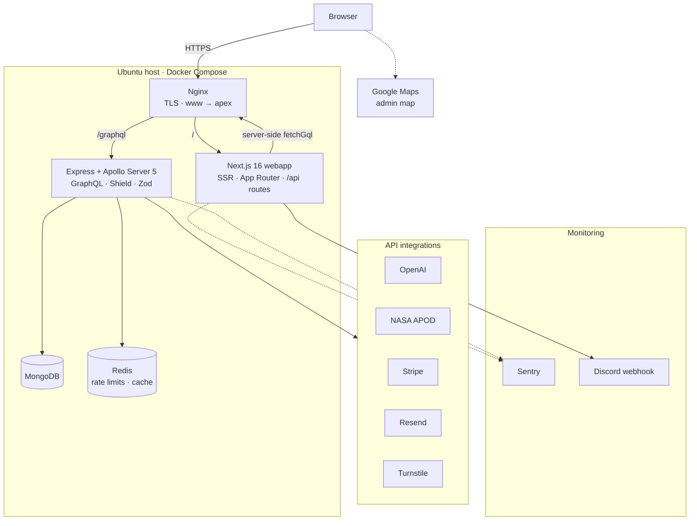
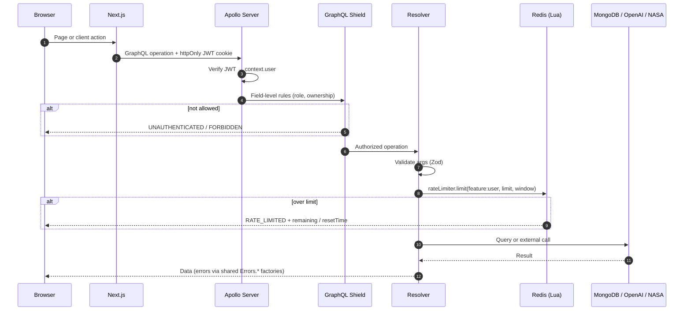
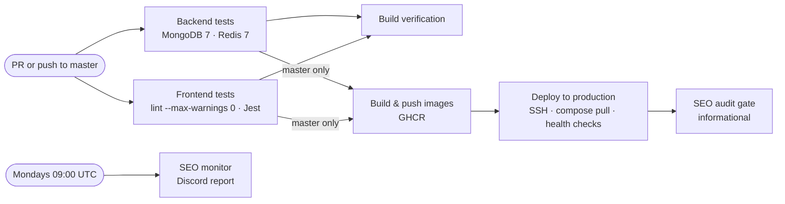

<div align="center">

# luisfaria.dev

A full-stack TypeScript portfolio application featuring case studies, public Dev.to writing, private tools, and an AI assistant.

[](https://luisfaria.dev)

[](https://github.com/lfariabr/luisfaria.dev/actions/workflows/ci.yml)
[](https://www.typescriptlang.org/)
[](https://nextjs.org/)
[](https://nodejs.org/)
[](https://graphql.org/)


</div>

---

## Overview

This repository powers [luisfaria.dev](https://luisfaria.dev) — a portfolio built with Next.js, Node.js, GraphQL, MongoDB, and Redis. It goes beyond a static portfolio by integrating curated case studies, Dev.to writing, authenticated private tools, an AI assistant, atomic rate limiting, CI/CD pipelines, and a layered caching strategy.

**Highlights for reviewers:**
- [Live site](https://luisfaria.dev) — portfolio for secure education data systems, applied ML, and agentic AI delivery
- [Work](https://luisfaria.dev/work) — curated case studies told as problem → approach → stack → outcome
- [Writing on Dev.to](https://dev.to/lfariaus) — public technical write-ups, now promoted from the primary header navigation
- [Agentic study pipeline](https://dev.to/lfariaus/12-modules-12-weeks-1-pipeline-studying-a-masters-with-agentic-ai-1ohg) — public write-up for the open-source Master of SWE & AI workflow
- [Security Incident Report: Cryptominer Attack](https://dev.to/lfariaus/security-incident-report-cryptominer-attack-on-nextjs-application-1df4) — led to the `feat/sec-auth` hardening milestone

---

## Architecture

### Runtime

Production runs as a Docker Compose stack on a single Ubuntu host. Nginx terminates TLS and routes `/graphql` to the API and everything else to Next.js.



### Request lifecycle

Every GraphQL request passes through the same auth, authorization and validation layers. Rate-limited features (chatbot, APOD history, Goggins) add an atomic Redis check before doing any expensive work.



### CI/CD

Pull requests run both test suites and a build check. Pushes to `master` additionally build images, deploy over SSH, and only then audit the live site.



### Repository

```
luisfaria/
├── _docs/              # Feature specs, release notes, articles
├── backend/            # Express, Apollo Server 5, Mongoose, Redis
├── frontend/           # Next.js 16+, React 19, Apollo Client, TailwindCSS 4, shadcn/ui
└── docker-compose.yml
```

### Design Decisions

| Concern | Approach |
|---|---|
| **API** | GraphQL with modular schema composition and resolver-level error handling |
| **Auth** | JWT in httpOnly cookies, role-based access (ADMIN / EDITOR / USER / PARTNER), GraphQL Shield, Turnstile-protected registration, partner read-only relationship-map access |
| **Rate Limiting** | Redis + atomic Lua scripts — sliding window per user per feature |
| **Caching** | Multi-layer: Redis (server), Apollo Client cache (client) |
| **Validation** | Zod schemas for all GraphQL inputs |
| **Error Handling** | Shared error factories (`createErrorHandler`) with standardized codes |
| **CI/CD** | GitHub Actions with parallel test suites, a zero-warning lint gate, GHCR images, SSH deploy with health checks, and a post-deploy SEO audit |
| **Payments** | Stripe hosted checkout — origin-validated return URLs, `trackClientEvent` analytics, phase-2 webhook fulfillment planned |

---

## Tech Stack

| Layer | Technologies |
|---|---|
| **Frontend** | Next.js 16+, React 19, TypeScript, Apollo Client, TailwindCSS 4, shadcn/ui |
| **Backend** | Node.js, Express, Apollo Server 5, GraphQL, Mongoose |
| **Data** | MongoDB, Redis |
| **Integrations** | OpenAI (chatbot), NASA API (APOD), Stripe (payments), Resend (email), Cloudflare Turnstile, Google Maps, Discord webhooks |
| **Infrastructure** | Docker Compose on Ubuntu 26.04 LTS, Nginx + Let's Encrypt, GHCR, GitHub Actions |
| **Observability** | Sentry (frontend + backend), Discord activity notifications, structured `logger` |
| **Quality** | Jest, React Testing Library, MongoDB Memory Server, ESLint (`eslint-config-next`, zero warnings) |

---

## Features

### Public site

| Feature | What it does | Since |
|---|---|---|
| **Case studies** | `/work` tells curated projects as problem → approach → stack → outcome, with statically prerendered `/work/[slug]` pages | v3.9 |
| **Evidence-led home** | Rotating hero headline with reduced-motion support, proof metrics, pillars, and Impact metrics curated in `content/` | v3.8, v3.14–v3.16 |
| **About · Timeline · Contact** | Positioning page, curated career timeline, and contact page | v3.8, v3.10 |
| **Writing** | Header links to Dev.to; `/articles` and `/projects` remain as archive routes with markdown, images and syntax highlighting | v1.2, v1.15, v3.16 |
| **SEO** | Metadata, sitemap, robots, JSON-LD, `noindex` on private routes; audited after every deploy and weekly | v1.13, v2.8, v2.9.91 |

### AI and integrations

| Feature | What it does | Since |
|---|---|---|
| **AI assistant** | `/chatbot` answers from a curated knowledge base (published articles and career timeline); 5 requests/hour per user with live countdown | v1.4, v2.3, v2.9 |
| **APOD** | NASA Astronomy Picture of the Day, cached in Redis; browsing past dates is rate-limited per user | v2.4 |
| **Payments** | Coffee and meeting checkout through Stripe hosted checkout with origin-validated return URLs | v3.1 |
| **Goggins Mode** | Motivational AI coach, 2 requests/24h per email *(deprecated, kept for reference)* | v2.0 |

### Private tools

| Feature | What it does | Since |
|---|---|---|
| **Notes & flashcards** | `/notes` weekly/monthly checkpoints: month accordion, timeline and week/month views, search, one-item-per-line entry, dated title autofill, delete confirmation, mobile-first layout | v3.3, v3.4, v3.18 |
| **Relationship map** | Google Maps view of outings with spend/date context; admin full access, partner read-only | v3.6 |
| **Admin** | Manage articles, projects and user roles | v1.3 |

### Platform

| Area | What's in place | Since |
|---|---|---|
| **Auth** | JWT in httpOnly cookies, roles (ADMIN · EDITOR · USER · PARTNER), resilient session restore, Turnstile + IP/email throttling on registration | v1.3, v3.2, v3.7 |
| **Rate limiting** | Redis sliding windows via atomic Lua scripts, unified `RATE_LIMITED` error code | v2.0.1, v3.12 |
| **Errors** | Shared `createErrorHandler` and `Errors.*` factories across all resolvers | v2.5, v3.13 |
| **Observability** | Sentry with source maps; Discord notifications for logins, registrations, APOD, Stripe and Goggins | v2.7, v3.5 |
| **Delivery** | GitHub Actions → GHCR → SSH deploy with health checks; post-deploy SEO gate | v2.6, v3.18.4 |
| **Code quality** | Native ESLint flat config with a zero-warning CI gate | v3.18.3, v3.18.4 |
| **Security** | Dependabot alerts kept at zero; production on Ubuntu 26.04 LTS with Docker 29 | v2.2, v3.17 |

<details>
<summary><strong>Release history</strong> (v1.1 → v3.18.4)</summary>

| Version | Feature | Description |
|---|---|---|
| v1.1 | Portfolio | Project showcase with highlights and filtering |
| v1.2 | Articles | Technical articles with categorization |
| v1.3 | Auth | JWT authentication with role-based access |
| v1.4 | Chatbot | AI assistant — 5 req/hr per user, conversation history |
| v1.13 | SEO | Meta tags, sitemap, robots.txt, social sharing |
| v1.15 | Markdown | Image support + code syntax highlighting |
| v2.0 | Goggins Mode | Motivational AI coach with rate limiting *(deprecated)* |
| v2.0.1 | Atomic Rate Limiting | Redis + Lua scripts for race-condition-free limits |
| v2.2 | Security Hardening | Auth improvements, QA regression tests, monitoring |
| v2.3 | Assistant UX | Guided prompts, clearer rate-limit feedback |
| v2.4 | APOD | NASA Astronomy Picture of the Day — cached, rate-limited, browsable |
| v2.5 | Error Infrastructure | Shared GraphQL error handling with standardized codes |
| v2.6 | CI/CD | GitHub Actions pipeline, Docker, minimal-downtime deployment |
| v2.7 | Sentry Integration | Error tracking with source maps and release management |
| v2.9 | Chatbot Knowledge Upgrade | Enriched AI knowledge base (20 articles), structured system prompt, career timeline |
| ~~v3.0~~ | ~~Resend Integration~~ | ~~Transactional emails~~ |
| v3.1 | Stripe Payments | Coffee & meeting checkout via Stripe — APOD-style FAB, hosted checkout, success/cancel pages |
| v3.2 | Registration Security Hardening | Cloudflare Turnstile on `register`, IP/email throttling, fail-fast Turnstile config validation |
| v3.3 | Authenticated Notes | Private `/notes` area — CRUD checkpoints, timeline + week/month views, period/search filters, Shield-validated queries, ISO date serialization |
| v3.4 | Notes & Flashcards Redesign | Redesigned notes and flashcards workspace with improved UX and layout |
| v3.5 | Discord Activity Monitoring | Real-time webhook notifications across login, register, APOD, Stripe, and Goggins interactions — fire-and-forget, never blocks user flow |
| v3.6 | Relationship Pins Admin Map | Private admin Google Maps view for relationship outings with spend/date context, timeline, and optional backend-only home marker |
| v3.7 | Auth Session Persistence | Resilient session restore (status state machine, transient-error tolerance + retry UI), `sameSite=lax`, `JWT_SECRET` strength guard, and an nginx www→apex canonical host |
| v3.8 | Home Reposition + About | Problem/outcome-led home, four pillars (Software · Data · Automation · AI/ML), stack-by-pillar, and a new `/about` page |
| v3.9 | Case Studies | `/work` repurposed into curated case studies (problem → approach → stack → outcome) with statically prerendered `/work/[slug]` detail pages |
| v3.10 | Timeline + Contact | Dedicated `/timeline` page (curated data), new `/contact` page, and a Review Pulse ML case study |
| v3.11 | Impact Metrics Curation | Curated home metrics for freshness + credibility; data moved to `content/metrics.ts` |
| v3.12 | Backend Cleanup | Removed dead resolver files, `checkRole` on the `UserRole` enum, and unified the rate-limit error code on `RATE_LIMITED` |
| v3.13 | Error Handling Standardization | `screams` / `resend` resolvers migrated to the shared `Errors.*` factories |
| v3.14 | Rotating Hero Headline | Hybrid hero headline with rotating proof lenses, reduced-motion support, and progress-bar polish |
| v3.15 | Homepage Proof Points | Evidence-first hero metrics, pillars, stack, and Impact metrics rebuilt around stronger proof |
| v3.16 | Profile Positioning Refresh | Header simplified to Home / Work / Writing / About; Dev.to promoted; homepage copy aligned to secure education systems, SQL/Power BI, applied ML, and agentic AI |
| v3.17 | Security & Platform Maintenance | 11 Dependabot PRs consolidated, 27 security alerts → 0 (incl. Next.js critical fixes); production moved to Ubuntu 26.04 LTS with Docker 29 |
| v3.18 | My Notes Mobile UX | iOS focus-zoom fix, compact stats, one-item-per-line entry, month/year accordion |
| v3.18.1 | Notes Mobile Polish | Readable stat labels, dated title autofill, Week/Month overflow fix |
| v3.18.2 | Delete Confirmation | Notes ask before deleting; failures keep the dialog open |
| v3.18.3 | ESLint Gate | Native flat config, 44 lint errors fixed, lint gates CI |
| v3.18.4 | CI Hygiene | SEO gate runs after deploy; 67 lint warnings → 0 with `--max-warnings 0` |

</details>

---

## Documentation Map

| Area | Location |
|---|---|
| Latest release notes | `_docs/releaseNotes/` |
| Feature breakdowns | `_docs/featureBreakdown/` |
| Build-in-public Dev.to drafts | `_docs/buildInPublic/devTo/` |
| Build-in-public LinkedIn drafts | `_docs/buildInPublic/linkedIn/` |
| Backend implementation notes | `backend/docs/` |
| Frontend implementation notes | `frontend/docs/` |

Latest release docs:

- `_docs/releaseNotes/v.3.18.4_CI-SEO-After-Deploy-Zero-Warnings.md`
- `_docs/featureBreakdown/v3.18.4-ci-seo-after-deploy-zero-warnings.md`

---

## Getting Started

### Prerequisites

- Node.js 20.9+
- MongoDB (local or Atlas)
- Redis

### Setup

```bash
# Clone
git clone https://github.com/lfariabr/luisfaria.dev.git
cd luisfaria.dev

# Install dependencies
cd backend && npm install && cd ..
cd frontend && npm install && cd ..

# Configure environment
cp backend/.env.example backend/.env
# Edit backend/.env with your keys (see Environment Variables below)

# Start development servers
cd backend && npm run dev   # GraphQL API on :4000
cd frontend && npm run dev  # Next.js on :3000
```

Or with Docker:

```bash
docker-compose up --build
```

### Environment Variables

| Variable | Service |
|---|---|
| `MONGODB_URI` | MongoDB connection string |
| `REDIS_URL` | Redis connection string |
| `JWT_SECRET` | Auth token signing |
| `OPENAI_API_KEY` | AI chatbot |
| `RESEND_API_KEY` | Transactional email |
| `NASA_API_KEY` | APOD feature |
| `DISCORD_WEBHOOK_URL` | Notifications |
| `FRONTEND_URL` | Backend redirect base URL for Stripe checkout |
| `STRIPE_SECRET_KEY` | Stripe server secret key |
| `STRIPE_COFFEE_PRICE_ID` | Stripe Price ID for coffee checkout item |
| `STRIPE_MEETING_PRICE_ID` | Stripe Price ID for meeting checkout item |
| `STRIPE_WEBHOOK_SECRET` | Stripe webhook signature secret *(reserved for phase 2)* |
| `TURNSTILE_SECRET_KEY` | Backend secret for Cloudflare Turnstile verification |
| `NEXT_PUBLIC_GRAPHQL_URL` | Frontend → API (defaults to `http://localhost:4000/graphql`) |
| `NEXT_PUBLIC_TURNSTILE_SITE_KEY` | Public Turnstile site key for the register page |
| `NEXT_PUBLIC_GOOGLE_MAPS_API_KEY` | Browser key for Google Maps JavaScript API; restrict by HTTP referrer |
| `NEXT_PUBLIC_GOOGLE_MAPS_MAP_ID` | Google Maps Map ID required by Advanced Markers |
| `GEOCODING_API_KEY` | Backend-only Google Geocoding key for local/private import helpers |
| `RELATIONSHIP_HOME_LAT` | Optional backend-only admin home marker latitude |
| `RELATIONSHIP_HOME_LNG` | Optional backend-only admin home marker longitude |
| `RELATIONSHIP_HOME_LABEL` | Optional backend-only home marker label, defaults to `"Home base"` |
| `COOKIE_DOMAIN` | Auth cookie domain in production (e.g. `.luisfaria.dev`) — required in prod, omit in dev |

### Stripe Local Setup

The Stripe checkout flow requires a few one-time steps to run locally.

**1. Get test API keys**

Log in to the [Stripe Dashboard](https://dashboard.stripe.com) and toggle to **Test mode**.
Navigate to [Developers → API keys](https://dashboard.stripe.com/test/apikeys) and copy the **Secret key** (`sk_test_...`).

**2. Create test products and prices**

Go to [Products](https://dashboard.stripe.com/test/products) in Test mode and create two products:

| Product | Suggested price | `backend/.env` variable |
|---|---|---|
| Coffee | AUD 5 one-time | `STRIPE_COFFEE_PRICE_ID` |
| Meeting | AUD 150 one-time | `STRIPE_MEETING_PRICE_ID` |

After saving each product, copy its **Price ID** (`price_...`) into your `backend/.env`.

**3. Set `FRONTEND_URL`**

```bash
# backend/.env
FRONTEND_URL=http://localhost:3000   # no trailing slash
STRIPE_SECRET_KEY=sk_test_...
STRIPE_COFFEE_PRICE_ID=price_...
STRIPE_MEETING_PRICE_ID=price_...
```

`FRONTEND_URL` is used to build the `cancel_url` and `success_url` sent to Stripe, so it must match the URL the frontend is actually running on. A trailing slash or extra path will cause redirect failures.

**4. `STRIPE_WEBHOOK_SECRET` — Phase 2 (deferred)**

Webhook fulfillment (persisting payment results to the database, sending confirmation emails) is planned for a future release. `STRIPE_WEBHOOK_SECRET` is wired into the config but **not required** to run the checkout flow today — leave it blank locally. When webhook support is added, create a webhook endpoint in the [Stripe Dashboard](https://dashboard.stripe.com/test/webhooks) pointing to `/api/stripe/webhook` and paste the signing secret into this variable.

---

### Turnstile Local Setup

The register flow in v3.2 requires both a backend Turnstile secret and a frontend site key.

```bash
# backend/.env
TURNSTILE_SECRET_KEY=your_cloudflare_turnstile_secret_key

# frontend/.env.local
NEXT_PUBLIC_TURNSTILE_SITE_KEY=your_cloudflare_turnstile_site_key
```

- `TURNSTILE_SECRET_KEY` stays server-side and is used by the GraphQL API to verify the captcha token with Cloudflare
- `NEXT_PUBLIC_TURNSTILE_SITE_KEY` is the browser-safe key used to render the widget on `/register`
- On localhost, Turnstile may auto-complete quickly for low-risk traffic; backend verification remains authoritative

---

### Relationship Pins / Google Maps Setup

The v3.6 relationship pins map is private and admin-only at `/admin/relationship`.

Frontend values are browser-visible by design:

```bash
# frontend/.env.local
NEXT_PUBLIC_GOOGLE_MAPS_API_KEY=your_maps_javascript_api_key
NEXT_PUBLIC_GOOGLE_MAPS_MAP_ID=your_maps_javascript_map_id
```

- Restrict `NEXT_PUBLIC_GOOGLE_MAPS_API_KEY` in Google Cloud to trusted HTTP referrers and Maps JavaScript API.
- Create `NEXT_PUBLIC_GOOGLE_MAPS_MAP_ID` in Google Maps Platform → Map Management. Advanced Markers require a valid Map ID. `DEMO_MAP_ID` is suitable only for local testing.
- Keep production CSP in sync with the Maps dependency. The Nginx file is server-local and intentionally not committed; update it manually on the host to allow Google Maps JavaScript/static endpoints and Google Analytics if tracking remains enabled.

Backend-only values stay out of the browser:

```bash
# backend/.env or production server env
GEOCODING_API_KEY=your_geocoding_key
RELATIONSHIP_HOME_LAT=
RELATIONSHIP_HOME_LNG=
RELATIONSHIP_HOME_LABEL="Home base"
```

- `GEOCODING_API_KEY` is optional at boot and should be restricted to Geocoding API.
- `RELATIONSHIP_HOME_*` is optional. If unset or invalid, the admin map renders without the home marker.
- Never expose home coordinates through `NEXT_PUBLIC_*`; those values would be bundled into frontend JavaScript.

---

## Testing

Both suites run in CI with MongoDB 7 and Redis 7 service containers. Frontend lint runs before the tests with `--max-warnings 0`, so a new warning fails the build.

```bash
# Backend
cd backend
npm test                   # All tests
npm run test:coverage      # With coverage

# Frontend
cd frontend
npm test                   # All tests
npm run test:coverage      # With coverage
npm run lint               # ESLint — fails on any error or warning
npx tsc --noEmit           # Frontend app typecheck

# Single test file
cd backend && npx jest path/to/test.ts
cd frontend && npx jest path/to/test.tsx
```

**Backend**: Jest + ts-jest, MongoDB Memory Server, mocked external services (OpenAI, Resend, NASA, Stripe)
**Frontend**: Jest + React Testing Library + jsdom, Apollo Client mocks, `trackClientEvent` utility tested in isolation

---

## License

This project is the source code for [luisfaria.dev](https://luisfaria.dev). Feel free to reference the architecture and patterns for your own projects.
