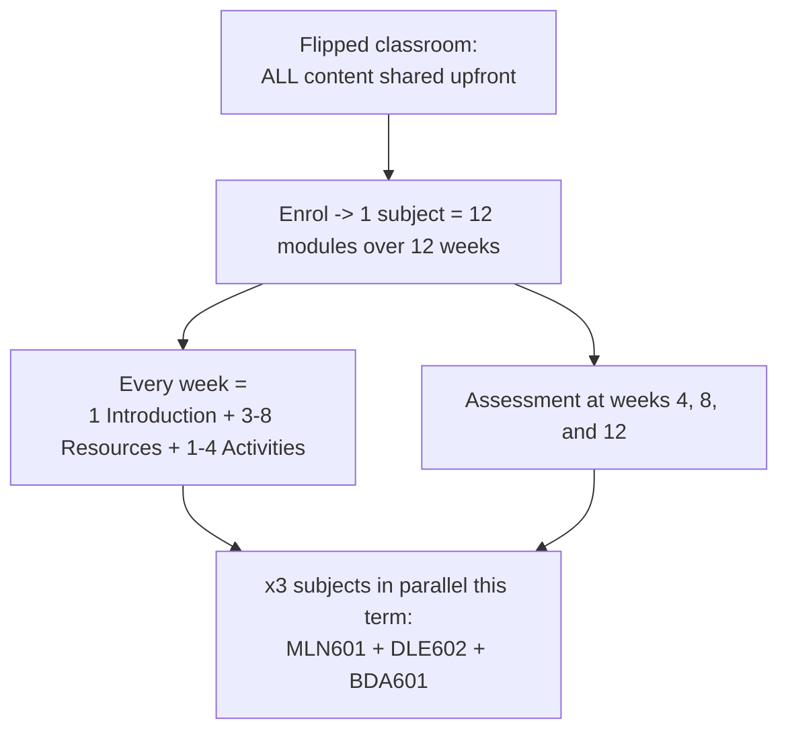
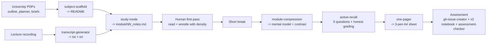
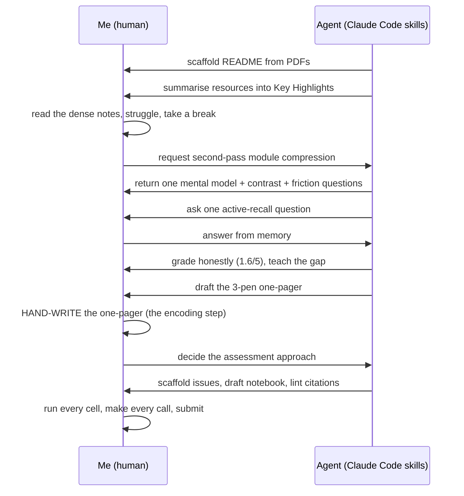
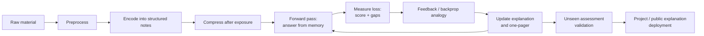

# 12 modules, 12 weeks, 1 pipeline: studying a Master's with agentic AI

**Tags:** `ai` `productivity` `learning` `opensource`

---

I am doing a Master of Software Engineering and Artificial Intelligence while holding a part-time job. The university runs a *flipped classroom*: every scrap of content is handed to you upfront, before a single class. Then you enrol, and the real volume arrives.

One subject is 12 modules across 12 weeks. Each week has an Introduction, 3 to 8 Resources (textbook chapters, papers, videos, podcasts), and 1 to 4 Activities (forums, hands-on notebooks, quizzes). An assessment lands roughly every 4 weeks. This term I am running three subjects at once.

You do not get to read all of that. Nobody does. You triage.

> *The content was never the problem. The throughput was.*

So I stopped brute-forcing it and built a pipeline instead - a set of [Claude Code skills](https://github.com/lfariabr/masters-swe-ai/tree/master/.claude/skills) that each own one stage of the journey, from raw university PDFs to structured notes, second-pass compression, a hand-written revision sheet, and a submitted assessment.

**It is all public - [skills, prompts, and the real outputs they produce](https://github.com/lfariabr/masters-swe-ai). Clone it and point it at your own subject. The rest of this article is the walkthrough.**

---

## Contents

- [The volume](#the-volume) - what a flipped-classroom term actually dumps on you
- [The pipeline](#the-pipeline) - six bounded stages, one per kind of pain
- [Stage by stage](#stage-by-stage) - map -> notes -> recall -> one-pager -> assessment
- [The split that matters](#the-split-that-matters) - what the agent does vs. what stays mine
- [The pipeline is a training loop](#the-pipeline-is-a-training-loop) - the same loop I am studying, applied to studying
- [Lessons learned](#lessons-learned) - the six things worth stealing
- [Building in Public](#building-in-public) - how this started, and why I'm sharing it

---

## The volume

Here is the load for a single subject, before you multiply by three.

| Per subject (12 weeks) | Count |
|---|---|
| Modules (1 per week) | 12 |
| Resources per module | 3 - 8 |
| Activities per module | 1 - 4 |
| Assessments (weeks 4, 8, 12) | 3 |



*Fig 1 - What a flipped-classroom term actually dumps on you: all content upfront, multiplied across three parallel subjects.*
*Image in HD: [fig1-flipped-classroom.png](https://github.com/lfariabr/luisfaria.dev/blob/master/_docs/buildInPublic/devTo/figures/2026_06_30_fig1.png)*

Multiply that out and a single term is somewhere north of 100 resources and 9 assessments, while you hold down a day job. The trap is obvious: skim everything, retain nothing, and arrive at the assessment with a blank page.

The flipped classroom assumes you will do the front-loading yourself. Fine. I just refused to do it by hand.

<sub>[↑ Back to contents](#contents)</sub>

---

## The pipeline

Instead of one heroic study session, I split the journey into stages and gave each stage a bounded contract. A skill in Claude Code is a named, reusable prompt that resolves the same inputs, follows the same guardrails, and produces a consistent kind of result. That repeatability is the whole point: I am not re-explaining "how I study" every week, I am running `/study-mode BDA 5` and getting the same disciplined result every time.



*Fig 2 - The pipeline end to end: raw PDFs and lectures flow through six bounded stages, with a human first pass and break in the middle.*
*Image in HD: [fig2-pipeline.png](https://github.com/lfariabr/luisfaria.dev/blob/master/_docs/buildInPublic/devTo/figures/2026_06_30_fig2.png)*

Six stages. Most are Claude Code skills; the assessment stage combines skills with a repeatable execution pattern. Each stage removes a specific kind of pain.

<sub>[↑ Back to contents](#contents)</sub>

---

## Stage by stage

### 1. Map the subject - `/subject-scaffold`

**The pain:** a new subject is a pile of PDFs - a subject outline, a planner, three assessment briefs - and no single place that tells you what the 12 weeks actually look like.

`/subject-scaffold` reads those PDFs with `pdftotext` and builds the subject `README.md`: introduction, learning outcomes, a week-by-week delivery schedule, the module checklist, and the assessment table. The contract is strict about staying honest:

```text
3. Build the README from source facts only.
   - Fill or update these sections when source material supports them:
     Subject Introduction, Subject Details, Subject Learning Outcomes (SLO),
     Delivery Schedule, Learning Facilitator, Modules, Assignments, Source Notes
...
   - Do not invent module titles, learning outcomes, assessment topics, grades, or dates.
```

That last line matters. The skill is allowed to summarise, never to hallucinate a deadline. The output is the map I navigate the whole term from - the delivery schedule that tells me the BDA601 assessments fall in weeks 4, 8, and 12, weighted 30 / 30 / 40.

**So what:** before I study anything, I know the shape of the whole subject. The volume has a floor plan.

---

### 2. Summarise the resources - `/study-mode`

**The pain:** module 2 alone has a textbook chapter on data strategy plus two chapters on data lakes. Reading all three closely is 90 minutes I do not have on a Tuesday.

`/study-mode` reads each resource (PDF via `pdftotext`, web articles via fetch) and writes structured notes into `moduleNN_notes.md`. Every resource gets the same "Key Highlights" frame:

```markdown
### N. Author, A. (Year). Title of work.

**Purpose:** 1-2 sentence summary of what this resource covers and why it matters.

#### 1. First Major Theme
- Bullet points with **bold labels** for key terms
- Use comparison **tables** where multiple items are compared

#### Key Takeaways for [Subject Name]
1. How this connects to the module's activities and assessments
```

Run it on BDA module 2 and you get a notes file with a task list and real, sourced highlights:

```markdown
### 1. Marr, B. (2021). Data Strategy - Chapter 6: Sourcing and Collecting

**Purpose:** After deciding *what* you want from data, this chapter covers
*where to get it* - by structure (structured / semi / unstructured) and by
ownership (internal / external).

#### 1. Start from strategy, not from the data
- **Sequence matters:** identify business questions first, *then* source the data.
```

The skill marks each resource done with a status emoji and refuses to touch anything already reviewed. It is a summariser with a memory.

But structured notes are not the same as compressed understanding. Deep Learning Module 6 produced 227 lines on PCA, factor analysis, ICA, SFA, sparse coding, latent variables, and eigenvalues. I spent about 40 focused minutes reading the notes, hit cognitive overload, took a 20-minute break, and came back. That dense first encounter was not wasted time. It gave the later compression something to attach to.

**So what:** the notes make the source material navigable and traceable. They do not pretend that deep material can be learned in ten minutes.

---

### 3. Compress after exposure - `/module-compression`

This is the stage I was missing.

Compression works best **after** the detailed material has already pushed against your working memory. Run it too early and it becomes a shortcut that feels clear but has nothing underneath it. Run it after a first pass and a break, and it behaves like a conceptual bottleneck: the detail is still there, but now it has a small structure to hang from.

`/module-compression DLE 6` reduced that entire linear-factor-model module to one shared model:

```text
observed data x = hidden factors h mixed together + noise
```

Then every method became one question:

| Method | The question it asks |
|---|---|
| PCA | Which directions preserve the most variance? |
| Factor analysis | Which hidden causes explain correlated variables? |
| ICA | Which independent sources were mixed together? |
| SFA | Which underlying features change slowly over time? |
| Sparse coding | Can a few active features explain this input? |

That was not a replacement for the 40-minute read. It was the moment the 40-minute read became organised knowledge. The skill also predicts the next friction points - in this case: *What is variance? Why do directions matter? What exactly is a hidden cause?* - so confusion becomes the input to the next learning loop.

**So what:** good compression removes cognitive load without removing conceptual boundaries.

---

### 4. Active recall, not re-reading - `/active-recall`

Here is where the agent stops doing the work for me and starts making me do it.

Summaries are comfortable and useless on their own - re-reading feels like learning and is not. So `/active-recall BDA 5` reads the notes produced by `/study-mode`, privately builds five questions, and asks them one at a time. It grades my first attempt before teaching anything:

```text
- Ask Question 1 only and stop. Never reveal the private answer key.
- Grade the first attempt from 0 to 5 before teaching or asking a follow-up.
- Return: Right, Gap, Fix, and a practical Anchor when it genuinely helps.
- After five questions, calculate the mean and produce three retest prompts.
```

A 1.6 out of 5 stings. It is supposed to. The skill keeps the original score even if I repair the answer, teaches only the gap, and anchors abstract ideas to my actual day job - "schema-on-write is your warehouse, schema-on-read would be the lake." That hook is why it sticks.

**So what:** the AI is most valuable when it withholds the answer, not when it hands it over.

---

### 5. The one-pager - `/one-pager`

This is the showpiece.

**The pain:** notes are too long to revise from the night before an exam. I need one page.

`/one-pager` distils a module's notes into a single A4 sheet I then **hand-write** with three pens. The colour code is the system:

```markdown
**Pen legend:** black = skeleton / always-true · blue = definitions & examples · red = exam + assessment hooks

## The Big Idea (box it, centre of page)
> **<the single core concept in 1-3 sentences>**

## Zone 1 - <title>
- black / blue / red bullets with **bold labels**; comparison tables

## Assessment Hook (bottom red strip)
> **<assessment name>** · <words/format> · <weight> · due **<date>** · SLOs <refs>.

## If you only memorise 5 things
1. <bite-sized takeaway>
```

Run it on BDA module 2 and the abstract chapter collapses into something you could redraw from memory in five minutes:

```markdown
## The Big Idea (box it, centre of page)
> **Source from STRATEGY, then ingest RAW into a lake at the right SPEED.**

## If you only memorise 5 things
1. Strategy -> data (source for the question, not the other way).
2. Lake = schema-on-read · Warehouse = schema-on-write.
3. Intake zones: Source -> Transient (validate!) -> Raw.
...

## Assessment 1 hooks (bottom red strip)
> A1 = Design a Data Pipeline · 1500w · 30% · due 28/06/2026 · SLOs a) b) e).
```

The skill pulls the assessment hook - weight, due date, the exact learning outcomes - straight from the README that stage 1 built, so the revision sheet always points at the thing being graded. Then I copy it onto blank A4 by hand. The hand-writing is not nostalgia; it is the encoding step. The agent produces the script, my hand performs it, and that is when it lands in memory.

**So what:** the artifact you hand-write is the one you remember. The AI builds the script; you still have to act it out.

---

### 6. Tackle the assessment

Every four weeks the reading has to become a deliverable. Three skills carry that load.

**`/gh-issue-creator`** turns a markdown plan into a batch of GitHub issues - module epics, assessment tasks, due dates - in one command. Tight issues are not bureaucracy; they are the leash. A well-scoped issue with a Goal and an Acceptance section is a bounded task an executor agent cannot drift out of. I wrote about that pattern separately in [How I keep LLMs on a tight leash](https://github.com/lfariabr/gh-issue-creator).

The assessment itself follows a **v2 executed pattern**: never a skeleton full of `TBD` placeholders, always a notebook that actually runs.

```text
add dataset/ (download script + committed CSVs), code/ (clean, runnable),
an executed notebook/ with embedded outputs, and outputs/ (metrics + figures).
Then replace every placeholder with the real executed numbers.
```

Because the repo doubles as academic evidence and a public portfolio, every assessment ships with real data, real figures, and real numbers - a Telco churn model in PySpark MLlib, a wine-quality regression, a sentiment classifier - not a plan that describes one.

Finally, **`/assessment-checker`** runs a pre-submission audit: structural compliance against the brief, word count within tolerance, every inline citation matched to a reference, and each reference spot-checked on the web for a real author, year, and venue. It flags issues as critical, minor, or verified before a human marker ever sees the document.

Feeding all of this, **`/transcript-generator`** turns a lecture recording into text and subtitles offline with `whisper.cpp` on Apple Silicon - so a class I attended becomes searchable notes that flow back into stage 2.

**So what:** by submission day the work is done, checked, and reproducible - and the agent had guardrails at every step.

<sub>[↑ Back to contents](#contents)</sub>

---

## The split that matters

None of this works if the agent does the learning. The agent does the *logistics* of learning. Look at where the line falls:

| The agent does | I do |
|---|---|
| Scaffold the subject README from PDFs | Decide what to prioritise |
| Summarise resources into cited notes | Spend focused time encountering the detail |
| Compress the module into one model and a contrast table | Test whether that structure matches what I read |
| Run `/active-recall` and grade honestly | Retrieve the answer and feel the 1.6/5 |
| Draft the 3-pen one-pager | Hand-write it onto A4 |
| Scaffold issues, draft the notebook, lint citations | Run every cell, make every academic call, submit |



*Fig 3 - Who does what, step by step: the agent handles logistics, but every act of understanding stays on the human side.*
*Image in HD: [fig3-who-does-what.png](https://github.com/lfariabr/luisfaria.dev/blob/master/_docs/buildInPublic/devTo/figures/2026_06_30_fig3.png)*

The agent clears the throughput problem. The understanding stays mine. That is the only split that makes this honest rather than a cheating machine.

<sub>[↑ Back to contents](#contents)</sub>

---

## The pipeline is a training loop

There is a useful engineering analogy here. It is not literal neuroscience and my brain is not running gradient descent, but the pipeline now resembles the deep-learning training loop I am studying:

| Deep learning term | Study-pipeline equivalent | What it does |
|---|---|---|
| **Input data** | PDFs, papers, lectures, briefs | Supplies the raw signal |
| **Preprocessing** | Subject scaffold and transcripts | Normalises messy inputs into searchable structure |
| **Encoding / representation** | `/study-mode` notes | Converts raw sources into concepts, relationships, and citations |
| **Bottleneck / compression** | `/module-compression` | Forces many details through one mental model without erasing their distinctions |
| **Forward pass** | First active-recall answer | Produces an answer using the current mental model |
| **Loss measurement** | Score, gaps, and wrong assumptions | Measures the distance between my answer and the source-grounded target |
| **Backpropagation analogy** | Feedback travels back through the explanation | Identifies which concepts or links produced the error |
| **Weight update analogy** | I restate, rewrite, and reconnect the weak concept | Changes the mental model before the next attempt |
| **Regularisation** | Spacing, interleaving, and unseen questions | Stops me from memorising one summary or one question format |
| **Validation / test set** | Forum prompts and assessments | Tests whether the knowledge generalises to unfamiliar tasks |
| **Inference / deployment** | Building the project and explaining it publicly | Uses the trained representation outside the study loop |



*Fig 4 - The study pipeline mapped onto a deep-learning training loop: retrieval is the forward pass, gaps are the loss, and the one-pager is the weight update.*
*Image in HD: [fig4-pipeline.png](https://github.com/lfariabr/luisfaria.dev/blob/master/_docs/buildInPublic/devTo/figures/2026_06_30_fig4.png)*

The important part is the loop. If the pipeline stops at summarisation, there is no measured error and therefore no targeted update. Retrieval creates the error signal. Feedback tells me where to update. Repetition tests whether the update generalises.

<sub>[↑ Back to contents](#contents)</sub>

---

## Lessons learned

1. **Skills beat prompts.** A one-off prompt solves today. A skill is a bounded contract you can re-run for 12 modules across 3 subjects without re-explaining yourself. Repeatability is the feature.
2. **Compress after exposure, not instead of it.** The 40-minute struggle created the raw representation; the two-minute compression organised it.
3. **Tight issues are better context than long prompts.** Handing an agent a scoped GitHub issue - Goal, Scope, Acceptance - leaves it less room to drift than a paragraph of instructions. The discipline pays double when the coder is an LLM.
4. **The artifact you hand-write is the one you remember.** Let the agent draft the one-pager; do not let it hold the pen. The encoding happens in your hand.
5. **Honest grading beats flattery.** A skill that tells you 1.6/5 and teaches the gap is worth more than one that congratulates you into a false sense of readiness.
6. **Make it term-agnostic.** My skills glob `[0-9][0-9][0-9][0-9]-T[0-9]/*` to find subjects, so they survive every term rollover untouched. Build the pipeline once; let it outlast the semester.

<sub>[↑ Back to contents](#contents)</sub>

---

## Building in Public

Studying for a Master's while working part-time means the only way through the volume is to systematise it. This did not start sophisticated. A year ago, nine days into this repo, I wrote about a [manual daily follow-up system](https://luisfaria.dev/articles/how-i-created-a-daily-follow-up-system-to-dominate-my-masters-degree-assignments) - a Google Doc and a tracking spreadsheet. A year and 1,100+ commits later, that same instinct has grown into the agentic pipeline above. I am sharing the whole thing - skills, prompts, and the real outputs they produce - because the flipped classroom is everywhere now, and most students are still doing all of it by hand.

If you are doing a degree, a bootcamp, or just teaching yourself something large, you can copy this: scaffold the map, summarise to cited notes, encounter the detail, compress it, quiz yourself honestly, hand-write the one-pager, then build the deliverable for real.

- The repo (skills, notes, executed assessments): [github.com/lfariabr/masters-swe-ai](https://github.com/lfariabr/masters-swe-ai)
- The issue-creator skill: [github.com/lfariabr/gh-issue-creator](https://github.com/lfariabr/gh-issue-creator)

---

## Let's Connect

- **GitHub:** [github.com/lfariabr](https://github.com/lfariabr)
- **LinkedIn:** [linkedin.com/in/lfariabr](https://www.linkedin.com/in/lfariabr/)
- **Portfolio:** [luisfaria.dev](https://luisfaria.dev)

---

> *The AI is the accelerator. The learning is ours!*
