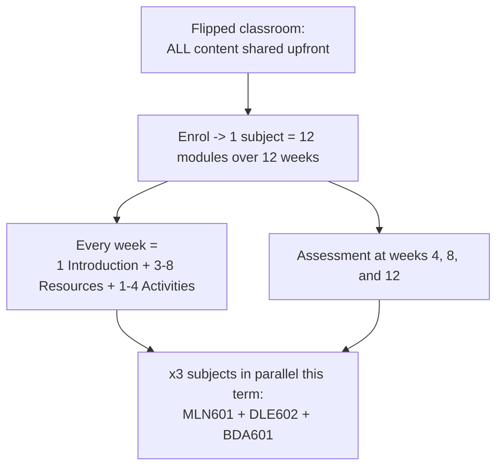
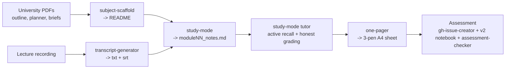
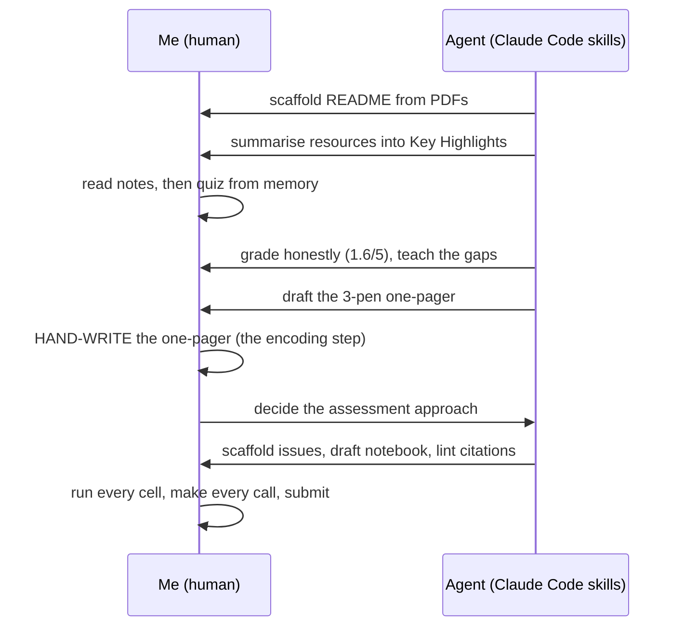

# 12 modules, 12 weeks, 1 pipeline: studying a Master's with agentic AI

**Tags:** `ai` `productivity` `learning` `opensource`

---

I am doing a Master of Software Engineering and AI while holding a part-time job. The university runs a *flipped classroom*: every scrap of content is handed to you upfront, before a single class. Then you enrol, and the real volume arrives.

One subject is 12 modules across 12 weeks. Each week has an Introduction, 3 to 8 Resources (textbook chapters, papers, videos, podcasts), and 1 to 4 Activities (forums, hands-on notebooks, quizzes). An assessment lands roughly every 4 weeks. This term I am running three subjects at once.

You do not get to read all of that. Nobody does. You triage.

> *The content was never the problem. The throughput was.*

So I stopped brute-forcing it and built a pipeline instead - a set of Claude Code skills that each own one stage of the journey, from raw university PDFs to a hand-written revision sheet and a submitted assessment. This is the whole thing, skill prompts included, so you can copy it.

---

## The volume

Here is the load for a single subject, before you multiply by three.

| Per subject (12 weeks) | Count |
|---|---|
| Modules (1 per week) | 12 |
| Resources per module | 3 - 8 |
| Activities per module | 1 - 4 |
| Assessments (weeks 4, 8, 12) | 3 |



Multiply that out and a single term is somewhere north of 100 resources and 9 assessments, while you hold down a day job. The trap is obvious: skim everything, retain nothing, and arrive at the assessment with a blank page.

The flipped classroom assumes you will do the front-loading yourself. Fine. I just refused to do it by hand.

---

## The pipeline

Instead of one heroic study session, I split the journey into stages and gave each stage a skill. A skill in Claude Code is a named, reusable prompt with a fixed contract - it always reads the same inputs, follows the same steps, and writes the same shape of output. That repeatability is the whole point: I am not re-explaining "how I study" every week, I am running `/study-mode BDA 5` and getting the same disciplined result every time.



Five stages. Each one removes a specific kind of pain. Here is what is actually inside them.

---

## Stage by stage

### 1. Map the subject - `/subject-scaffold`

**The pain:** a new subject is a pile of PDFs - a subject outline, a planner, three assessment briefs - and no single place that tells you what the 12 weeks actually look like.

`/subject-scaffold` reads those PDFs with `pdftotext` and builds the subject `README.md`: introduction, learning outcomes, a week-by-week delivery schedule, the module checklist, and the assessment table. The contract is strict about staying honest:

```text
3. Build the README from source facts only.
   - Fill or update these sections when source material supports them:
     Subject Introduction, Subject Details, Subject Learning Outcomes (SLO),
     Delivery Schedule, Learning Facilitator, Modules, Assignments, Source Notes
...
   - Do not invent module titles, learning outcomes, assessment topics, grades, or dates.
```

That last line matters. The skill is allowed to summarise, never to hallucinate a deadline. The output is the map I navigate the whole term from - the delivery schedule that tells me the BDA601 assessments fall in weeks 4, 8, and 12, weighted 30 / 30 / 40.

**So what:** before I study anything, I know the shape of the whole subject. The volume has a floor plan.

---

### 2. Summarise the resources - `/study-mode`

**The pain:** module 2 alone has a textbook chapter on data strategy plus two chapters on data lakes. Reading all three closely is 90 minutes I do not have on a Tuesday.

`/study-mode` reads each resource (PDF via `pdftotext`, web articles via fetch) and writes structured notes into `moduleNN_notes.md`. Every resource gets the same "Key Highlights" frame:

```markdown
### N. Author, A. (Year). Title of work.

**Purpose:** 1-2 sentence summary of what this resource covers and why it matters.

#### 1. First Major Theme
- Bullet points with **bold labels** for key terms
- Use comparison **tables** where multiple items are compared

#### Key Takeaways for [Subject Name]
1. How this connects to the module's activities and assessments
```

Run it on BDA module 2 and you get a notes file with a task list and real, sourced highlights:

```markdown
### 1. Marr, B. (2021). Data Strategy - Chapter 6: Sourcing and Collecting

**Purpose:** After deciding *what* you want from data, this chapter covers
*where to get it* - by structure (structured / semi / unstructured) and by
ownership (internal / external).

#### 1. Start from strategy, not from the data
- **Sequence matters:** identify business questions first, *then* source the data.
```

The skill marks each resource done with a status emoji and refuses to touch anything already reviewed. It is a summariser with a memory.

**So what:** 90 minutes of reading becomes a 10-minute scan of notes I can trust, because every claim is tied back to a cited source.

---

### 3. Active recall, not re-reading - `/study-mode` (tutor mode)

Here is where the agent stops doing the work for me and starts making me do it.

Summaries are comfortable and useless on their own - re-reading feels like learning and is not. So the same `/study-mode` session flips into a tutor that quizzes me from memory and grades me without mercy. The behaviour is pinned down in my own notes on how I want to be taught:

```text
- Active recall over re-reading - quiz them from memory, grade honestly
  (real check/cross, even a blunt score like 1.6/5), then teach the gaps.
- Real-world anchor: the user has a day job with a data warehouse +
  operational database - use their work stack to make abstract concepts
  (lake vs warehouse, schema-on-read) stick.
```

A 1.6 out of 5 stings. It is supposed to. The agent then teaches only the gaps, and anchors every abstract idea to my actual day job - "schema-on-write is your warehouse, schema-on-read would be the lake." That hook is why it sticks.

**So what:** the AI is most valuable when it withholds the answer, not when it hands it over.

---

### 4. The one-pager - `/one-pager`

This is the showpiece.

**The pain:** notes are too long to revise from the night before an exam. I need one page.

`/one-pager` distils a module's notes into a single A4 sheet I then **hand-write** with three pens. The colour code is the system:

```markdown
**Pen legend:** black = skeleton / always-true · blue = definitions & examples · red = exam + assessment hooks

## The Big Idea (box it, centre of page)
> **<the single core concept in 1-3 sentences>**

## Zone 1 - <title>
- black / blue / red bullets with **bold labels**; comparison tables

## Assessment Hook (bottom red strip)
> **<assessment name>** · <words/format> · <weight> · due **<date>** · SLOs <refs>.

## If you only memorise 5 things
1. <bite-sized takeaway>
```

Run it on BDA module 2 and the abstract chapter collapses into something you could redraw from memory in five minutes:

```markdown
## The Big Idea (box it, centre of page)
> **Source from STRATEGY, then ingest RAW into a lake at the right SPEED.**

## If you only memorise 5 things
1. Strategy -> data (source for the question, not the other way).
2. Lake = schema-on-read · Warehouse = schema-on-write.
3. Intake zones: Source -> Transient (validate!) -> Raw.
...

## Assessment 1 hooks (bottom red strip)
> A1 = Design a Data Pipeline · 1500w · 30% · due 28/06/2026 · SLOs a) b) e).
```

The skill pulls the assessment hook - weight, due date, the exact learning outcomes - straight from the README that stage 1 built, so the revision sheet always points at the thing being graded. Then I copy it onto blank A4 by hand. The hand-writing is not nostalgia; it is the encoding step. The agent produces the script, my hand performs it, and that is when it lands in memory.

**So what:** the artifact you hand-write is the one you remember. The AI builds the script; you still have to act it out.

---

### 5. Tackle the assessment

Every four weeks the reading has to become a deliverable. Three skills carry that load.

**`/gh-issue-creator`** turns a markdown plan into a batch of GitHub issues - module epics, assessment tasks, due dates - in one command. Tight issues are not bureaucracy; they are the leash. A well-scoped issue with a Goal and an Acceptance section is a bounded task an executor agent cannot drift out of. I wrote about that pattern separately in [How I keep LLMs on a tight leash](https://github.com/lfariabr/gh-issue-creator).

The assessment itself follows a **v2 executed pattern**: never a skeleton full of `TBD` placeholders, always a notebook that actually runs.

```text
add dataset/ (download script + committed CSVs), code/ (clean, runnable),
an executed notebook/ with embedded outputs, and outputs/ (metrics + figures).
Then replace every placeholder with the real executed numbers.
```

Because the repo doubles as academic evidence and a public portfolio, every assessment ships with real data, real figures, and real numbers - a Telco churn model in PySpark MLlib, a wine-quality regression, a sentiment classifier - not a plan that describes one.

Finally, **`/assessment-checker`** runs a pre-submission audit: structural compliance against the brief, word count within tolerance, every inline citation matched to a reference, and each reference spot-checked on the web for a real author, year, and venue. It flags issues as critical, minor, or verified before a human marker ever sees the document.

Feeding all of this, **`/transcript-generator`** turns a lecture recording into text and subtitles offline with `whisper.cpp` on Apple Silicon - so a class I attended becomes searchable notes that flow back into stage 2.

**So what:** by submission day the work is done, checked, and reproducible - and the agent had guardrails at every step.

---

## The split that matters

None of this works if the agent does the learning. The agent does the *logistics* of learning. Look at where the line falls:

| The agent does | I do |
|---|---|
| Scaffold the subject README from PDFs | Decide what to prioritise |
| Summarise resources into cited notes | Read the notes, then recall from memory |
| Grade my recall, honestly | Sit the quiz and feel the 1.6/5 |
| Draft the 3-pen one-pager | Hand-write it onto A4 |
| Scaffold issues, draft the notebook, lint citations | Run every cell, make every academic call, submit |



The agent clears the throughput problem. The understanding stays mine. That is the only split that makes this honest rather than a cheating machine.

---

## Lessons learned

1. **Skills beat prompts.** A one-off prompt solves today. A skill is a bounded contract you can re-run for 12 modules across 3 subjects without re-explaining yourself. Repeatability is the feature.
2. **Tight issues are better context than long prompts.** Handing an agent a scoped GitHub issue - Goal, Scope, Acceptance - leaves it less room to drift than a paragraph of instructions. The discipline pays double when the coder is an LLM.
3. **The artifact you hand-write is the one you remember.** Let the agent draft the one-pager; do not let it hold the pen. The encoding happens in your hand.
4. **Honest grading beats flattery.** A skill that tells you 1.6/5 and teaches the gap is worth more than one that congratulates you into a false sense of readiness.
5. **Make it term-agnostic.** My skills glob `[0-9][0-9][0-9][0-9]-T[0-9]/*` to find subjects, so they survive every term rollover untouched. Build the pipeline once; let it outlast the semester.

---

## Building in Public

Studying for a Master's while working part-time means the only way through the volume is to systematise it. This did not start sophisticated. A year ago, nine days into this repo, I wrote about a [manual daily follow-up system](https://luisfaria.dev/articles/how-i-created-a-daily-follow-up-system-to-dominate-my-masters-degree-assignments) - a Google Doc and a tracking spreadsheet. A year and 1,000+ commits later, that same instinct has grown into the agentic pipeline above. I am sharing the whole thing - skills, prompts, and the real outputs they produce - because the flipped classroom is everywhere now, and most students are still doing all of it by hand.

If you are doing a degree, a bootcamp, or just teaching yourself something large, you can copy this: scaffold the map, summarise to cited notes, quiz yourself honestly, hand-write the one-pager, then build the deliverable for real.

- The repo (skills, notes, executed assessments): [github.com/lfariabr/masters-swe-ai](https://github.com/lfariabr/masters-swe-ai)
- The issue-creator skill: [github.com/lfariabr/gh-issue-creator](https://github.com/lfariabr/gh-issue-creator)

---

## Let's Connect

- **GitHub:** [github.com/lfariabr](https://github.com/lfariabr)
- **LinkedIn:** [linkedin.com/in/lfariabr](https://www.linkedin.com/in/lfariabr/)
- **Portfolio:** [luisfaria.dev](https://luisfaria.dev)

---

> *The AI is the accelerator. The learning is ours!*
