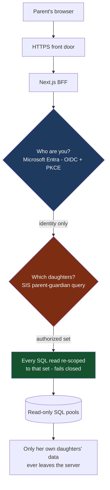
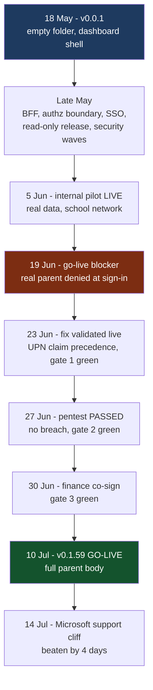

# 2,000 parents, 1 rule, 0 leaks: a parent portal from v0.0.1 to pentested go-live

**Tags:** `security` `nextjs` `webdev` `buildinpublic`

---

What does it take to let nearly 2,000 parents log in and see their daughter's data - attendance, grades, report PDFs, fee statements - and be certain that none of them ever sees anyone else's?

That was the brief. I work as a Data Analyst at an independent K-12 girls' school (~1,100 students), and in **eight weeks** I took a Next.js portal from an empty folder to a penetration-tested go-live: version 0.0.1 on 18 May, live to the full parent body on 10 July. 282 commits, dozens of numbered releases from `0.0.1` to `0.1.59`, one rule that never bent.

In most apps, a bug is a bug. In a school, a single cross-family leak is not a bug - it is an incident involving a child's data. That one constraint drove every decision in this article.

> *"Safe" was not a feature on the list. It was the entire product.*

This is the walkthrough: the architecture rule that held everything together, the go-live blocker that only a real parent could find, why logging out was harder than logging in, and what a 2-day external pentest did (and didn't) find.

---

## Contents

- [The deadline that started it](#the-deadline-that-started-it) - why build, and why the clock was real
- [One rule: authentication is not authorization](#one-rule-authentication-is-not-authorization) - the design idea everything hangs on
- [Boring on purpose](#boring-on-purpose) - 4 production dependencies, read-only by construction
- [The bug only a real parent could find](#the-bug-only-a-real-parent-could-find) - the go-live blocker hiding in a token claim
- [Logging out is harder than logging in](#logging-out-is-harder-than-logging-in) - the family-iPad problem
- [Prove it, don't assert it](#prove-it-dont-assert-it) - isolation under load, audit that fails closed
- [The pentest](#the-pentest) - 2 days, 9 categories, 0 breaches
- [Go-live](#go-live) - three gates and four days of margin
- [Lessons learned](#lessons-learned) - what generalizes beyond schools

---

## The deadline that started it

The school's parent-facing intranet ran on Microsoft technology that reaches end of support on **14 July 2026**. Parents' view of their daughters' information - attendance, timetables, assessment results, report PDFs, fee statements, mandatory data - was scattered across systems that the dying intranet barely surfaced.

Buy or build? The vendor options were compared seriously. But the data already lived in the school's own student information system (SIS) and data warehouse, on-premises, and the hard requirement was a guarantee no brochure makes: **a signed-in parent sees their children, and only their children, every time, under load, forever.**

So: empty folder, 18 May. Version 0.0.1 was a dashboard shell with per-daughter cards. Fifty-three days later, version 0.1.59 went live on 10 July - four days ahead of the cliff.

<sub>[↑ Back to contents](#contents)</sub>

---

## One rule: authentication is not authorization

The core design idea is that *who you are* and *which children you may see* are answered by two independent systems - and the second one never trusts the first.

- **Authentication (who):** Microsoft Entra ID via OIDC authorization-code flow with PKCE. SSO answers identity, full stop. The ID token is fully validated (signature via JWKS, audience, issuer, nonce, expiry), and the session is a signed HttpOnly cookie carrying nothing but an opaque parent ID and an 8-hour expiry.
- **Authorization (which children):** a separate query against the SIS resolves the set of children this person is a parent or guardian of - current year, active enrolment, parent flag set. That set is **re-asserted at the SQL boundary on every single read**. The database query itself is scoped to the authorized children, so even a forged child ID in a request returns nothing. The boundary fails closed.
- **A backend-for-frontend in between:** the browser never talks to the database. Every read flows through a server layer with parameterized SQL only, and a `mock | sql` mode switch so every demo and shared surface runs on synthetic data. Live SQL exists only on the approved host.

The subtle part: the `?student=` parameter in the URL is **selection state, not authorization**. It picks which authorized daughter to display. It can never expand the set. A parent editing the URL to another family's student ID falls back to her own daughter, and the attempt is audited.



*Fig 1 - Authentication and authorization as two independent systems: SSO proves who you are, the SIS decides which children you may see, and the SQL boundary re-checks it on every read.*

> *Auth tells you who. The data boundary decides what they get.*

<sub>[↑ Back to contents](#contents)</sub>

---

## Boring on purpose

The production dependency list is four packages: `next`, `react`, `react-dom`, and the SQL Server driver. Everything else is dev tooling. `npm audit`: 0 vulnerabilities, kept at 0.

That is not minimalism for style points. Every dependency is attack surface, and this app's threat model is "a stranger on the internet, one login away from children's data." Fewer moving parts meant the pentest scope was the code I wrote, not a tree of transitive packages I didn't.

Same logic elsewhere:

- **Read-only by construction.** Every write path returns `405` until write-back is separately approved and governed. You cannot exploit a write that does not exist.
- **Three read-only SQL pools** into the SIS, the warehouse, and payments. No ORM. Parameterized queries only - zero string interpolation in any SQL constant.
- **Data minimization at the mapper boundary.** Medicare numbers masked to the last four digits, medical free-text withheld entirely, finance amounts kept inside the streamed PDF, insurance reduced to a boolean. The API never returns more than the screen needs.
- **On-prem deployment** on a Windows VM as two services: the Next.js standalone server on loopback, and a small TLS-terminating proxy in front. A load test showed nothing heavier was needed.
- **Honest degraded states.** If a data source is down, the UI says "Temporarily unavailable" - it never renders an empty list that could read as "no fees owing" or "no absences."

> *In a child-data system, boring is a security feature.*

<sub>[↑ Back to contents](#contents)</sub>

---

## The bug only a real parent could find

By mid-June the portal was in live pilot. SSO worked. The test logins worked. Then, on 19 June, a supervised test with a real parent - sitting next to me, on the school network - failed. Five sign-in attempts, five denials: *"Authenticated identity is not linked to a current parent."*

Her data was perfect. Correctly linked, two current daughters, nothing stale. The deny path was doing exactly what it was designed to do - fail closed. The defect was that a *legitimate* parent was being denied.

The root cause was one line of claim precedence. The token verifier derived the sign-in identity as:

```ts
claims.email ?? claims.preferred_username ?? claims.upn
```

The identity provider populates `email` from the account's mailbox - and for **~99.6% of parents that is a personal address** (Gmail, Hotmail, work). A personal mailbox can never match the school directory login that the authorization resolver keys on. The school UPN - the value that *does* match - was sitting right there in the token, never consulted, because `email` was present and won the `??` chain.

Why did every earlier test pass? Because staff accounts were tested - and a staff member's `email` claim *is* their school address, so deriving identity from email happened to work. The bug was invisible to every identity except the one that mattered: a real parent with a personal mailbox.

The fix reversed the precedence - school UPN first, email as last-resort fallback:

```ts
claims.upn ?? claims.preferred_username ?? claims.email
```

Authorization untouched. Regression tests added for exactly this token shape. Four days later, the same parent signed in under supervision and saw her own daughter's data - and the same account produced a clean A/B: mailbox-alias form denied, UPN form admitted. Go-live blocker closed, validated on a live token.

> *Test with the users you actually have, not the accounts you happen to hold.*

<sub>[↑ Back to contents](#contents)</sub>

---

## Logging out is harder than logging in

Everyone designs the login flow. The logout flow is where two real defects hid - and in a school, logout matters more than usual, because the device is often a shared family iPad.

**Defect one:** "Log out" cleared the portal's cookie but left the identity provider's web session alive. Click "Sign in" again and you were silently readmitted - as the *previous* user. On a shared device, that is one parent landing in another household's session. Fix: route sign-out through the IdP's federated end-session, not just the local cookie.

**Defect two** surfaced on a school-managed device and was caught in the audit stream: a parent clicked Sign out, the logout was recorded... and 5 to 13 seconds later a fresh successful login appeared. No password prompt. Repeatedly. The managed device's own SSO session was re-vouching for her - ending the web session was futile, and from her seat, sign-out was a no-op.

The fix had two parts: sign-out now lands on the app's own terminal "you are signed out" screen (no silent bounce back into SSO), and the next sign-in carries `prompt=login`, forcing a credential prompt even when a device session is live. Sign-out finally *stuck*.

> *A logout that doesn't survive a managed device isn't a logout. It's a redirect.*

<sub>[↑ Back to contents](#contents)</sub>

---

## Prove it, don't assert it

"No parent can see another family's child" is a claim. Claims are cheap. So I built a load harness that mints **100 concurrent sessions for 100 distinct parents**, floods the app, and inspects every response for cross-family bleed.

Result: **0 errors, 0 cross-family leakage, p50 ≈ 463 ms** on the production VM.

And the honest caveats went into the report next to the headline, because over-claiming performance would undermine the trust story:

- Cache hit-rate is 48% when the same parents return, but only 3% under a distinct-parent flood - real traffic sits between.
- An adversarial cold burst pushed p95 to ~5.5 s. Slow is acceptable; wrong is not.

The other "prove it" mechanism is the audit trail, and it **fails closed**: every child-data read writes a durable audit record - who, which child, which route, which session - *before* the response is returned. If the audit sink cannot be written, the data is not returned. The system can always answer "who looked at what," or it answers nothing. On top of that sits an access monitor watching for anomalies - one identity fanning out across many students, denial bursts, non-parent login bursts.

The regression net grew with every incident: **505 tests passing at 0.1.51**, including a dedicated security suite of 77 tests covering the authorization matrix, SSO negative paths, session tampering, header spoofing, and audit-fail-closed behaviour. Every bug in this article became a permanent test.

<sub>[↑ Back to contents](#contents)</sub>

---

## The pentest

Before go-live, the school commissioned an independent penetration-testing firm: a **2-day authenticated external web-app test**, OWASP-based across nine categories - configuration and leakage, business logic, authentication, authorization/IDOR, session management, input validation (XSS/SQLi), DoS, web services, AJAX - with two test accounts specifically to attempt cross-account escalation.

Two things about the setup mattered as much as the test:

1. **The testers attacked seeded fake families on a fake-data instance behind the real SSO.** Real attack surface, zero real children. Live student data was never in scope.
2. **Known residual risks were signed off *before* the test**, so they would land as *accepted*, not *open*: the stateless session cookie has no server-side revocation (compensated by an 8h TTL, cookie flags, and a secret-rotation kill switch), and inline CSS styles are allowed (scripts are locked behind a per-request nonce CSP). Residuals you document are decisions. Residuals you hide are findings.

Preparation was treated as a discipline, not a patch - structured hardening waves in the weeks prior: nonce-based CSP with no inline scripts, `no-store` on the child-data API surface, constant-time key comparisons on operational endpoints, request body caps, generic client errors with detail kept server-side, and logout converted from GET to POST to close a forced-logout CSRF.

The result: **passed - no breach**. The testers could not penetrate the application, and cross-account escalation did not succeed. The written report went into governance as the citable artifact.

> *The pentest wasn't a security event. It was the audit of eight weeks of security decisions.*

<sub>[↑ Back to contents](#contents)</sub>

---

## Go-live

Go-live was gated on three things, and nothing shipped until all three were green:

1. **A real parent, supervised, signs in via SSO and sees her own daughter's data** - done 23 June (the claim-precedence validation above).
2. **The external pentest comes back clean** - passed 27 June.
3. **Finance co-signs the fee figures** the portal displays - confirmed 30 June, with display corrections landed in the days after.

One more number had to be checked before opening the doors: could every family actually get in? A sizing query across the full parent body found **0 families locked out** - every current student had at least one sign-in-capable authorized parent. The residual was a short, named triage list of individual records for ICT, not a launch risk.

**10 July 2026: live to the full parent body.** Four days ahead of the Microsoft support cliff, fifty-three days after the first commit. Version 0.1.59 - 282 commits and dozens of numbered releases, each one a small, gated, tested step.



*Fig 2 - Fifty-three days from empty folder to go-live: the pilot, the blocker a real parent exposed, three binding gates, and four days of margin on the deadline.*

<sub>[↑ Back to contents](#contents)</sub>

---

## Lessons learned

1. **The tenancy boundary belongs in the data layer, not the application layer.** Re-asserting the authorized scope at the query - and failing closed - is what lets the app grow new surfaces without re-litigating trust each time. This generalizes to every multi-tenant system.
2. **Test with real users, not representative accounts.** The staff account that "proved SSO worked" was structurally incapable of finding the bug that blocked go-live. The 99.6% case was invisible until an actual parent sat down.
3. **Logout is a feature. Design it like one.** Especially anywhere shared and managed devices live - schools, hospitals, kiosks, family iPads.
4. **Publish the caveats next to the headline.** "0 leaks at 100 concurrent parents" earns trust *because* it ships alongside "and here is where p95 got ugly."
5. **Accepted residuals beat hidden residuals.** Signing off known trade-offs before the pentest turned would-be findings into documented decisions.
6. **Boring is a security feature.** Four production dependencies, read-only by construction, parameterized everything. The most auditable code is the code that isn't there.

> *Trust isn't a launch milestone. It's the architecture.*

<sub>[↑ Back to contents](#contents)</sub>

---

## Let's Connect

This was built solo, end to end - data contracts, BFF, SSO, hardening, load testing, deployment, runbooks - alongside a Master's in Software Engineering and AI, with AI coding agents as force multipliers on the mechanical work. The security decisions stayed human.

If you are building anything where one user must never see another user's data - multi-tenant SaaS, health, education, fintech - I'd genuinely like to compare notes.

- 🌐 [luisfaria.dev](https://luisfaria.dev)
- 💼 [LinkedIn](https://www.linkedin.com/in/lfariabr/)
- 🐙 [GitHub](https://github.com/lfariabr)

*Details in this article are de-identified: no school name, no vendor names, no internal hostnames or identifiers. All figures are aggregates or load-test results; no student, parent, or finance records appear anywhere.*
