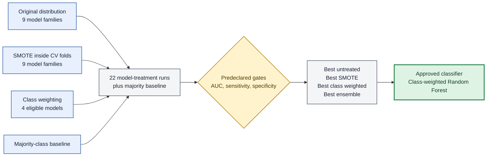
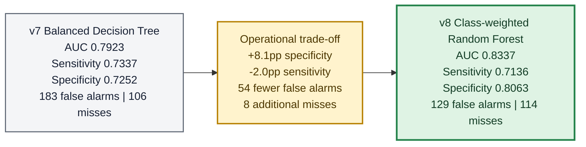

# My Master's assessment selected a Random Forest. Production was still serving a Decision Tree.

**Tags:** `machinelearning` `mlops` `python` `showdev`

<!--
Draft status: review before publishing.
Before publishing:
- generate/export the three TODO figures;
- verify the final live, API, and release URLs;
- add the published sequel link to the update banner in 2026_06_29_wine-ml.md;
- remove this comment.
-->

In June, I published a project called **Sommelier API** and wrote about the idea behind it:
give the same 6,497 wines to two models and ask them different questions.

One model answered a regression question:

```text
How good is this wine on a 0-10 scale?
```

The other answered a classification question:

```text
Is this wine high quality (>=6) or low quality (<6)?
```

The result was a shared machine-learning core, a typed FastAPI service, and a Streamlit
interface. That first story was about moving beyond a notebook and putting models where
someone could actually use them.

Then my Master's degree changed the model.

My revised MLN601 assessment selected a class-weighted Random Forest for classification.
Production was still serving the balanced Decision Tree approved by the previous version.

Neither side was corrupted. The API accurately described the model it had. The assessment
accurately described its newly approved model. The problem was that they now represented
different versions of the same project.

Fixing that mismatch became a better ML engineering lesson than training either model.

This is the sequel to
[*I gave the same 6,497 wines to two models and asked them different questions*](https://dev.to/lfariaus/i-gave-the-same-6497-wines-to-two-models-and-asked-them-different-questions-4hdn).

This work sits inside [MLN601 Machine Learning](https://github.com/lfariabr/masters-swe-ai/blob/master/2026-T2/MLN/README.md),
a core subject in the current term of my Master's degree that I am now close to completing.
I keep the wider learning journey in my public
[Master's repository](https://github.com/lfariabr/masters-swe-ai), where the MLN601 area connects
the 12-week subject plan with detailed module notes, practical notebooks, readings, assessment
iterations, lecturer feedback, and the projects that grew from them. Sommelier API is one of those
projects: academic work carried far enough to expose the engineering problems outside the notebook.

---

## Contents

- [The assessment got wider](#the-assessment-got-wider)
- [The winner did not improve everything](#the-winner-did-not-improve-everything)
- [A notebook is evidence, not a deployment contract](#a-notebook-is-evidence-not-a-deployment-contract)
- [Reproducible did not mean bit-identical everywhere](#reproducible-did-not-mean-bit-identical-everywhere)
- [Changing predictions without breaking clients](#changing-predictions-without-breaking-clients)
- [The UI exposed a boundary bug](#the-ui-exposed-a-boundary-bug)
- [What Dr Kamran's paper changed in how I report ML](#what-dr-kamrans-paper-changed-in-how-i-report-ml)
- [Where Module 9 fits, and where it does not](#where-module-9-fits-and-where-it-does-not)
- [What shipping the model actually meant](#what-shipping-the-model-actually-meant)
- [What I learned](#what-i-learned)

---

## The assessment got wider

The earlier production classifier was a balanced `DecisionTreeClassifier`. It was small,
inspectable, and aligned with the previous assessment submission.

The revised assessment asked a harder question: what happens when I compare more model
families and treat class imbalance in more than one way?

The experiment became a matrix:

- nine estimator families on the original training distribution;
- the same nine with SMOTE applied inside each cross-validation training fold;
- four eligible estimators with `class_weight="balanced"`;
- one majority-class baseline.

That produced **22 model-and-treatment runs plus the baseline**.

The nine families included Logistic Regression, KNN, Decision Tree, SVM, Random Forest,
Gaussian Naive Bayes, Bernoulli Naive Bayes, Multinomial Naive Bayes, and Complement Naive
Bayes. They were not interchangeable decorations. Each tested a different assumption:
linear boundaries, local neighbourhoods, margin separation, probabilistic independence,
single-tree rules, or variance reduction through an ensemble.

SMOTE was never applied to the held-out test set. It lived inside the training folds, so a
validation fold could not influence the synthetic samples used to train its model. The test
set remained untouched and was used only after finalist selection.

The target also remained intentionally easy to misread:

```text
class 1 = low quality  (quality < 6)
class 0 = high quality (quality >= 6)
```

The positive class was the bad outcome. Sensitivity therefore meant the proportion of
genuinely low-quality wines caught by the screen. Specificity meant the proportion of
high-quality wines correctly cleared.

The predeclared gates were applied during five-fold cross-validation on the training data:

```text
ROC-AUC    >= 0.75
Sensitivity >= 0.70
Specificity >= 0.70
```

Among models that passed, balanced accuracy ranked the finalists. Scores within 0.01 were
declared a technical tie, resolved first by a nine-family interpretability rank and then by
balanced accuracy.

That rule actually fired. Four candidates sat inside the tie window:

| Technical-tie candidate | Treatment | CV balanced accuracy | Interpretability rank |
|---|---|---:|---:|
| Random Forest | Class weight | **0.75718** | 7 |
| SVM | Class weight | 0.75622 | 8 |
| SVM | SMOTE | 0.75371 | 8 |
| Random Forest | SMOTE | 0.75107 | 7 |

The winning forest led the class-weighted SVM by only 0.00096. It was not the most
interpretable model in the experiment; it ranked seventh of nine families. It won because
the SVM ranked eighth, then beat the other tied Random Forest on balanced accuracy. That is
relative interpretability, not evidence that an ensemble is inherently transparent.

The approved classifier was:

```python
RandomForestClassifier(
    n_estimators=200,
    max_depth=10,
    min_samples_leaf=1,
    class_weight="balanced",
    random_state=42,
    n_jobs=1,
)
```

<!-- Export as figures/2026_08_02_sommelier_model-matrix.png before publishing. -->



<sub>[Back to contents](#contents)</sub>

---

## The winner did not improve everything

The easy version of this section would say that Random Forest won and move on.

The useful version compares it with the Decision Tree that production already served:

| Held-out metric | v7 Decision Tree | v8 Random Forest | Change |
|---|---:|---:|---:|
| ROC-AUC | 0.7923 | **0.8337** | +0.0414 |
| Accuracy | 0.7284 | **0.7716** | +0.0432 |
| Specificity (high cleared) | 0.7252 | **0.8063** | +0.0811 |
| F1 (low) | 0.6690 | **0.7004** | +0.0314 |
| Sensitivity (low caught) | **0.7337** | 0.7136 | -0.0201 |

The forest improved ranking, accuracy, specificity, and F1. It also reduced sensitivity.

The confusion matrices make the operational meaning clearer:

```text
v7 Decision Tree:  tn=483  fp=183  fn=106  tp=292
v8 Random Forest:  tn=537  fp=129  fn=114  tp=284
```

On the same 1,064-row test set, the new model:

- missed **8 additional low-quality lots** out of 398;
- raised **54 fewer false alarms** out of 666 high-quality lots.

That is the decision, not a footnote. The forest buys a large specificity improvement for
a smaller sensitivity reduction. It had already cleared the training-CV sensitivity gate
at 0.7484. The held-out sensitivity of 0.7136 remained above the same numerical floor, but
the test result confirmed the frozen choice; it did not select it. The forest does not
dominate the tree on every business-relevant metric.

Class weighting and the v7-to-v8 comparison also needed to remain separate ideas.

Class weighting is an imbalance treatment. It changes how an eligible estimator values
errors during training without synthesising rows. The v7-to-v8 comparison changes both the
model family and its fitted decision function. Saying "class weighting improved
specificity" would conflate two different experiments.

<!-- Export as figures/2026_08_02_sommelier_operating-tradeoff.png before publishing. -->



<sub>[Back to contents](#contents)</sub>

---

## A notebook is evidence, not a deployment contract

At this point the assessment had a winner, but production had no reliable way to know what
"the assessment model" meant.

A model name was not enough. Two Random Forests can differ through data identity, duplicate
handling, feature order, target encoding, split seed, hyperparameters, library versions, or
the exact source result used to approve them.

So I introduced an assessment contract. It records:

- the assessment source commit;
- SHA-256 hashes for the submitted notebook, held-out metrics, and selection summary;
- hashes for both raw UCI CSV files;
- raw, duplicate, and unique row counts;
- canonical feature order;
- target semantics and class labels;
- split parameters;
- estimator type and parameters;
- exact held-out metrics and confusion matrix.

A shortened version looks like this:

```json
{
  "contract_version": "mln601-a2-v8",
  "source_commit": "c5be26cf1bb7cc71f8f057fba45aa5b3ea8dd5b2",
  "estimator": {
    "type": "RandomForestClassifier",
    "params": {
      "n_estimators": 200,
      "max_depth": 10,
      "min_samples_leaf": 1,
      "class_weight": "balanced",
      "random_state": 42,
      "n_jobs": 1
    }
  }
}
```

The first version of that contract covered only the A2 classifier. Auditing the other lens
exposed an asymmetry that the phrase "the A1 regressor was unchanged" had hidden:

| Regression evidence | Submitted A1 | Production serving adaptation |
|---|---:|---:|
| Rows modelled | 6,497 | 5,320 |
| Exact duplicates removed | 0 | 1,177 |
| R-squared | 0.5002 | 0.4146 |
| MAE | 0.4364 | 0.5096 |
| RMSE | 0.6075 | 0.6634 |

Production reused the Random Forest configuration selected in A1 but retrained it after
removing exact duplicates. A1 was never resubmitted under that corrected protocol. The
serving metrics were pinned as constants in tests, with no A1 source commit, submission
hash, or model-specific contract. The regressor was stable as a production artifact, but
it was not parity-locked to the submitted assessment.

That did not make the deduplicated model wrong. It made the scope of my provenance claim
too broad: at v0.2.0, executable assessment provenance applied to classification only.

The training code also stopped hardcoding `DecisionTreeClassifier`. A small factory now
dispatches the estimator from the contract. Without that change, the JSON could claim one
model while the Python code silently built another.

The migration pipeline became:

```mermaid
flowchart LR
    A["Master's assessment<br/>notebook + outputs"] --> B["Versioned contract<br/>commits + hashes + metrics"]
    B --> C["Training pipeline<br/>raw CSVs + dedupe + split"]
    C --> D["Committed artifacts<br/>classifier + metrics + schema"]
    D --> E["Parity tests<br/>artifact + fresh retrain"]
    E --> F["FastAPI + Streamlit"]
    F --> G["Production smoke tests<br/>tagged v0.2.0 release"]

    classDef evidence fill:#e8f0fe,stroke:#3568a8,color:#172033,stroke-width:1.5px;
    classDef control fill:#fff3cd,stroke:#b78103,color:#4c3700,stroke-width:1.5px;
    classDef artifact fill:#f4f5f7,stroke:#5d6673,color:#172033,stroke-width:1.5px;
    classDef production fill:#dff3e4,stroke:#24834b,color:#123c25,stroke-width:2px;
    class A evidence;
    class B,C,E control;
    class D artifact;
    class F,G production;
```

<!-- Export as figures/2026_08_02_sommelier_assessment-to-production.png before publishing. -->



This changed provenance from prose into an executable constraint. Training fails if the
dataset identity, feature order, metrics, or confusion matrix diverges from the approved
assessment evidence.

<sub>[Back to contents](#contents)</sub>

---

## Reproducible did not mean bit-identical everywhere

The first parity test was intentionally strict. It freshly retrained the Random Forest and
compared every prediction, probability, parameter, and internal tree against the committed
serving artifact.

It passed on my macOS arm64 machine.

It failed on Linux x64 by **one label out of 1,064 test rows**.

Python, NumPy, SciPy, joblib, and scikit-learn were pinned. The model parameters and random
seeds were identical. A small numerical difference in tree computation was still enough to
move one sample across the 0.5 decision boundary.

The per-sample probability comparison measured a maximum difference of `0.01297316` in the
Linux run.

Pretending this was bit-identical reproducibility would have made the test look stronger
than the evidence.

The revised strategy separates two guarantees:

1. **The committed serving artifact is exact.** It must reproduce every submitted metric
   and confusion-matrix count exactly.
2. **A fresh cross-platform retrain is bounded.** It must retain estimator parameters and
   all 200 tree seeds, differ on at most two labels, remain within `0.005` per aggregate
   metric, and remain within `0.015` per predicted probability.

Before release, `make train` reproduced the classifier, current serving regressor, and
schema byte for byte in the canonical environment. That proved serving-build stability;
it did not prove that the deduplicated regressor reproduced the A1 submission. The only
regenerated difference was the training timestamp in `metrics.json`, which was not committed.

This was one of the most useful lessons in the migration: deterministic source code,
fixed seeds, and pinned packages do not automatically guarantee bitwise equality across
hardware and operating systems.

<sub>[Back to contents](#contents)</sub>

---

## Changing predictions without breaking clients

The model swap intentionally changed classification predictions and probabilities. It did
not need to change how clients talked to the service.

The public endpoints remained:

```text
GET  /health
GET  /features
GET  /model/info
POST /predict/score
POST /predict/grade
POST /predict
```

Request fields, response fields, validation types, and label semantics also stayed the
same. The A1-derived serving artifact and its golden `5.065` score prediction did not move.

I added focused OpenAPI tests that lock:

- every public route and HTTP method;
- the `WineFeatures` request model;
- the score, grade, and combined response models;
- field names, primitive types, and required fields;
- the API version surfaced by Swagger.

The release became `v0.2.0`, not `v0.1.2`, because classification behaviour changed even
though the HTTP schema remained backward compatible.

That distinction matters. API compatibility asks whether a client can still send and
parse the same structures. Model compatibility asks whether the values mean and behave
the same way. The first remained stable; the second intentionally changed.

<sub>[Back to contents](#contents)</sub>

---

## The UI exposed a boundary bug

Updating the Streamlit Model Card sounded like documentation work. It exposed an inference
bug instead.

The shared artifact schema represents wine type numerically:

```text
red   = 1
white = 0
```

The public Pydantic API accepts:

```json
{ "wine_type": "red" }
```

Local inference accepted either representation. The API boundary did not. When a numeric
artifact example went through API mode, FastAPI returned `422`. The Streamlit service then
fell back to the local model, exactly as designed for a cold backend.

The interface still returned a prediction, which made the integration failure easy to
miss.

The fix explicitly translates `1/0` into `"red"/"white"` before the HTTP request. A parity
test now sends the example wine through local Streamlit inference and the FastAPI path and
requires the score, class, and probabilities to match.

This was a reminder that graceful fallback can hide defects as effectively as it hides
outages. A resilient interface still needs evidence about which path actually served the
result.

The updated Model Card now presents two different explanations separately:

- why class weighting was considered as an imbalance treatment;
- what changed operationally between the served v7 tree and the approved v8 forest.

It also makes the sensitivity reduction visible instead of placing it behind the stronger
headline metrics.

<sub>[Back to contents](#contents)</sub>

---

## What Dr Kamran's paper changed in how I report ML

[Dr Kamran Shaukat](https://github.com/lfariabr/masters-swe-ai/blob/master/2026-T2/MLN/README.md#learning-facilitator)
is my lecturer for MLN601 Machine Learning. During Module 9, he shared his 2024 paper,
[*A novel machine learning approach for detecting first-time-appeared malware*](https://www.sciencedirect.com/science/article/pii/S0952197623019851),
as both a real-world example of anomaly-oriented thinking and a model for communicating
experimental results.

Its method is not a Random Forest pipeline. It converts Windows binaries into RGB images,
extracts deep features with pretrained CNNs, reduces those features with PCA, and uses a
one-class SVM to learn a boundary around benign software.

I did not copy those algorithms into Sommelier API.

What transferred was the structure of the argument.

His paper makes the pipeline explicit:

```text
raw input
-> representation
-> feature extraction
-> feature reduction
-> classifier
-> evaluation
```

It also refuses to trust accuracy alone on imbalanced data. The results are reported with
balanced accuracy, precision, recall, specificity, F1, G-mean, and AUC. Each result is
attached to a concrete model and hyperparameter configuration.

The writing rhythm I took from it is:

```text
point -> quantify -> compare -> explain -> qualify
```

Applied to this project:

> The class-weighted Random Forest reached ROC-AUC 0.8337, compared with 0.7923 for the
> previously served tree. The largest gain was specificity, which increased from 0.7252
> to 0.8063. However, sensitivity decreased from 0.7337 to 0.7136, corresponding to eight
> additional low-quality lots not detected on the held-out test. The forest therefore
> changes the operating trade-off rather than improving every screening outcome.

That paragraph does five jobs. It identifies the result, gives exact numbers, provides a
baseline, explains the operational meaning, and states the limitation.

The same pattern shaped the release:

- one paragraph or caption per table and figure;
- configurations reported exactly, not as "the better model";
- multiple metrics read together;
- limitations kept visible;
- source evidence and deployment state tied through provenance.

The project does not yet reproduce everything I admired in the paper. I did not add a
Wilcoxon significance test to this serving migration. The API does not provide per-lot
SHAP explanations. Its probabilities have not been calibrated. Those remain limitations,
not implied features.

The paper also sits at the end of a three-paper research arc by Kamran Shaukat, Suhuai Luo,
and Vijay Varadharajan: a [2022 study of robustness against adversarial attacks](https://www.sciencedirect.com/science/article/pii/S0952197622004511),
a [2023 hybrid deep-learning malware detector](https://www.sciencedirect.com/science/article/pii/S0952197623002142),
and the 2024 work on first-time-appeared malware. Reading the sequence reinforced another
lesson that now shapes this project: model performance is not a permanent property. The data,
threats, assumptions, and deployment context can move, so the evidence around a model must be
maintained too.

My detailed [Module 9 class notes](https://github.com/lfariabr/masters-swe-ai/blob/master/2026-T2/MLN/modules/module-09-kmeans-clustering/module09_notes-class.md)
document how I connected the paper, the lecture, clustering concepts, imbalanced evaluation,
and the reporting pattern I applied here.

<sub>[Back to contents](#contents)</sub>

---

## Where Module 9 fits, and where it does not

Module 9 was about K-means and the broader clustering family. Sommelier API v0.2.0 does
not use K-means, DBSCAN, OPTICS, or K-medoids.

The distinction matters:

| Module 9 clustering | Sommelier classification |
|---|---|
| Unsupervised, no target label | Supervised, known `quality_label` |
| Cluster IDs are arbitrary | Class 1 and class 0 have fixed meanings |
| Evaluate inertia, silhouette, Davies-Bouldin | Evaluate confusion matrix, sensitivity, specificity, F1, AUC |
| Scaling is critical for distance-based K-means | Tree ensembles do not require feature scaling |
| Choose `k` and a distance geometry | Choose a classifier, imbalance treatment, and operating threshold |

The transferable lesson is that a measurement only makes sense relative to the problem.

Dr Kamran used SMC versus Jaccard to show that two similarity measures can disagree because
they interpret shared absence differently. In this classifier, sensitivity and specificity
can disagree because they value different sides of the confusion matrix.

There is no context-free "best" measurement. The domain decides what a match, miss,
distance, or false alarm means.

The v8 tiebreak made that concrete. The Random Forest's CV balanced accuracy exceeded the
class-weighted SVM by less than one thousandth. The declared interpretability rank then
favoured the forest 7 to 8. Change the decision policy, or value margin-based separation
over ensemble feature attribution, and the recommendation could change without any metric
being recalculated.

Module 9's four-step business workflow also survives the change from clustering to
classification:

```text
collect and clean
-> choose the configuration
-> run the algorithm
-> evaluate whether the result is meaningful
```

The algorithm is only one box in the pipeline. The graded thinking sits around it.

<sub>[Back to contents](#contents)</sub>

---

## What shipping the model actually meant

Sommelier API `v0.2.0` was released only after the following state agreed:

```text
Master's assessment
    same approved estimator and metrics

assessment contract
    same source commit, hashes, target, split, and parameters

committed artifacts
    same predictions, probabilities, and confusion matrix

FastAPI and Streamlit
    same model metadata and example-wine result

production
    same contract, API version, and golden predictions
```

The release audit verified:

- Python `3.11.9` and scikit-learn `1.9.0`;
- 39 passing tests;
- 23 focused parity tests;
- a clean lint run;
- exact classifier, regressor, and schema reproduction;
- `mln601-a2-v8` provenance from `/health`;
- exact Random Forest parameters and metrics from `/model/info`;
- API version `0.2.0` from `/openapi.json`;
- `low`, label `1`, `proba_high=0.1681`, and `proba_low=0.8319` for the example wine;
- the unchanged A1 score prediction of `5.065`;
- public Render and Streamlit deployments;
- an annotated Git tag and GitHub Release pointing to the verified commit.

The final public surfaces are:

- **Streamlit:** [sommelier-api.streamlit.app](https://sommelier-api.streamlit.app/)
- **Swagger:** [sommelier-api-yd1m.onrender.com/docs](https://sommelier-api-yd1m.onrender.com/docs)
- **Code:** [github.com/lfariabr/sommelier-api](https://github.com/lfariabr/sommelier-api)
- **Release:** [v0.2.0](https://github.com/lfariabr/sommelier-api/releases/tag/v0.2.0)

<sub>[Back to contents](#contents)</sub>

---

## What I learned

The first Sommelier article taught me that a trained model is not a product.

This release taught me that a deployed model is not automatically a trustworthy ML
system either.

A trustworthy system needs answers to questions that a `.fit()` call cannot provide:

- Which source evidence approved this estimator?
- Which exact data and target semantics trained it?
- Was class imbalance treated only inside training?
- Which metrics improved, and which one got worse?
- Can another environment reproduce the result within an honest bound?
- Can clients survive a model change without rewriting their integrations?
- Does the interface expose the trade-off or only the winning headline?
- Does production serve the same artifact that the documentation describes?

My Master's assessment supplied the experimental evidence. The engineering work turned
that evidence into a contract, an artifact, two serving surfaces, and a release that could
be checked independently.

That is now the part of the project I value most.

I did not just replace a Decision Tree with a Random Forest. I learned how to change the
model without losing the truth around it.

---

## References

- Cortez, P., Cerdeira, A., Almeida, F., Matos, T., & Reis, J. (2009). *Modeling wine
  preferences by data mining from physicochemical properties.* Decision Support Systems,
  47(4), 547-553. [UCI Wine Quality](https://archive.ics.uci.edu/dataset/186/wine+quality).
- Shaukat, K., Luo, S., & Varadharajan, V. (2024). *A novel machine learning approach for
  detecting first-time-appeared malware.* Engineering Applications of Artificial
  Intelligence, 131, 107801. [ScienceDirect](https://www.sciencedirect.com/science/article/pii/S0952197623019851).
- Shaukat, K., Luo, S., & Varadharajan, V. (2023). *A novel deep learning-based approach
  for malware detection.* [ScienceDirect](https://www.sciencedirect.com/science/article/pii/S0952197623002142).
- Shaukat, K., Luo, S., & Varadharajan, V. (2022). *A novel method for improving the
  robustness of deep learning-based malware detectors against adversarial attacks.*
  [ScienceDirect](https://www.sciencedirect.com/science/article/pii/S0952197622004511).
- [Master's of Software Engineering and Artificial Intelligence learning repository](https://github.com/lfariabr/masters-swe-ai).
- [MLN601 Machine Learning subject hub](https://github.com/lfariabr/masters-swe-ai/blob/master/2026-T2/MLN/README.md).
- [MLN601 Module 9 class notes](https://github.com/lfariabr/masters-swe-ai/blob/master/2026-T2/MLN/modules/module-09-kmeans-clustering/module09_notes-class.md).
- [Sommelier API source](https://github.com/lfariabr/sommelier-api).
- [Sommelier API v0.2.0 release](https://github.com/lfariabr/sommelier-api/releases/tag/v0.2.0).
- [Original Sommelier article](https://dev.to/lfariaus/i-gave-the-same-6497-wines-to-two-models-and-asked-them-different-questions-4hdn).
