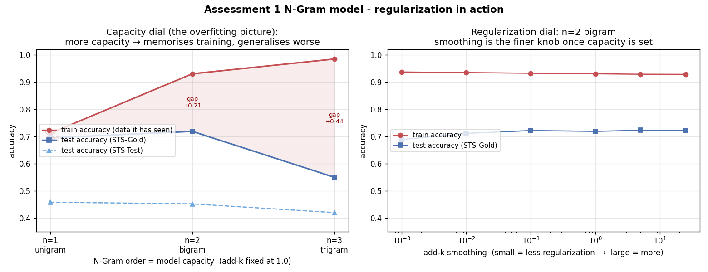
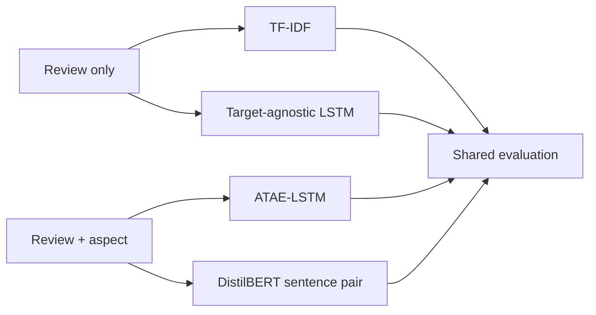
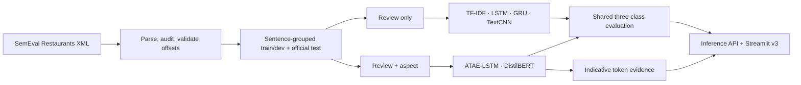
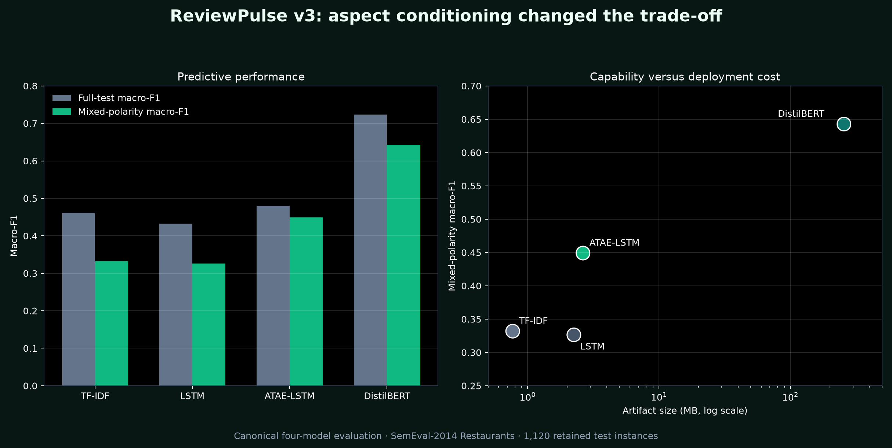
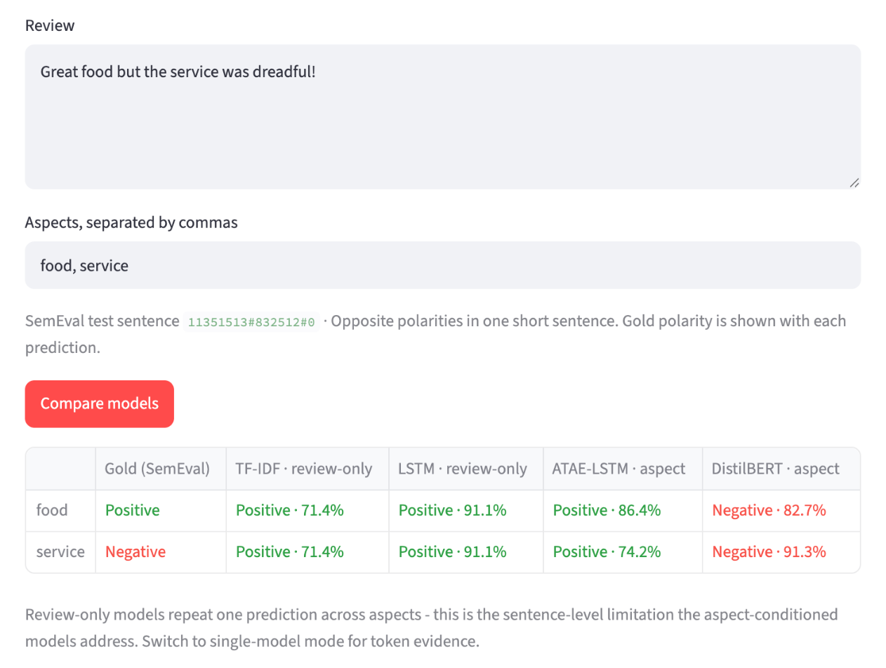
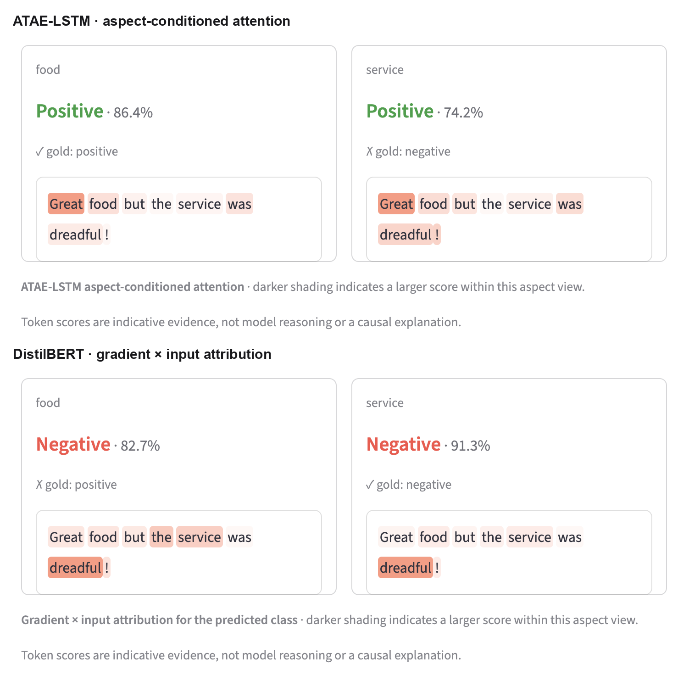

# What happens between a token and a prediction? Making sentiment models inspectable

**Tags:** `machinelearning` `deeplearning` `nlp` `showdev`

> *"Great food but the service was dreadful!"*

This is a verbatim sentence from the [SemEval-2014 Restaurants](https://alt.qcri.org/semeval2014/task4/) test split. It contains two aspects with opposite sentiments: `food` is positive, while `service` is negative.

ReviewPulse v2 had one job: assign one sentiment label to an entire review. For this sentence, whichever label it chose, one opinion disappeared.

Over four months and two master's subjects — from **ISY503 Intelligent Systems** to **DLE602 Deep Learning** — I rebuilt ReviewPulse from a binary Amazon-review classifier into a six-model aspect-based sentiment system.

The first public commit landed on 14 April 2026. By the v3 release, the project had crossed **200 public commits**, with 363 passing tests, 3 documented dataset-dependent skips, 6 versioned inference artifacts, reproducible evaluations, token-level evidence, and a deployed Streamlit application.

This is not a story about replacing a small model with a bigger one and watching every number improve. The baseline beat my first neural network. A trigram nearly memorised its training set and generalised worse. A lightweight attention model improved the subset I cared about while still losing the overall benchmark to the Transformer. The Transformer eventually won — and turned predictive performance into a trade-off involving storage, delivery, and inspectability.

That made the central question personal: **what happens between the text and the label?**

Many sentiment demos receive language, return a class and confidence, and hide which tokens influenced the output. ReviewPulse v3 became my attempt to expose part of that hidden behaviour:

- ATAE-LSTM exposes attention weights.
- DistilBERT exposes token-attribution scores.

These views do not reveal a model's private reasoning. They provide indicative, token-level evidence that can be inspected aspect by aspect — especially when the final prediction is wrong.

---

## Contents

- [The sentence that broke v2](#the-sentence-that-broke-v2)
- [Two subjects, one evolving product](#two-subjects-one-evolving-product)
- [Where deep learning earned its cost](#where-deep-learning-earned-its-cost)
- [The demo became part of the evidence](#the-demo-became-part-of-the-evidence)
- [What building in public actually meant](#what-building-in-public-actually-meant)
- [Where ReviewPulse goes next](#where-reviewpulse-goes-next)
- [Try it yourself](#try-it-yourself)

---

## The sentence that broke v2

The ISY503 version of ReviewPulse classified one complete Amazon review as positive or negative:

```text
Input:  "Great food but the service was dreadful!"
Output: one sentiment label for the entire text
```

That is review-level sentiment analysis. It can be useful, but it cannot represent two opinions attached to two targets inside the same sentence.

The product question changed in DLE602:

```text
Input:  review + supplied aspects
Output: one label per aspect

food    -> positive
service -> negative
```

This is **aspect-based sentiment analysis (ABSA)**. The difference looks small in the interface, but architecturally, it changes the task: a review-only model sees identical input for `food` and `service`, so it has no basis for changing its answer while an aspect-conditioned model receives `(review, aspect)` and can construct a different representation for each target.

That one missing input became the research problem for the next version.

<sub>[↑ Back to contents](#contents)</sub>

---

## Two subjects, one evolving product

### ISY503: the first working product

ISY503 Assessment 3 began with **8,000 labelled Amazon reviews** across four domains. I treated it as a small product: parser and data audits, leakage-safe splits, TF-IDF and BiLSTM models, one inference API, error analysis, and a Streamlit interface.

| ISY503 model | Test F1 |
|---|---:|
| TF-IDF + Logistic Regression | **81.9%** |
| BiLSTM + GloVe | 80.3% |
| DistilBERT, added in v2 | **88.6%** |

The baseline beat the neural network. DistilBERT later beat both through contextual pretraining, not self-attention alone. More importantly, the interface exposed negation, sarcasm, short ambiguous inputs, and mixed sentiment that would otherwise remain buried in a CSV.

---

### DLE602 A1: the N-Gram warning

Assessment 1 was a separate Twitter exercise, but it became the intellectual bridge. The same probabilistic bigram reached `0.719` accuracy and `0.726` macro-F1 on binary STS-Gold, yet only `0.452` and `0.401` on three-class STS-Test, where neutral existed only as a threshold outcome. A capacity sweep then pushed trigram training accuracy to `0.99` while test accuracy fell to `0.42` on STS-Test and `0.55` on STS-Gold. More capacity meant more memorisation, not more understanding.



*Fig 1 — DLE602 A1 capacity and add-k regularisation sweep. The trigram nearly memorises the training set while test performance falls.*

Two rules carried into ReviewPulse v3: (1) a score belongs to the dataset and slice where it was measured, (2) and additional capacity deserves suspicion until held-out evidence proves otherwise.

---

### DLE602 A2: turning weakness into research questions

For DLE602 Assessment 2, I returned to ReviewPulse and converted the mixed-sentiment limitation into three research questions:

1. **RQ1:** Does explicit aspect conditioning improve classification on multi-aspect sentences over target-agnostic baselines?
2. **RQ2:** How do a lightweight ATAE-LSTM and a pretrained DistilBERT compare on predictive performance and efficiency?
3. **RQ3:** Can attention or attribution expose useful token-level evidence from otherwise black-box predictions without pretending to reveal causal reasoning?

The proposal deliberately defined a four-model ladder:



The comparison was about **input information**, not just architecture. TF-IDF and LSTM receive only the review. ATAE-LSTM and DistilBERT receive the review-aspect pair. Optional GRU and TextCNN variants could be added later, but they were not allowed to replace the canonical experiment.

ReviewPulse moved from whole Amazon reviews to **SemEval-2014 Task 4 Restaurants**, where one sentence can carry several gold aspect terms and polarities. The implementation now had to prove the proposal, not merely resemble it.

---

### DLE602 A3: building the experiment

The audit found **4,827 aspect annotations**: 4,722 retained three-class instances and 105 original `conflict` labels counted and excluded. The official test contributes 1,120 retained instances, including a mixed-polarity subset of 228 instances across 80 sentences. That subset contains different aspects with different gold polarities; it is not the removed SemEval `conflict` label.

The data pipeline groups development splits by sentence ID before expanding aspects, preventing two aspects from the same sentence leaking across train and validation. Neural trainers use fixed seeds, early stopping, development macro-F1 selection, and best-checkpoint restoration.

The final experimental architecture looks like this:



The implementation includes six model paths, artifact provenance, mixed-subset evaluation, confusion matrices, attention alignment, gradient × input attribution, Streamlit comparison mode, cached loading, thread-safe predictors, deterministic packages, and Git LFS artifacts. The recorded development run is **363 passed and three documented skips**; test collection confirms 366 nodes. Clean clones skip additional licensed-data checks, and that difference is recorded explicitly.


*Fig 2 — Canonical four-model confusion matrices on 1,120 retained SemEval Restaurants test instances. Rows are gold labels; columns are predictions.*

<sub>[↑ Back to contents](#contents)</sub>

---

## Where deep learning earned its cost

The canonical four-model result:

| Model | Full-test macro-F1 | Mixed-polarity macro-F1 | Artifact (MiB) |
|---|---:|---:|---:|
| TF-IDF review-only | 0.4605 | 0.3319 | 0.77 |
| LSTM review-only | 0.4326 | 0.3264 | 2.25 |
| ATAE-LSTM aspect-conditioned | 0.4799 | 0.4491 | 2.64 |
| DistilBERT sentence-pair | **0.7231** | **0.6427** | **256.11** |



*Fig 3 — Aspect conditioning improved the mixed-polarity slice, while DistilBERT introduced a very different deployment cost.*

The lower macro-F1 values are not a hidden pipeline failure. Positive examples dominate the official test set, with 728 instances against 196 negative and 196 neutral. Neutral is the hardest class: its F1 is 0.1794 for TF-IDF, 0.1322 for LSTM, 0.2888 for ATAE-LSTM, and 0.4931 even for DistilBERT. Macro-F1 gives all three classes equal weight, so that weakness remains visible instead of disappearing behind positive-heavy accuracy.

DistilBERT won every predictive metric. Its advantage does not come from self-attention alone: it starts with contextual representations learned through large-scale language-model pretraining, while the smaller neural models learn their task representations from the comparatively small SemEval benchmark.

The useful findings sit underneath it:

- Against the review-only LSTM, DistilBERT gained 31.6 percentage points of mixed-polarity macro-F1.
- ATAE-LSTM improved mixed macro-F1 from 0.3264 to 0.4491 while remaining a 2.64 MiB artifact.
- Four-model error analysis found 61 mixed cases where both aspect-conditioned models were correct and both review-only models were wrong, versus four cases in the opposite direction.
- The four models disagreed on 428 official-test instances and all missed 134.

The larger model was better, but the smaller aspect-aware model demonstrated something equally important: **conditioning changed the model's capability before scale changed its quality**.

The table is pinned to the canonical artifact commit `bf36c3b`. A later six-model retraining produced `0.7199` DistilBERT macro-F1 instead of `0.7231`. Both runs used seed 42 and the same dataset checksum, but they are different frozen MPS-trained artifacts. Fixed seeds support provenance; they do not make Apple MPS retraining bit-identical.

The deployment cost then became real. The tagged v3.0.0 archives measure **51.54 MiB** for the lightweight ZIP and **287.30 MiB** for the complete ZIP. The DistilBERT directory is **256.11 MiB uncompressed**, but ZIP deflation reduces its files to about **235.75 MiB**; that compressed payload accounts for essentially the entire **235.75 MiB difference** between the two archives. A model-selection decision had become a packaging and delivery decision.

That is ML engineering: the best metric does not cancel storage, delivery, or reproducibility constraints.

<sub>[↑ Back to contents](#contents)</sub>

---

## The demo became part of the evidence

The first v3 interface hid the most important finding behind a model dropdown. You could run TF-IDF, then LSTM, then ATAE-LSTM, but you had to remember every output yourself.

The current comparison mode renders an aspect-by-model matrix. Review-only columns repeat one result for every aspect because they receive identical review input. Aspect-conditioned columns are allowed to change.

Then I added a Gold column using six traceable SemEval test examples. This changed the demo from a confidence display into something a marker can inspect critically. Agreement is no longer automatically impressive: if every model predicts negative while the gold label is positive, the failure is visible immediately.



*Fig 4 — Compare mode on traceable SemEval test sentence `11351513#832512#0`. The review-only columns repeat one prediction across both aspects, while the Gold column makes every correct and incorrect result immediately visible.*

The evidence views follow the same rule. ATAE-LSTM exposes learned attention weights; DistilBERT exposes gradient × input attribution aligned to visible review tokens. TF-IDF, LSTM, GRU, and TextCNN explicitly report token evidence as unsupported.



*Fig 5 — ATAE-LSTM attention and DistilBERT gradient × input attribution for the same review and supplied aspects. Both models miss one gold label in opposite directions, while their token-level evidence changes with the aspect.*

This is the thesis I wanted the product to make visible. A normal classifier compresses everything it processed into a label and a confidence score. The heatmap gives me a way to inspect the intermediate signal that usually disappears: which visible tokens received stronger attention or attribution for one supplied aspect, and how that pattern changes when the aspect changes. It turns a hidden model behaviour into something I can compare, question, and debug.

That does not make the models transparent, and I do not call those views model reasoning. Attention can change without changing a prediction, and attribution is not a causal explanation. They are **indicative token-level evidence** useful for inspecting sensitivity and diagnosing errors. To me, that boundary is the interesting result: I did not solve the black-box problem, but I proved that the application can expose a meaningful, testable slice of what the model did with the tokens it received.

The honest example remains useful: for *"Great food but the service was dreadful!"*, ATAE-LSTM predicted both aspects positive while DistilBERT predicted both negative. The evidence changed with the supplied aspect, but neither model resolved both gold labels. The visualisation exposed the failure instead of explaining it away.

<sub>[↑ Back to contents](#contents)</sub>

---

## What building in public actually meant

Building in public meant leaving the uncomfortable parts visible in Git history:

- TF-IDF beating my BiLSTM and the trigram memorising its training set;
- unsafe XML parsing and misleading skip semantics corrected through review;
- sentence-grouped splits and device assumptions made explicit;
- attention kept indicative, never promoted to causal explanation;
- Git LFS artifacts, cached and locked predictors, and controlled missing-model states;
- clean-room skip differences documented instead of rounded away;
- a 256 MiB Transformer turning model choice into a delivery trade-off.

Issues became bounded contracts; branches isolated changes; PRs carried evidence and review. Codex and Claude implemented and reconciled bounded work under my direction, and CodeRabbit reviewed pull requests. I owned the architecture, the research questions, and every merge. I verified claims against source and rejected agent output that was wrong, including a confident, correct-looking citation "correction" that would have introduced an error into the report. The decisions, and the mistakes, are mine.

A3 was assessed as a group, and two people tested work I could not mark my own homework on. Juan Martinez ran independent acceptance QA against the deployed application. Victor Dorantes independently reproduced the results on different hardware, including a CUDA retrain that diverged from my frozen DistilBERT metrics; that run is versioned separately rather than quietly merged over the canonical numbers.

> Building in public is not evidence that every decision was right. It is evidence that the decisions, corrections, and trade-offs can be inspected.

<sub>[↑ Back to contents](#contents)</sub>

---

## Where ReviewPulse goes next

Version 3.0 is an academic comparison environment. The next step is not a seventh model; it is a stronger evidence layer with calibrated probabilities, comparable attribution experiments, error categories, and interfaces that help investigate failure without claiming access to hidden reasoning.

I would keep Streamlit as the demonstration client and put a versioned FastAPI service around inference. A later product phase would add automatic aspect extraction, user correction, category normalisation, batch analysis, and emerging-topic discovery. That is when ReviewPulse stops being only a classifier and becomes an aspect-intelligence platform.

<sub>[↑ Back to contents](#contents)</sub>

---

## Try it yourself

- **Live application:** [ReviewPulse v3.0.0](https://review-pulse.streamlit.app/ReviewPulse_v3_0_0)
- **ReviewPulse source:** [github.com/lfariabr/review-pulse](https://github.com/lfariabr/review-pulse)
- **Public Master's repository:** [github.com/lfariabr/masters-swe-ai](https://github.com/lfariabr/masters-swe-ai)
- **ISY503 project history:** [2026-T1/ISY/Assessment 3](https://github.com/lfariabr/masters-swe-ai/tree/master/2026-T1/ISY/assignments/Assessment3)
- **DLE602 A1 N-Gram study:** [2026-T2/DLE/Assessment 1](https://github.com/lfariabr/masters-swe-ai/tree/master/2026-T2/DLE/assignments/Assessment1)
- **DLE602 A2 proposal and A3 report:** [2026-T2/DLE assignments](https://github.com/lfariabr/masters-swe-ai/tree/master/2026-T2/DLE/assignments)
- **v3.0.0 release, with both archive SHA-256 digests:** [review-pulse/releases/tag/v3.0.0](https://github.com/lfariabr/review-pulse/releases/tag/v3.0.0)

If you have built an NLP system, which result taught you more: the model that won, or the one that failed in a way you could finally explain?

---

## References and context

- Blitzer, Dredze, and Pereira (2007), [*Biographies, Bollywood, Boom-boxes and Blenders: Domain Adaptation for Sentiment Classification*](https://aclanthology.org/P07-1056/).
- Pontiki et al. (2014), [*SemEval-2014 Task 4: Aspect Based Sentiment Analysis*](https://aclanthology.org/S14-2004/).
- Wang et al. (2016), [*Attention-based LSTM for Aspect-level Sentiment Classification*](https://aclanthology.org/D16-1058/).
- Sanh et al. (2019), [*DistilBERT, a distilled version of BERT*](https://arxiv.org/abs/1910.01108).
- Jain and Wallace (2019), [*Attention is not Explanation*](https://aclanthology.org/N19-1357/).

---

## Let's connect

- **GitHub:** [github.com/lfariabr](https://github.com/lfariabr)
- **LinkedIn:** [linkedin.com/in/lfariabr](https://www.linkedin.com/in/lfariabr/)
- **Portfolio:** [luisfaria.dev](https://luisfaria.dev)

*The model is only one commit. The system is everything that happened around it.*
