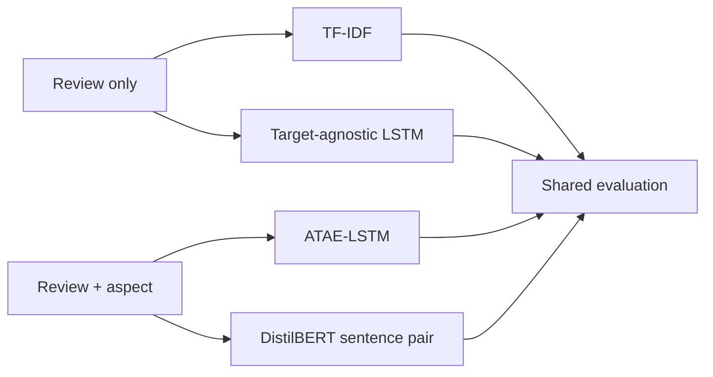
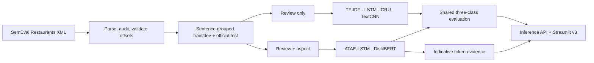
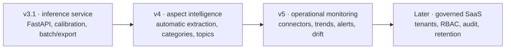

# What happens between a token and a prediction? Making sentiment models inspectable

**Tags:** `machinelearning` `deeplearning` `nlp` `showdev`

<!--
Draft version: v1 · 2026-08-09.
Draft status: publish after the final ReviewPulse v3.0.0 tag.
Before publishing: refresh the final test count, verify the live and release URLs,
and remove this comment.
-->

> *"Great food but the service was dreadful!"*

That is not a polished example invented for this article. It is a literal sentence from the SemEval test split that later became one of ReviewPulse v3's traceable demo cases.

ReviewPulse v2 had one job: decide whether that review was positive or negative. Whatever label it returned, one opinion disappeared.

That limitation followed me from **ISY503 Intelligent Systems** into **DLE602 Deep Learning**. Across 5 university subjects and four months of public development, I rebuilt the same product from a binary Amazon-review classifier into a six-model aspect-based sentiment laboratory.

The [ReviewPulse repository](https://github.com/lfariabr/review-pulse) itself starts on 14 April 2026. By the v3 release it had crossed **200 public commits**, alongside 350+ passing tests, six versioned inference artifacts, reproducible evaluations, token-level evidence, and a deployed Streamlit application.

This is not a story about replacing a small model with a bigger one and watching every number go up. The baseline beat my first neural network. A trigram memorised its training set and generalised worse. A lightweight attention model improved the exact subset I cared about while still losing the overall benchmark to the Transformer. The Transformer won the benchmark and forced me to confront what predictive performance costs in storage, delivery, and inspectability.

That messiness is the useful part.


---

## Contents

- [The sentence that broke v2](#the-sentence-that-broke-v2)
- [Where AI, machine learning, and deep learning fit](#where-ai-machine-learning-and-deep-learning-fit)
- [Phase one: ISY503 and the first working product](#phase-one-isy503-and-the-first-working-product)
- [The bridge: a deliberately simple N-Gram](#the-bridge-a-deliberately-simple-n-gram)
- [Assessment 2: turning a product weakness into research questions](#assessment-2-turning-a-product-weakness-into-research-questions)
- [Assessment 3: building the experiment for real](#assessment-3-building-the-experiment-for-real)
- [Where deep learning earned its cost](#where-deep-learning-earned-its-cost)
- [The demo became part of the evidence](#the-demo-became-part-of-the-evidence)
- [What building in public actually meant](#what-building-in-public-actually-meant)
- [What I learned](#what-i-learned)
- [Where ReviewPulse goes next](#where-reviewpulse-goes-next)
- [Try it yourself](#try-it-yourself)

---

## The sentence that broke v2

The ISY503 version of ReviewPulse classified one complete Amazon review as positive or negative:

```text
Input:  "Great food but the service was dreadful!"
Output: one sentiment label for the entire text
```

That is review-level sentiment analysis. It can be useful, but it cannot represent two opinions attached to two targets inside the same sentence.

The product question changed in DLE602:

```text
Input:  review + supplied aspects
Output: one label per aspect

food    -> positive
service -> negative
```

This is **aspect-based sentiment analysis (ABSA)**. The difference looks small in the interface. Architecturally, it changes the task. A review-only model sees identical input for `food` and `service`, so it has no basis for changing its answer. An aspect-conditioned model receives `(review, aspect)` and can construct a different representation for each target.

That one missing input became the research problem for the next version.

<sub>[↑ Back to contents](#contents)</sub>

---

## Where AI, machine learning, and deep learning fit

ReviewPulse stopped these terms being abstract definitions for me. The AI system is the complete product: language input, model selection, predictions, evidence, failure handling, and an interface a person can inspect. Its TF-IDF baseline is machine learning; LSTM, GRU, TextCNN, ATAE-LSTM, and DistilBERT are deep-learning components. Codex, Claude, and CodeRabbit belong to a fourth category: AI-assisted engineering tools used to plan, inspect, challenge, and review the work.

Deep learning is not the product, and TF-IDF is not "less AI" because it is simpler. Every architecture still has to earn its complexity against the baseline and against the constraints of the surrounding system.

The question that became personal for me was what happens between the text and the label. Most sentiment interfaces behave like complete black boxes: they receive a sentence, return a class and confidence, and hide which tokens shaped that output. ReviewPulse v3 became my attempt to make part of that hidden behaviour inspectable. ATAE-LSTM exposes attention weights; DistilBERT exposes token-attribution scores. The goal was not to pretend I could display a model's private reasoning. It was to show, token by token and aspect by aspect, what signal each supported model assigned to the text it received — especially when the final prediction was wrong.

<sub>[↑ Back to contents](#contents)</sub>

---

## Phase one: ISY503 and the first working product

ISY503 Assessment 3 asked for an end-to-end sentiment classifier over the Blitzer, Dredze, and Pereira Amazon review corpus. My local dataset contained **8,000 labelled reviews** across books, DVDs, electronics, and kitchen products.

I could have submitted a notebook and a button. Instead, I treated it as a small product:

- a parser for the pseudo-XML source files;
- label and rating audits;
- leakage-safe train, validation, and test splits;
- a TF-IDF + Logistic Regression baseline;
- a PyTorch BiLSTM with optional GloVe embeddings;
- one inference API shared by evaluation and Streamlit;
- confusion matrices and error analysis;
- a public application with model selection and sample reviews.

The first held-out result was exactly the kind worth keeping public:

| ISY503 model | Test F1 |
|---|---:|
| TF-IDF + Logistic Regression | **81.9%** |
| BiLSTM + GloVe | 80.3% |
| DistilBERT, added in v2 | **88.6%** |

The baseline beat the neural network. The Transformer later beat both.

That sequence taught me more than a clean progression ever could. With only 8,000 reviews, bigrams already captured highly discriminative phrases. The BiLSTM showed mild overfitting. DistilBERT finally justified the additional machinery through contextual pre-training, but it also introduced dependency, artifact, and deployment costs.

The Streamlit interface made the limitations impossible to hide. Negation, sarcasm, ambiguous short inputs, and mixed sentiment were no longer rows buried in a CSV. A marker could type them into the box.

The old, unpublished ReviewPulse article draft ends around this point. I kept it as a private snapshot of what I understood then. The project did not end there.

<sub>[↑ Back to contents](#contents)</sub>

---

## The bridge: a deliberately simple N-Gram

DLE602 Assessment 1 was a separate Twitter sentiment exercise, not ReviewPulse code. It became the intellectual bridge between versions.

The task required a probabilistic N-Gram language model. I trained separate positive and negative bigram models on an 80,000-tweet Sentiment140 sample, then applied the same model and decision rule to two evaluation sources.

| Dataset | Classes | Accuracy | Macro-F1 |
|---|---:|---:|---:|
| STS-Test | negative / neutral / positive | 0.452 | 0.401 |
| STS-Gold | negative / positive | 0.719 | 0.726 |

Same implementation, very different usefulness. STS-Test introduced a neutral class the model had never genuinely learned; neutrality existed only as a threshold outcome. STS-Gold was binary and linguistically closer to the training source.

Then I swept capacity:

| N-Gram order | Training accuracy | STS-Test | STS-Gold | Train-test gap |
|---|---:|---:|---:|---:|
| Unigram | 0.71 | 0.46 | 0.69 | 0.25 |
| Bigram | 0.93 | 0.45 | 0.72 | 0.48 |
| Trigram | **0.99** | 0.42 | 0.55 | **0.57** |

The trigram looked brilliant during training and generalised worst. More capacity meant more memorisation, not more understanding.


*Fig 1 — DLE602 A1 capacity and add-k regularisation sweep. The trigram nearly memorises the training set while test performance falls.*

This assessment reinforced two rules that shaped ReviewPulse v3:

1. A score belongs to the dataset and slice on which it was measured.
2. Additional capacity deserves suspicion until held-out evidence proves otherwise.

<sub>[↑ Back to contents](#contents)</sub>

---

## Assessment 2: turning a product weakness into research questions

For DLE602 Assessment 2, I returned to ReviewPulse and converted the mixed-sentiment limitation into three research questions:

1. **RQ1:** Does explicit aspect conditioning improve classification on multi-aspect sentences over target-agnostic baselines?
2. **RQ2:** How do a lightweight ATAE-LSTM and a pretrained DistilBERT compare on predictive performance and efficiency?
3. **RQ3:** Can attention or attribution expose useful token-level evidence from otherwise black-box predictions without pretending to reveal causal reasoning?

The proposal deliberately defined a four-model ladder:



The comparison was about **input information**, not just architecture. TF-IDF and LSTM receive only the review. ATAE-LSTM and DistilBERT receive the review-aspect pair. Optional GRU and TextCNN variants could be added later, but they were not allowed to replace the canonical experiment.

The dataset also changed. ReviewPulse moved from whole Amazon reviews to **SemEval-2014 Task 4 Restaurants**, where each sentence can contain multiple gold aspect terms and polarities.

The implementation would have to prove the proposal rather than merely resemble it.

<sub>[↑ Back to contents](#contents)</sub>

---

## Assessment 3: building the experiment for real

The dataset audit found **4,827 original aspect annotations**:

- 4,722 retained positive, neutral, or negative instances;
- 105 original SemEval `conflict` labels counted and excluded;
- 1,120 retained official-test instances;
- 228 instances across 80 sentences in the mixed-polarity multi-aspect subset.

That last subset is the centre of RQ1. It contains sentences with at least two retained aspects carrying different gold polarities. It is not the same thing as SemEval's original `conflict` label.

The data pipeline groups development splits by sentence ID before expanding aspects, preventing two aspects from the same sentence leaking across train and validation. Neural trainers use fixed seeds, early stopping, development macro-F1 selection, and best-checkpoint restoration.

The final experimental architecture looks like this:



The implementation now includes six model paths, artifact provenance, mixed-subset evaluation, confusion matrices, error categories, attention alignment, gradient × input attribution, Streamlit comparison mode, cached model loading, thread-safe shared predictors, deterministic package construction, and Git LFS artifacts.

The development suite grew beyond **350 passing tests**. Its remaining skips are explicit integration checks for licensed datasets or deliberately untracked provenance evidence; a clean clone therefore reports a different count from the development machine. The difference is documented rather than rounded away.


*Fig 2 — Canonical four-model confusion matrices on 1,120 retained SemEval Restaurants test instances. Rows are gold labels; columns are predictions.*

<sub>[↑ Back to contents](#contents)</sub>

---

## Where deep learning earned its cost

The canonical four-model result:

| Model | Full-test macro-F1 | Mixed-polarity macro-F1 | Artifact (MiB) |
|---|---:|---:|---:|
| TF-IDF review-only | 0.4605 | 0.3319 | 0.77 |
| LSTM review-only | 0.4326 | 0.3264 | 2.25 |
| ATAE-LSTM aspect-conditioned | 0.4799 | 0.4491 | 2.64 |
| DistilBERT sentence-pair | **0.7231** | **0.6427** | **256.11** |


*Fig 3 — Aspect conditioning improved the mixed-polarity slice, while DistilBERT introduced a very different deployment cost.*

DistilBERT won every predictive metric. That is the easy headline.

The useful findings sit underneath it:

- Against the review-only LSTM, DistilBERT gained 31.6 percentage points of mixed-polarity macro-F1.
- ATAE-LSTM improved mixed macro-F1 from 0.3264 to 0.4491 while remaining a 2.64 MiB artifact.
- Four-model error analysis found 61 mixed cases where both aspect-conditioned models were correct and both review-only models were wrong, versus four cases in the opposite direction.
- The four models disagreed on 428 official-test instances.
- All four missed 134 instances.

The larger model was better, but the smaller aspect-aware model demonstrated something equally important: **conditioning changed the model's capability before scale changed its quality**.

The deployment cost then became real. Fresh package builds measured **51.53 MiB** for the lightweight ZIP and **287.28 MiB** for the complete ZIP. The DistilBERT directory is **256.11 MiB uncompressed**, but ZIP deflation reduces its files to about **235.75 MiB**; that compressed payload accounts for essentially the entire **235.75 MiB difference** between the two archives. A model-selection decision had become a packaging and delivery decision.

That is ML engineering: the best metric does not cancel storage, delivery, or reproducibility constraints.

<sub>[↑ Back to contents](#contents)</sub>

---

## The demo became part of the evidence

The first v3 interface hid the most important finding behind a model dropdown. You could run TF-IDF, then LSTM, then ATAE-LSTM, but you had to remember every output yourself.

The current comparison mode renders an aspect-by-model matrix. Review-only columns repeat one result for every aspect because they receive identical review input. Aspect-conditioned columns are allowed to change.

Then I added a Gold column using six traceable SemEval test examples. This changed the demo from a confidence display into something a marker can inspect critically. Agreement is no longer automatically impressive: if every model predicts negative while the gold label is positive, the failure is visible immediately.


*Fig 4 — Compare mode on traceable SemEval test sentence `11351513#832512#0`. The review-only columns repeat one prediction across both aspects, while the Gold column makes every correct and incorrect result immediately visible.*

The evidence views follow the same rule. ATAE-LSTM exposes learned attention weights; DistilBERT exposes gradient × input attribution aligned to visible review tokens. TF-IDF, LSTM, GRU, and TextCNN explicitly report token evidence as unsupported.


*Fig 5 — ATAE-LSTM attention and DistilBERT gradient × input attribution for the same review and supplied aspects. Both models miss one gold label in opposite directions, while their token-level evidence changes with the aspect.*

This is the thesis I wanted the product to make visible. A normal classifier compresses everything it processed into a label and a confidence score. The heatmap gives me a way to inspect the intermediate signal that usually disappears: which visible tokens received stronger attention or attribution for one supplied aspect, and how that pattern changes when the aspect changes. It turns a hidden model behaviour into something I can compare, question, and debug.

That does not make the models transparent, and I do not call those views model reasoning. Attention can change without changing a prediction, and attribution is not a causal explanation. They are **indicative token-level evidence** useful for inspecting sensitivity and diagnosing errors. To me, that boundary is the interesting result: I did not solve the black-box problem, but I proved that the application can expose a meaningful, testable slice of what the model did with the tokens it received.

The honest example remains useful: for *"Great food but the service was dreadful!"*, ATAE-LSTM predicted both aspects positive while DistilBERT predicted both negative. The evidence changed with the supplied aspect, but neither model resolved both gold labels. The visualisation exposed the failure instead of explaining it away.

<sub>[↑ Back to contents](#contents)</sub>

---

## What building in public actually meant

Building in public was not posting a screenshot after everything worked. It meant leaving the uncomfortable parts visible in Git history:

- the TF-IDF baseline beating my BiLSTM;
- the trigram reaching 99% training accuracy and generalising worse;
- parser and test semantics corrected through review;
- CPU, CUDA, and Apple MPS assumptions made explicit;
- data leakage prevented by sentence-grouped splits;
- attention described as indicative rather than causal;
- model artifacts moved into Git LFS;
- shared Streamlit predictors protected for concurrent access;
- missing artifacts converted into controlled application states;
- a clean-room installation producing a different skip count for a documented reason;
- a 256 MiB Transformer turning model choice into a packaging and delivery trade-off.

The repository uses issues as bounded contracts, branches for isolated changes, PRs for evidence and review, and conventional commits that explain why a change exists. CodeRabbit and human/agent reviews found real defects: unsafe XML parsing, misleading skipped tests, incorrect type annotations, version floors, and error messages that blamed the wrong component.

AI assistants were part of the workflow, and that is documented too. Codex and Claude helped inspect files, plan issues, implement bounded changes, and reconcile reports with artifacts. CodeRabbit reviewed pull requests. I remained responsible for the architecture, executed commands, source claims, model training, merge decisions, and final writing.

> Building in public is not evidence that every decision was right. It is evidence that the decisions, corrections, and trade-offs can be inspected.

<!--
TODO before publication:
Optional screenshot of the GitHub PR/issue history or release page.
Save as figures/2026_08_09_reviewpulse_build-public.png.
-->

<sub>[↑ Back to contents](#contents)</sub>

---

## What I learned

### 1. Build the baseline first

Without TF-IDF, I could have called the BiLSTM sophisticated and stopped. The baseline forced the neural architecture to justify itself.

### 2. A score belongs to a dataset and a slice

The same N-Gram was 0.72 on one Twitter dataset and 0.45 on another. In ReviewPulse, aggregate accuracy hid the multi-aspect limitation that the mixed-polarity subset exposed.

### 3. Deep learning matters when it changes representation

Review-only models could not produce different answers per aspect because the aspect was absent from their input. Aspect conditioning fixed a structural limitation, not merely a hyperparameter.

### 4. More capacity can mean more memorisation

The trigram nearly memorised Sentiment140. DistilBERT did earn its size, but only held-out evidence gave it that right.

### 5. Explanation interfaces need epistemic honesty

Attention and attribution help inspect behaviour. They do not expose a private chain of reasoning or guarantee causal faithfulness.

### 6. Shipping ML is software engineering

Parsers, schemas, artifact loading, dependency pins, caches, locks, checksums, package sizes, error messages, release notes, and runbooks are not "the boring part around the model." They are the system.

### 7. Negative results make better public work

The most reusable lessons came from results I could have hidden: baseline over neural, overfitting, neutral-class weakness, shared model failures, and a package too large to submit.

<sub>[↑ Back to contents](#contents)</sub>

---

## Where ReviewPulse goes next

Version 3.0 is still an academic comparison environment. The next step is not a seventh model. It is making the evidence layer more rigorous: calibrated probabilities, comparable attribution experiments, error categories, and interfaces that help a person investigate why a model may have failed without claiming access to hidden reasoning.



For v3.1, I would keep Streamlit as the visible demonstration client and place a versioned FastAPI service around the existing inference layer. Django/DRF becomes the stronger option only when accounts, administration, permissions, persistent business workflows, or multi-tenancy become first-class requirements.

Version 4 is the real product change: automatic aspect extraction, user correction, synonym/category normalisation, batch review analysis, and emerging-topic discovery. Users should not need to know every aspect before the system can analyse a review.

At that point ReviewPulse stops being a classifier and becomes an aspect-intelligence platform: identify what customers discuss, measure how they feel about each subject, and track how those perceptions change over time.

<sub>[↑ Back to contents](#contents)</sub>

---

## Try it yourself

- **Live application:** [review-pulse.streamlit.app](https://review-pulse.streamlit.app/)
- **ReviewPulse source:** [github.com/lfariabr/review-pulse](https://github.com/lfariabr/review-pulse)
- **Public Master's repository:** [github.com/lfariabr/masters-swe-ai](https://github.com/lfariabr/masters-swe-ai)
- **ISY503 project history:** [2026-T1/ISY/Assessment 3](https://github.com/lfariabr/masters-swe-ai/tree/master/2026-T1/ISY/assignments/Assessment3)
- **DLE602 A1 N-Gram study:** [2026-T2/DLE/Assessment 1](https://github.com/lfariabr/masters-swe-ai/tree/master/2026-T2/DLE/assignments/Assessment1)
- **DLE602 A2 proposal and A3 report:** [2026-T2/DLE assignments](https://github.com/lfariabr/masters-swe-ai/tree/master/2026-T2/DLE/assignments)

<!-- Add the final v3.0.0 release and marker quick-start links after tagging. -->

If you have built an NLP system, which result taught you more: the model that won, or the one that failed in a way you could finally explain?

---

## References and context

- Blitzer, Dredze, and Pereira (2007), [*Biographies, Bollywood, Boom-boxes and Blenders: Domain Adaptation for Sentiment Classification*](https://aclanthology.org/P07-1056/).
- Pontiki et al. (2014), [*SemEval-2014 Task 4: Aspect Based Sentiment Analysis*](https://aclanthology.org/S14-2004/).
- Wang et al. (2016), [*Attention-based LSTM for Aspect-level Sentiment Classification*](https://aclanthology.org/D16-1058/).
- Sanh et al. (2019), [*DistilBERT, a distilled version of BERT*](https://arxiv.org/abs/1910.01108).
- Jain and Wallace (2019), [*Attention is not Explanation*](https://aclanthology.org/N19-1357/).

---

## Let's connect

- **GitHub:** [github.com/lfariabr](https://github.com/lfariabr)
- **LinkedIn:** [linkedin.com/in/lfariabr](https://www.linkedin.com/in/lfariabr/)
- **Portfolio:** [luisfaria.dev](https://luisfaria.dev)

---

> *The model is only one commit. The system is everything that happened around it.*
