# 1,854 commits, 3 reviewers, 1 correction: cleaning up two years of academic git history

**Tags:** `git` `github` `productivity` `showdev`

**A 2GB academic portfolio repo, a plan to rewrite its history, and the moment an independent reviewer - and then I - had to admit the fix was wrong.**

> *"The plan's own estimate of the blast radius is not the same as measuring it."*

---

## Contents

- [The repo that grew for two years](#the-repo-that-grew-for-two-years)
- [The rule before any of it started](#the-rule-before-any-of-it-started)
- [The moment I refused to invent a number](#the-moment-i-refused-to-invent-a-number)
- [Measuring the destructive step instead of trusting the plan](#measuring-the-destructive-step-instead-of-trusting-the-plan)
- [Borrowing a reviewer from a completely different project](#borrowing-a-reviewer-from-a-completely-different-project)
- [The fix that was actually wrong](#the-fix-that-was-actually-wrong)
- [What actually happens when you clone this repo](#what-actually-happens-when-you-clone-this-repo)
- [Closing the issue by not doing the thing](#closing-the-issue-by-not-doing-the-thing)
- [Try it yourself](#try-it-yourself)

---

## The repo that grew for two years

[masters-swe-ai](https://github.com/lfariabr/masters-swe-ai) is both my Master's evidence locker and a public portfolio - every subject, every assessment, every study note for two years of a Software Engineering and AI degree, in one repository. By this term it had quietly become a 2GB checkout: nine MP4 presentations and a zip sitting in assignment folders, lecturer correspondence committed next to actual submissions, a CI workflow pointing at a path that hadn't existed in a year, and three `XX/100 pts` placeholders under subjects the README already marked done.

None of it was urgent. All of it was the kind of debt that makes a portfolio slow to clone and awkward to hand to a recruiter.

<sub>[↑ Back to contents](#contents)</sub>

---

## The rule before any of it started

Two constraints, set before touching anything:

1. Work on a branch, never push straight to `master`.
2. **No file leaves disk without being moved somewhere safe first.** Drafts and large media both went to a sibling folder outside the repo, never `rm`.

The one genuinely destructive step - rewriting git history to strip large blobs out of every commit that ever carried them - was scheduled last, deliberately, and only after everything else had merged and a backup clone existed.

<sub>[↑ Back to contents](#contents)</sub>

---

## The moment I refused to invent a number

Part of the cleanup was filling in three `XX/100 pts` placeholders from each subject's grade file - "ask, don't invent marks" was the explicit rule. When I went looking, all three subject-summary files said the same thing: *"submitted, grade pending."* The original plan had assumed marks that didn't exist yet.

Two scores came back for real. The third subject's mark genuinely hadn't landed from the university, so its README line stayed honest instead of getting a fabricated number:

```diff
- - [X] Assessment 3 ... ✅, ... XX/100 pts
+ - [X] Assessment 3 ... ✅, ... grade pending
```

**So what:** a plan is not a source of truth. When the plan's assumption and the repo's own data disagree, the repo wins, and the honest gap gets an explicit label instead of a placeholder guess.

<sub>[↑ Back to contents](#contents)</sub>

---

## Measuring the destructive step instead of trusting the plan

The plan's last task was `git filter-repo --strip-blobs-bigger-than 10M`, meant to shrink the 2GB `.git` folder. Before running anything against a shared, public history, I wanted real numbers instead of the plan's estimate - because "how many commits does this touch" is more subtle than it sounds.

**Filter-repo doesn't delete commits. It rewrites content, and hashes cascade.** A commit's SHA is a hash of its tree, its parent's SHA, and its metadata, so a commit whose full ancestry never touches a large blob keeps its *original* hash after the rewrite. Everything downstream of the first oversized blob gets a new hash, because at minimum its parent pointer changed.

| Metric | Value |
|---|---:|
| Total commits | 1,854 |
| First commit introducing a blob >10MB | `4e28a3e` (2025-06-23) |
| Commits from there to `HEAD` (new SHAs) | 1,400 |
| Commits before that point (SHA unchanged) | 454 |
| Blobs >10MB in history | 45 |
| Blobs >5MB in history | 98 |

The last row matters on its own: 98 blobs sit between 5MB and 10MB, so a single pass at the 10MB threshold might not even hit a real size target. That's a table you build once and reuse before deciding whether a second pass is worth another 1,400 hash changes - not something you find out after force-pushing.

<sub>[↑ Back to contents](#contents)</sub>

---

## Borrowing a reviewer from a completely different project

I run a second project - a family-hub product with real child-data safety requirements - that has its own independent, read-only review agent: callsign **GATE**, defined in that repo's `.claude/agents/`, with one job: apply exact-head review to a pull request and return `READY`, `AT RISK`, or `BLOCKED`, Must Fix and Should Fix kept separate.

```mermaid
flowchart LR
    PR["PR #242 opened"] --> CR["CodeRabbit: 19 inline findings"]
    CR --> ME["My response: 2 real fixes, 17 declined with reasons"]
    ME --> GATE["GATE: independent exact-head review"]
    GATE --> FOUND["Must Fix: one file the earlier fix missed"]
    FOUND --> FIX["Fixed, GATE-verified"]
    FIX --> HUMAN["Human review: one of my 'fixes' was actually wrong"]
    HUMAN --> REVERT["Reverted, corrected on the record"]
    REVERT --> MERGE["Merged"]
```



*The review pipeline had four independent passes before merge - and the last one, the human, is the one that caught the mistake the other three missed.*

GATE has no context on an academic portfolio repo. Its whole operating contract is written for a different domain - authz, child-data safety, a product team's delivery process. I spawned it as a fresh agent anyway, handed it GATE's actual contract text stripped of the irrelevant parts, and pointed it at the real PR diff instead of the PR description.

It came back **AT RISK**, with a genuine Must Fix: a subject-summary file that an earlier commit's status-propagation fix had missed entirely, because that file was never part of the PR's diff to begin with. Verified against the actual file content before acting on it, fixed, pushed.

**So what:** an independent reviewer is only as useful as the domain-specific noise you're willing to strip out of it. GATE's actual value here wasn't its child-safety checklist - it was "trust nothing the PR description claims, verify against exact head" applied by something with zero stake in whether my earlier commit was actually complete.

<sub>[↑ Back to contents](#contents)</sub>

---

## The fix that was actually wrong

Here's the part that's less comfortable to publish. Fixing the grade-placeholder issue, I also flipped that subject's status emoji from done to in-progress, on the reasoning that a pending grade meant the subject wasn't finished.

The repo owner pushed back: *the coursework was done. Only the grade was pending.* And looking at how the other two subjects had already been handled - both had sat at "done" with a placeholder mark while their own grades were pending, weeks earlier - my new subject was never an exception to that pattern. I had invented a rule the repo didn't have, applied it inconsistently, and then had an independent agent chase the resulting inconsistency as if it were a bug.

```diff
- Assessment 3 ... 🔥, ... grade pending
+ Assessment 3 ... ✅, ... grade pending
```

Reverted across every file the earlier "fix" had touched, and said so plainly on the PR thread instead of quietly editing history:

> Correction to my last comment: the status downgrade I applied was actually wrong, not a fix. [...] Reverted in `fcab558`.

**So what:** the review loop worked, but not in the order I expected. CodeRabbit and GATE both validated the *consistency* of a decision. Neither of them - nor I - questioned whether the decision itself was correct. That check came from the one participant with the actual context for what "done" means in this specific repo: the person who owns it.

<sub>[↑ Back to contents](#contents)</sub>

---

## What actually happens when you clone this repo

Before deciding whether the history rewrite was worth its cost, I ran the thing I was tempted to just estimate: an actual `git clone` of the real remote, timed.

| Metric | Value |
|---|---:|
| Clone time | 1m 38s |
| `.git` history size | 1.9 GB |
| Total on disk | 3.2 GB |

Not fast. Not broken, either - nothing times out, nothing fails, GitHub doesn't throttle it. It's "grab a coffee," not "doesn't work."

Weighed against that: `git filter-repo` would rewrite 1,400 of 1,854 commit hashes, force every existing clone (including my own machine) to be re-cloned instead of pulled, and - something the original plan hadn't accounted for - rewrite every existing release tag too, since `filter-repo` processes tags by default along with branches. Four release tags, each needing to be recreated or re-pointed, to save roughly ninety seconds on an occasional clone of a repo that's almost certainly viewed on GitHub's web UI far more than it's cloned.

<sub>[↑ Back to contents](#contents)</sub>

---

## Closing the issue by not doing the thing

The tracking issue for the history rewrite closed with the measured numbers attached, not the original plan's estimate, and a plain conclusion: not worth it, given what actually matters going forward - not committing new large media in the first place - was already fixed with a hardened `.gitignore`. The historical bloat is a one-time sunk cost, not a growing one. If clone speed ever becomes a real, reported problem for someone, the fix is to re-run this exact audit fresh, not to trust today's numbers on a repo that will have grown.

**So what:** closing an issue without doing the work it describes is still a decision, and it's a better one when it's backed by a measured table instead of a feeling. "We decided not to" is a legitimate outcome of an investigation - it just needs the same evidence bar as "we did it."

<sub>[↑ Back to contents](#contents)</sub>

---

## Try it yourself

- **The repo:** [github.com/lfariabr/masters-swe-ai](https://github.com/lfariabr/masters-swe-ai)
- **The cleanup PR, with the full review trail:** [PR #242](https://github.com/lfariabr/masters-swe-ai/pull/242)
- **The closed history-rewrite issue, with the measured numbers:** [Issue #241](https://github.com/lfariabr/masters-swe-ai/issues/241)
- **The correction commit:** [`fcab558`](https://github.com/lfariabr/masters-swe-ai/commit/fcab558)

If you've run an agent-reviewed pipeline before, what caught the mistake the agents didn't: a second agent, a different reviewer, or the one person who actually owned the decision?

---

## Let's connect

- **GitHub:** [github.com/lfariabr](https://github.com/lfariabr)
- **LinkedIn:** [linkedin.com/in/lfariabr](https://www.linkedin.com/in/lfariabr/)
- **Portfolio:** [luisfaria.dev](https://luisfaria.dev)

*Exact head, exact evidence, no favours - including for your own last commit.*
