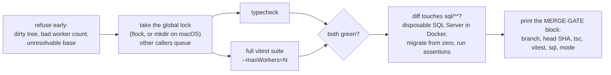
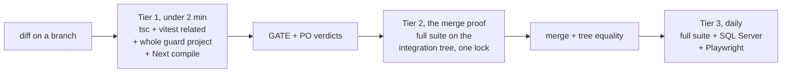

# 0.2.0 to 0.8.2 in 25 days: 765 merges, 9,081 tests, and the merge gate that replaced a CI bill

**Tags:** `testing` `devops` `nextjs` `buildinpublic`

**A parent portal serving nearly 2,000 families, built on sensitive child data, went from version 0.2.0 to 0.8.2 between 31 August and 25 September 2026. In those 25 days: 765 merges, 66 version cuts, 18 installs on the production host, the test suite from 180 files to 641 and 9,081 runtime tests. GitHub Actions had already stopped running because of the bill. This is what replaced it, what it costs on an 8 GB laptop, where the minutes really go, and the redesign that starts this weekend.**

> *"Run it at the EXACT head you intend to merge and paste its MERGE-GATE block VERBATIM into the PR before merging."*

That line is the first comment in the gate script. Everything below is a consequence of it.

---

## Contents

- [Twenty-five days](#twenty-five-days)
- [Why the suite tripled](#why-the-suite-tripled)
- [The month CI cost more than it verified](#the-month-ci-cost-more-than-it-verified)
- [The local merge gate](#the-local-merge-gate)
- [Three kinds of review before the merge word](#three-kinds-of-review-before-the-merge-word)
- [Where the minutes actually go](#where-the-minutes-actually-go)
- [The redesign: projects, quarantine, tiers, a train](#the-redesign-projects-quarantine-tiers-a-train)
- [What I am deliberately not doing](#what-i-am-deliberately-not-doing)
- [Try it yourself](#try-it-yourself)

---

## Twenty-five days

The application is a Next.js portal for the families of a K-12 school: nearly 2,000 parents, about 1,100 students, single sign-on, a strict read-only posture against the student system, and one rule that never bends. A cross-family leak is an incident involving a child's data, so every screen is server-authorised and every read is audited. The [first article](https://dev.to/lfariabr) covered how it went live in eight weeks. This one covers what happened when demand arrived.

Version `0.2.0` on 31 August was the first release in which a parent could submit anything. By `0.8.2` on 25 September, the portal accepted enrolment forms for five families of forms across six live campaigns, took uniform-shop bookings against a capacity model with reschedule and cancel, gave staff a review queue with an audited approve-and-decline cycle, dispatched confirmation e-mails through an outbox, shipped a help centre and a feedback channel, and had a dark theme. Each of those is a production feature with a data-governance entry, a migration, a pre-flight check and an install record.

The delta, measured between the two cut commits and excluding lockfiles:

| | `0.2.0` (31 Aug) | `0.8.2` (25 Sep) |
|---|---:|---:|
| Source files under `web/src` | 280 | 670 |
| API route handlers | 35 | 60 |
| Pages | 19 | 48 |
| SQL migration and assertion files | 12 | 55 |
| Test files | 180 | 641 |

| Between the two | |
|---|---:|
| Days | 25 |
| Merges to master (first parent) | 765 |
| Commits | 3,166 |
| Version cuts | 66 |
| Installs on the production host | 18 |
| Lines added, application source | 81,101 |
| Lines added, SQL | 21,016 |
| Lines added, tests | 127,607 |
| Lines added, documentation and records | 141,259 |

Read the last four rows together. For every line of application code, 1.6 lines of test and 1.7 lines of documentation landed with it. That ratio was not a policy. It is what a portal holding children's data looks like when every release has to be provable to the school, to the vendor whose database it reads, and to whoever installs the next package over RDP at 15:00 on a Friday.

The GitHub contribution graph shows the same month from the other side, counted by the API across all my repositories, 29 August to 26 September:

| Week | Contributions | Peak day |
|---|---:|---|
| 29 Aug to 4 Sep | 1,180 | 393 (Thu 4 Sep) |
| 5 to 11 Sep | 3,925 | 701 (Sun 7 Sep) |
| 12 to 18 Sep | 1,513 | 436 (Tue 15 Sep) |
| 19 to 25 Sep | 1,486 | 732 (Thu 24 Sep) |

8,106 in 29 days. The two tallest bars are the day CI was retired, 10 September at 686, and the day a 22-PR interface release landed, 24 September at 732. The four near-empty days in the middle were four days away from the keyboard. Nothing merged, and nothing broke.

**So what:** the volume was demand, not vanity. When a product goes from "can submit" to six live campaigns in under a month, verification has to scale with it or the next install is a guess.

<sub>[↑ Back to contents](#contents)</sub>

---

## Why the suite tripled

Test files went from 180 to 641, and runtime tests from 7,106 on 19 September to 9,081 on 25 September. The suite has three populations, and they behave nothing alike:

| Population | Files | Tests | Needs | Why it exists |
|---|---:|---:|---|---|
| Component tests | 201 | 1,638 | a DOM (`jsdom`) | every parent-facing screen is rendered and asserted |
| Unit, server, security, integration | 326 | 3,838 | plain Node | routes, stores, authorisation, rate limits, audit |
| Lockstep guards | 114 | ~1,600 | plain Node plus the repository on disk | they open files and check that SQL manifests, flag lists, docs and code agree |

The third population is the one that grew. A lockstep guard does `readFileSync` on the repository and asserts, for example, that every migration the runbook names exists on disk, that the strict-numeric config keys the pre-flight script checks are the same 33 the docs claim, or that a package heading, the release-source row and the packages table tell the same story. Each one was born from a specific escape.

At 30 merges a day, "changed the SQL, forgot the manifest" becomes the dominant failure mode. No type checker sees it. No unit test sees it, because nothing imports a runbook. Only a test that reads both files and compares them does, and once you have one of those, you write the next one the day something else drifts.

| Tag | Date | Test files | Runtime tests |
|---|---|---:|---:|
| `v0.30.0` | 15 Sep | 522 | |
| `v0.35.0` | 17 Sep | 543 | |
| `v0.37.0` | 19 Sep | | 7,106 |
| `v0.40.0` | 20 Sep | 554 | |
| `v0.44.0` | 24 Sep | 578 | 8,293 |
| `v0.50.0` | 25 Sep | 641 | 9,081 |

Sixty-three new test files in the last day of that table. Almost none are "more coverage of the same code". They are new guards, each pinning an invariant that had just been broken once.

**So what:** a suite grows in guards when the risk is drift between artefacts, not bugs inside functions. Guards are exactly the tests a "run only what changed" strategy cannot find. Keep that in mind for the end.

<sub>[↑ Back to contents](#contents)</sub>

---

## The month CI cost more than it verified

Until early September, GitHub Actions ran everything on every pull request: type check, the full vitest suite, a docs-guards job, Playwright, and a disposable SQL Server container that replayed every migration from zero. On a private repository, with dozens of PRs a day, my Actions bill for the month passed 70 USD.

Then it stopped verifying anything. On 6 September the spending limit blocked the runners at about 03:50. By the evening of 9 September every run ended in `startup_failure` with zero jobs. The commit that retired it on 10 September records the reason plainly:

```text
Runs had already been failing at startup (Actions billing): every run
since the evening of 9 Sep ended startup_failure with zero jobs.
```

So the choice was never "CI or no CI". It was "a dead CI that still costs money, or something that runs on hardware I already pay for". The workflows were reduced to `workflow_dispatch` with a dated retirement header, the job definitions kept for manual runs, and the one workflow that mirrors the repository left automatic because it is publication infrastructure, not test CI.

One thing was genuinely lost: the free Windows runner that validated the PowerShell 5.1 deployment scripts. That contract is now validated on the Windows host at install time, and the gate prints a warning whenever anything under the Windows deploy folder changes.

**So what:** the cost of CI scales with merges times suite size, and both were growing. Moving the run to a machine you already own converts a monthly bill into a scheduling problem. The rest of this article is that scheduling problem.

<sub>[↑ Back to contents](#contents)</sub>

---

## The local merge gate

The replacement is one bash script and one process document. The script does four things and refuses to do them out of order:



*Typecheck and the suite start together and the run pays the slower of the two, not their sum. The SQL stage runs only when SQL changed, and fails, rather than skips, when Docker is missing.*

Three rules make it a gate rather than a script:

1. **Exact head.** The block names the commit it ran on and is pasted verbatim into the PR. If the head moves, the run is void. A block naming a different SHA than the merge is not evidence.
2. **One suite at a time.** A global lock with a two-hour acquisition timeout serialises every caller on the machine. Three branches asking at once wait in line instead of turning an 8 GB laptop into a swap party. That was measured before it was decided: with seven parallel work streams live, more than two vitest workers meant OOM-killed workers, not a faster run.
3. **Fail closed.** Dirty tree, empty docs discovery, fewer files run than discovery selected, Docker missing while SQL changed: each is a FAIL with a reason, never a skipped stage.

There is one fast path, and it is narrow. A PR whose diff touches only documentation may merge on the docs-guards runner at the exact head. That runner discovers every test that reads a docs path (86 files, 2,334 tests today) and refuses to report green if vitest ran fewer files than it discovered. The refusal exists because an earlier fast-path comment named the wrong guard file and pasted a plausible count, and the guard it dropped stayed broken on master for about ten hours. Anything touching `src`, `tests`, `sql`, `scripts` or a package file is never eligible.

The post-merge proof runs on an **integration commit**: master merged with the PR head, in a clone nothing else checks out. After the merge, the tree of the actual merge commit must equal the gated tree. If master moved in between, the gate re-runs, or the diff between the two trees is shown on the PR and is confined to files the suite does not execute.

One more rule came from a bad afternoon. On 15 September two working environments cut releases 56 seconds apart from different views of master. Since then a version is cut in exactly one place, and a written page per day names where that is.

**So what:** CI's real product was never the green check. It was an artefact saying "this exact tree passed". A bash script and a lock produce the same artefact if the SHA is the unit of truth.

<sub>[↑ Back to contents](#contents)</sub>

---

## Three kinds of review before the merge word

A green gate proves the tree passes the tests the tree contains. It proves nothing about whether those are the right tests. Three separate review practices sit around it, each with a different question.

| Review | Question | Output |
|---|---|---|
| **GATE** | Is this diff correct at this exact head, and do the tests prove what the PR body claims? | `GATE round N, head <sha>` ending in `Verdict: MERGE` or `NO-MERGE (SF-n)` |
| **PO** | Does it do what the issue asked, and nothing that was not asked? | a product verdict on the same head |
| **ARCHIMEDES** | Is the codebase still what the documents say it is? | a dated, evidence-led architecture assessment, every number re-measured on a fresh worktree |

GATE and PO are independent, read-only reviews of every code PR. The process document makes PO mandatory for SQL migrations, authorisation boundaries, feature flags, release cuts and anything past about 300 lines. Since 19 September my own rule is stricter: both verdicts on every code PR, no exception for "small". The rules that turned out to matter:

- **No conditional verdicts.** "MERGE once you fix X" is a NO-MERGE. Fix X, push, and the reviewer runs another numbered round at the new head.
- **The PR thread is the record.** Every round is replied to on the PR. A chat somewhere else is not evidence.
- **Reviewers measure; they do not read.** A review that runs the test file and pastes the count is worth more than one that says "looks right".

Last Friday, four of eight code PRs came back NO-MERGE in round one. One was a celebration animation that would also have fired on a stale-record refusal. Another was a keyboard focus ring clipped by a new scroll container. Neither breaks a test. Both would have shipped.

ARCHIMEDES is the slow loop. It is a written procedure that produces a fresh codebase assessment on a schedule or on request: routes counted, migrations counted, the claims in the architecture docs checked against the tree, the gate's own blind spots named. Since 26 August it has produced 91 dated artefacts, and 36 issues cite one of them as their evidence. Two findings from last week explain why it earns its keep. The first: the merge gate compiles nothing but TypeScript and `jsdom`, so a server component importing a client hook broke the dev server on master for 3 h 58 min while nine green gate blocks landed. The second: the package cut record in the release notes had no guard, so the heading, the release-source row and the packages table could disagree, and did. Both became issues the same day, and the first one shaped the redesign below.

The part that is less comfortable to publish: on 16 September I paused the whole delivery because I had proposed merging four branches on a gate alone, with no independent review available that night. My own note was that I was not comfortable with the suggestion and would come back with a fresh head. Three days later the two reviews caught a thrown error in an ops gate and a wrong Playwright path that my own read had already approved. The rule has been fixed since.

**So what:** tests are part of the change under review, not the review. Separate the reviewer from the author, make the verdict a dated, head-addressed artefact, and keep a slower loop that re-measures the whole thing.

<sub>[↑ Back to contents](#contents)</sub>

---

## Where the minutes actually go

Last Friday I timed three gate runs on the Mac, with other work streams live but no other gate queued:

| Run | Tests | Workers | Wall time |
|---|---:|---:|---:|
| integration tree of five PRs | 9,031 passed, 50 skipped | 2 | 4 min 16 s |
| final tree before the cut | 9,031 passed, 50 skipped | 2 | 5 min 16 s |
| the cut commit | 9,031 passed, 50 skipped | 2 | 3 min 31 s |

The process document's own measurement, on a train of 15 PRs with seven work streams live, was 10 to 12 minutes per run, twice per PR. So the honest range is "three and a half minutes when the box is quiet, twelve when it is not".

Then I looked at *why* rather than *how long*, and the picture changed:

| Fact | Measured | Consequence |
|---|---|---|
| Environment | `jsdom` for all 641 files | only 201 files render React; about 440 files pay for a DOM they never touch |
| Isolation | a fresh module graph per file | correct, and it is why the fixed cost per file dominates |
| Workers | default 2 on an 8-core host | chosen for memory under seven work streams, not for speed on a quiet box |
| Load-sensitive tests | 2 files with real timers | pass alone, time out under a loaded gate, and cost a waiver on Friday |
| Docs guards | already a separate runner | the tier model exists; it stopped at one tier |

The two load-sensitive files deserve a sentence. They test a notification dispatcher's intervals with real timers. With two workers competing against `tsc` and a SQL Server container, the clock slips and they time out. That is not a defect in the code under test. It is also not a reason to raise the timeout, because a test that only passes in a quiet room fails on the day you need it.

The first measurements after this article was drafted came in the same morning, and they settle the argument. Three full gate runs, one at a time, nothing else testing, all on the same commit:

| Run | Workers | Tests | Files | vitest duration | Environment time (summed across workers) | Gate wall time |
|---|---:|---:|---:|---:|---:|---:|
| Before: one project, `jsdom` everywhere | 4 | 9,405 passed, 50 skipped | 664 | 129.8 s | 227.9 s | 133 s |
| After: `jsdom` for 220 files, `node` for 440, 4 in quarantine | 4 | 9,405 passed, 50 skipped | 664 | 84.5 s | 103.4 s | 87 s |
| Same config | 6 | 9,405 passed, 50 skipped | 664 | 84.7 s | 102.8 s | 88 s |

Same count before and after, so no file was lost or doubled by the split. The gate lost 35 % of its wall time, and the whole saving is environment setup, which halved. Six workers gained nothing over four, so four stays, and the memory headroom goes to the SQL Server container. No test changed.

**So what:** before you shard, split or buy anything, look at the fixed cost per file. Here it was a third of the gate, it belonged to environment setup that 70 % of the files never used, and it went away with a configuration change measured on one commit.

<sub>[↑ Back to contents](#contents)</sub>

---

## The redesign: projects, quarantine, tiers, a train

The constraint comes first because it rules out the obvious shortcut: **the full suite on the integration tree stays the merge proof.** Everything below makes that proof cheaper and rarer, not smaller.

### 1. Split the suite into projects by environment

Configuration only, no test rewrites. Vitest projects let each population run in the environment it needs:

```ts
// vitest.config.ts (sketch)
export default defineConfig({
  test: {
    projects: [
      { extends: true, test: { name: "dom", environment: "jsdom",
          include: ["tests/components/**/*.test.tsx"] } },
      { extends: true, test: { name: "node", environment: "node",
          include: ["tests/{unit,server,security,integration,cache}/**/*.test.ts"],
          exclude: [/* the quarantine files */] } },
      { extends: true, test: { name: "quarantine", environment: "node",
          include: [/* the two timer-bound files */],
          fileParallelism: false, testTimeout: 20_000 } },
    ],
  },
});
```

The `quarantine` project is the answer to the load-sensitive files: serial, own timeout, run after the parallel pool. The tests stay in the merge gate; they stop competing for the CPU. `retry` stays at zero in the gate, because a retry turns a flake into silence.

The worker count is measured, not guessed: on this suite, 6 workers gave nothing over 4 once the environment cost was gone, so 4 is the default on the Mac and 2 when seven work streams are live. The block prints the count, so every measurement is labelled.

### 2. Three tiers instead of one gate



*Tier 1 runs the entire guard project rather than selecting from it: guards read files and import nothing, so the module graph cannot say which of them a change affects. They are cheap in Node. Run them all.*

Tier 1 exists because a developer who waits four minutes to learn they broke a type stops iterating and starts guessing. The Next compile step is the ARCHIMEDES finding from last week turned into a stage: it is the only check that sees the React server boundary.

Tier 3 is the expensive set: the full suite, the disposable SQL Server replaying every migration, and Playwright end to end. Too slow for every merge, too valuable to skip. Today it runs at every version cut. Where its daily run lives, on the laptop on a schedule or back on paid runners, is a decision I am deferring until the runner cost is measured rather than estimated.

### 3. The merge train

The gate's cost is per run, not per PR. Friday had 23 merges on master. Gating each alone at four minutes is 92 minutes of lock plus the queueing. Gating them in trains of five is five runs and about 20 minutes, and the tree proof stays per PR because the integration commit is built from all of them in order.

The rule becomes: a PR with both verdicts does not ask for the lock. It waits for the next train, which leaves when three PRs are ready or the oldest has waited 30 minutes, whichever comes first. This is what a hosted merge queue does. Here it is done by hand, on a laptop, with a lock directory.

### 4. Later: shards on rented hardware, with the bill in view

The structural step is to put tier 2 back on hosted runners on every PR, in four `--shard` jobs with SQL Server as a service container, as a required check, and keep the local gate only as the tree proof. That is a weekend's work and a monthly number I now know how to estimate: merges per day times shard minutes. It goes on the list with the estimate attached, not as a reflex.

**So what:** the order matters. Environment split and quarantine cost an afternoon and change no verification. Tiers and the train change how often the expensive thing runs. Shards change where it runs, and bring the bill back. Do them in that order.

<sub>[↑ Back to contents](#contents)</sub>

---

## What I am deliberately not doing

- **"Related tests only" as the merge proof.** The module graph does not see guards, and guards caught the real escapes this month.
- **Raising timeouts or adding retries to make the gate green.** Both hide the signal. Quarantine keeps the signal and removes the contention.
- **Pruning the suite for speed.** The volume is uncomfortable, but each guard is cheap and each exists because something escaped. The right reduction is structural and later: docs-only guards move into the docs-guards runner, and lockstep guards of one family become one parametrised file instead of a file per case. Fewer files, same invariants.
- **Cutting a version in two places.** Learned on 15 September. Not learning it twice.

<sub>[↑ Back to contents](#contents)</sub>

---

## Try it yourself

The smallest version of this gate is under fifty lines. The parts that matter are the lock, the exact-head block and the fail-closed exits:

```bash
#!/usr/bin/env bash
set -euo pipefail
BASE="${1:-origin/master}"
WORKERS="${MERGE_GATE_WORKERS:-2}"
LOCK="${MERGE_GATE_LOCK_DIR:-/tmp/merge-gate.lock}"

[ -z "$(git status --porcelain)" ] || { echo "dirty tree"; exit 2; }
HEAD_SHA="$(git rev-parse HEAD)"

until mkdir "$LOCK" 2>/dev/null; do sleep 5; done      # queue, never overlap
trap 'rmdir "$LOCK"' EXIT

npm run typecheck > /tmp/tsc.log 2>&1 & TSC_PID=$!
npx vitest run --maxWorkers="$WORKERS" > /tmp/vitest.log 2>&1 && V=pass || V=FAIL
wait "$TSC_PID" && T=pass || T=FAIL

if ! git diff --quiet "$BASE"...HEAD -- sql/; then
  command -v docker >/dev/null || S="FAIL (no docker)"
  [ -n "${S:-}" ] || { node scripts/sql-validation/run.mjs && S=pass || S=FAIL; }
else
  S="skipped (no sql change)"
fi

echo "MERGE-GATE head=$HEAD_SHA base=$BASE"
echo "tsc: $T"
echo "vitest: $V [workers=$WORKERS] $(grep -E '^ *Tests ' /tmp/vitest.log)"
echo "sql: $S"
[ "$T$V" = "passpass" ] && [[ "$S" != FAIL* ]]
```

Then the three habits that make it work:

1. **Paste the block on the PR at the exact head you merge.** If the head moves, run it again.
2. **Give the merge word to a reviewer who did not write the code**, and make the verdict name the head too.
3. **Measure where the minutes go before you buy runners.** Start with the environment per file and the worker count. The bill can wait until you know the number.

- **The portal's public mock demo:** [mydashboard-demo.vercel.app](https://mydashboard-demo.vercel.app)
- **The first article on this portal, the privacy rule that drives it:** [dev.to/lfariabr](https://dev.to/lfariabr)
- **Next on the list:** the projects split and the quarantine land this weekend, measured before and after on the same commit. The numbers go in the next post, whichever way they fall.

If you have run a large vitest suite through a merge queue, on your own hardware or on shards, what broke first: the lock, the flakes, or the bill?

<sub>[↑ Back to contents](#contents)</sub>

---

## Let's connect

- **GitHub:** [github.com/lfariabr](https://github.com/lfariabr)
- **LinkedIn:** [linkedin.com/in/lfariabr](https://www.linkedin.com/in/lfariabr/)
- **Portfolio:** [luisfaria.dev](https://luisfaria.dev)

*The green check was never the product. The exact tree that passed is.*
