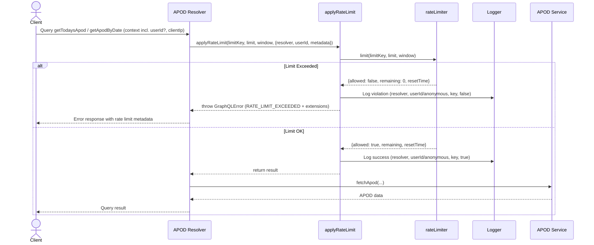

# APOD Feature
Astronomy Picture of the Day from NASA API

I will add a cool interactive button in my portfolio that will have a simple and straightforward behavior:

> Generate the APOD

Once generated (via agentic daily routine), the data will be saved in my database and next requests will re-use/return that previously generated APOD.

If user logs in, however, they will be able to play around more, generating new APODs with different dates.

--- 

## ✅ Issue #61: frontend: APOD floating action button (Fab) with NASA branding #61

```typescript
**Implementation Rules**
- Create ApodFab (`frontend/src/components/apod/ApodFab.tsx`)
- Mimic GogginsFab: floating button with NASA icon, gradient border, aura/pulse effect, tooltip, accessible aria-label
- Place on homepage (or portfolio page)
- Unit test: assert button renders, opens dialog on click

**Acceptance Criteria**
- APOD button appears, shows dialog on click
- Accessible, visually branded to NASA

**Learning Goals**
- Learn React portal, composition, a11y, and test-driven component architecture

**Code stub:**
See: [frontend/src/components/goggins/GogginsFab.tsx](https://github.com/lfariabr/luisfaria.dev/blob/main/frontend/src/components/goggins/GogginsFab.tsx)
See: [frontend/src/app/__tests__/GogginsFab.page.test.tsx](https://github.com/lfariabr/luisfaria.dev/blob/main/frontend/src/app/__tests__/GogginsFab.page.test.tsx)

```

---

### Implementation Steps

#### 1. First things first: I created `Apod.tsx`
A simple bottom-right circular button rendered on the client-side. Next, I've plugged into the main layout `Layout.tsx` to render it.

#### 2. Tests
Following that, I've created `frontend/__tests__/components/Apod.test.tsx` to test the button behavior.

#### 3. ApodDialog.tsx 
Created `frontend/src/components/apod/ApodDialog.tsx` with:
- NASA-branded dialog with gradient border (blue/red/blue NASA colors)
- Rocket icon with gradient title text
- Date display with calendar icon
- Placeholder for APOD image (ready for NASA API integration)
- External link to NASA APOD website
- "Powered by NASA Open APIs" footer

#### 4. Renamed Apod.tsx → ApodFab.tsx 
Following the naming convention from GogginsFab:
- Component now exports `ApodFab`
- Proper floating action button pattern

#### 5. Added Tooltip 
Installed `@radix-ui/react-tooltip` and created `frontend/src/components/ui/tooltip.tsx`:
- Tooltip appears on hover showing "Astronomy Picture of the Day"
- NASA-themed dark styling

#### 6. Added NASA Gradient Border 
Applied NASA brand colors gradient border using CSS mask technique:
- `linear-gradient(135deg, #0B3D91, #FC3D21, #1E90FF)` (NASA blue, red, lighter blue)
- Blue pulse aura effect (`bg-blue-500` instead of primary)

#### 7. Updated Tests 
Enhanced `frontend/src/__tests__/components/Apod.test.tsx`:
- Renders button with accessible name
- Renders NASA APOD image
- Opens dialog on click (verifies dialog role + NASA branding)
- Renders tooltip on hover

---

#### Files Created/Modified

| File | Action |
|------|--------|
| `src/components/apod/ApodFab.tsx` | Created (renamed from Apod.tsx) |
| `src/components/apod/ApodDialog.tsx` | Created |
| `src/components/ui/tooltip.tsx` | Created |
| `src/app/layout.tsx` | Updated import |
| `src/__tests__/components/Apod.test.tsx` | Updated tests |

---

## refactor: FAB adaptation to light mode

Updated both `ApodFab.tsx` and `ApodDialog.tsx` for light/dark mode compatibility using Tailwind's `dark:` variants.

### ApodFab.tsx
- Button: `bg-white dark:bg-zinc-950` with proper hover states
- Border: `border-zinc-200 dark:border-white/10`
- Inner circle: `bg-zinc-100 dark:bg-black` with `ring-zinc-300 dark:ring-white/15`
- Tooltip: Light background with dark text in light mode

### ApodDialog.tsx
- Dialog background: `bg-white/95 dark:bg-zinc-950/85`
- All text colors: `text-zinc-900 dark:text-white`, `text-zinc-600 dark:text-white/70`, etc.
- Borders: `border-zinc-200 dark:border-white/10`
- Button: Light gray background with proper hover states
- Bottom fade: `to-zinc-100/50 dark:to-black/30`

---

## ✅ Issue #65: backend: NASA_API_KEY config, validation & documentation for APOD #65

```typescript
**Implementation Rules**
- Create `.env.example` and update `.env` with NASA_API_KEY (document in backend/docs/1.Setup.MD)
- Type NASA_API_KEY in backend/src/config/config.ts:

  ts
  interface Config {
    // ...
    nasaApiKey: string;
  }
  // add to validation
  'NASA_API_KEY',
  // default
  nasaApiKey: process.env.NASA_API_KEY || '',

- Throw error if missing; update README and Setup docs for environment setup and Docker Compose instructions

**Acceptance Criteria**
- Server refuses to boot without NASA_API_KEY set
- Docs update with configuration example

**Learning Goals**
- Understand env var typing, validation, and config management with TypeScript and dotenv
- Practice documenting integrations for team clarity

**Code stub:**
See: [backend/src/config/config.ts](https://github.com/lfariabr/luisfaria.dev/blob/main/backend/src/config/config.ts)
See: [backend/docs/1.Setup.MD](https://github.com/lfariabr/luisfaria.dev/blob/main/backend/docs/1.Setup.MD)
See: [backend/README.MD](https://github.com/lfariabr/luisfaria.dev/blob/main/backend/README.MD)
```

### Implementation steps

1. First I created account at Nasa APOD API page
2. Then I updated `.env` and `.env.example` with the API key
3. Then I updated `backend/src/config/config.ts` to include the API key

---

## ✅ Issue #66: backend: NASA APOD API service, request validation & structured logging #66

```typescript
**Implementation Rules**
- Add backend/src/services/nasa/apod.ts for NASA APOD client
- Use fetch to call NASA API, validate response schema with Zod or built-in validation
- Log request status (success, error, latency, userId/context if available) using winston
- Handle 429s, errors gracefully; support date param for APOD history/fetch
- Unit tests: mock fetch, check error handling & logging

**Acceptance Criteria**
- Reliable NASA API fetch with schema validation
- Structured logs for request status (success, error, latency, userID)
- All request paths tested (success, network error, rate limit, invalid response)

**Learning Goals**
- Build robust external API client in TypeScript
- Validate API responses and add test coverage
- Instrument logging for observability

**Code stub:**
See: [backend/src/services/nasa/apod.ts](https://github.com/lfariabr/luisfaria.dev/blob/main/backend/src/services/nasa/apod.ts)
See: [backend/src/utils/logger.ts](https://github.com/lfariabr/luisfaria.dev/blob/main/backend/src/utils/logger.ts)
See: [backend/docs/11.DataValidationZod.MD](https://github.com/lfariabr/luisfaria.dev/blob/main/backend/docs/11.DataValidationZod.MD)
```

### Implementation steps
> *service → query resolver → schema additions*

#### 1. Create Zod Validation Schema
**File:** `backend/src/validation/schemas/apod.schema.ts`

```typescript
import { z } from 'zod';

export const apodResponseSchema = z.object({
  copyright: z.string().optional(),
  date: z.string().regex(/^\d{4}-\d{2}-\d{2}$/, 'Date must be in YYYY-MM-DD format'),
  explanation: z.string().min(1, 'Explanation is required'),
  media_type: z.enum(['image', 'video']),
  service_version: z.string(),
  title: z.string().min(1, 'Title is required'),
  url: z.string().url('URL must be valid'),
  hdurl: z.string().url().optional(),
});

export type ApodResponse = z.infer<typeof apodResponseSchema>;
```

**Learning:** Zod validates NASA responses at runtime, catching malformed data before it reaches clients.

---

#### 2. Create Hardened Service
**File:** `backend/src/services/apod.ts`

**Key Features:**
- **`ApodServiceError`** - Custom error class with typed codes:
  - `RATE_LIMITED` (429 from NASA)
  - `NASA_API_ERROR` (4xx/5xx errors)
  - `VALIDATION_ERROR` (response doesn't match schema)
  - `NETWORK_ERROR` (connection failures)

- **Latency logging** - Every request logs `latencyMs`
- **User context** - Optional `userId` for observability
- **Config internal** - NASA API key pulled from `config.nasaApiKey`

```typescript
export async function fetchApod(
  options: { date?: string; context?: ApodRequestContext } = {}
): Promise<ApodResponse>
```

**Why this signature?** Callers don't need to pass the API key - service handles it. Context is optional for logging/rate limiting.

---

#### 3. Create GraphQL Resolver
**File:** `backend/src/resolvers/apod/queries.ts`

**Two queries:**
- **`getTodaysApod`** - Public, no auth required
- **`getApodByDate(date: String!)`** - Requires authentication

**Error mapping:**
| Service Error Code | GraphQL Extension Code |
|-------------------|------------------------|
| `RATE_LIMITED` | `TOO_MANY_REQUESTS` |
| `NASA_API_ERROR` | `EXTERNAL_SERVICE_ERROR` |
| `VALIDATION_ERROR` | `BAD_GATEWAY` |
| `NETWORK_ERROR` | `SERVICE_UNAVAILABLE` |

```typescript
throw new GraphQLError(error.message, {
  extensions: {
    code: mapErrorCode(error.code),
    statusCode: error.statusCode,
    details: error.details,
  },
});
```

**Why structured errors?** Clients can react based on `extensions.code` (show retry button for rate limits, etc.)

---

#### 4. Add GraphQL Schema Types
**File:** `backend/src/schemas/types/apodTypes.ts`

```graphql
type Apod {
  copyright: String
  date: String!
  explanation: String!
  mediaType: String!      # Mapped from snake_case
  serviceVersion: String! # Mapped from snake_case
  title: String!
  url: String!
  hdurl: String
}

extend type Query {
  getTodaysApod: Apod!
  getApodByDate(date: String!): Apod!
}
```

**Field resolvers** in `resolvers/index.ts` map `media_type` → `mediaType` and `service_version` → `serviceVersion`.

---

#### 5. Wire Into Schema
**Files modified:**
- `backend/src/schemas/typeDefs.ts` - Import and include `apodTypes`
- `backend/src/resolvers/index.ts` - Spread `ApodQueries` + add `Apod` field resolver

---

#### 6. Create Tests (28 passing)
**Service tests:** `backend/src/__tests__/unit/apod.service.test.ts`
- Success cases (image, video, date param, user context)
- 429 rate limiting detection
- NASA API errors (403, 404, 500)
- Network errors (ETIMEDOUT)
- Validation errors (missing fields, wrong format, invalid URL)

**Resolver tests:** `backend/src/__tests__/unit/apod.resolver.test.ts`
- Returns data successfully
- Passes user context when authenticated
- Maps error codes correctly
- `getApodByDate` requires authentication

---

#### 7. Test using Apollo Studio

```graphql
query GetTodaysApod {
  getTodaysApod {
    copyright
    date
    explanation
    mediaType
    serviceVersion
    title
    url
    hdurl
  }
}
```

---


## ✅ Issue #78: refactor: Decompose apod.ts into service, api, fallback, types, errors, and constants modules #78

The current `apod.ts` file mixes types, validation, fetch logic, error codes, logging, and both main API & fallback paths. To improve readability, scalability, and maintainability, refactor by splitting into focused modules under `src/services/apod/`.

**Implementation Steps**
- Move domain types to `apod.types.ts` (e.g. `ApodResponse`, `ApodRequestContext`)
- Move all error types and codes to `apod.errors.ts` (e.g. `ApodServiceError`)
- Move infrastructure config (timeouts, retries, URLs) to `apod.constants.ts`
- Implement pure NASA API logic (fetch, retries, AbortController) in `apod.api.ts`
- Implement fallback scraping (HTML parsing) in `apod.fallback.ts`
- Core orchestration (try API, validate, fallback if needed, logger hooks, error handling): `apod.service.ts`
- Update imports in all code that depended on the monolithic file
- Keep existing logic close to unchanged—this is mostly a move, not a rewrite

**Acceptance Criteria**
- Each concern split to its own file; `apod.service.ts` is orchestration only
- No logic regressions; same tests (unit/integration) pass
- Better discoverability: easy to trace concerns, reason about code, and onboard

**Learning Goals**
- Understand separation of concerns at a real-world services scale
- Practice orchestrating feature logic in a clean/production-grade way
- Work with domain types, infra, error handling as first-class modules

**Code stub/snippet**
Example tree:
```
src/services/apod/
  apod.service.ts
  apod.api.ts
  apod.fallback.ts
  apod.errors.ts
  apod.types.ts
  apod.constants.ts
```
Example export in `apod.service.ts`:
```ts
import { fetchApodData } from './apod.api'
import { scrapeApodFallback } from './apod.fallback'
import { ApodResponse } from './apod.types'
import { ApodServiceError } from './apod.errors'
export class ApodService { /* ...orchestrated logic... */ }
```

### Implementation steps

I've done the hard work - structure is clean and logic is preserved. Status:

What's done:
- ✅ Constants, types, errors, API, fallback, service all created
- ✅ Fallback HTML scraping (nice addition!)

What needs finishing:
- Add missing logging to apod.api.ts
- Create index.ts barrel for clean exports
- Update resolver imports
- Update test imports
- Remove old apod.ts

### Modular APOD structure is now fully wired and working.

#### Final Structure
```
src/services/apod/
├── index.ts          # Barrel export (clean entry point)
├── apod.service.ts   # Orchestrator (API + fallback)
├── apod.api.ts       # NASA API client (retries, timeout, logging)
├── apod.fallback.ts  # HTML scraping fallback
├── apod.errors.ts    # ApodServiceError + ApodErrorCode
├── apod.types.ts     # ApodResponse, ApodRequestContext
└── apod.constants.ts # URLs, timeouts, retry config
```

#### What Was Done
| Task | Status |
|------|--------|
| Enhanced apod.api.ts with full logging (latency, retries, status codes) | ✅ |
| Created index.ts barrel for clean imports | ✅ |
| Updated resolver imports to use ../../services/apod/ | ✅ |
| Rewrote tests to properly mock modular structure | ✅ |
| Removed old monolithic apod.ts | ✅ |

---

#### Key Architectural Benefit
The service now has graceful fallback:

```typescript
try {
  return await fetchApodFromApi(url, logContext);
} catch (error) {
  logger.warn("NASA API failed, falling back to HTML", {...});
  return await fetchApodHtmlFallback();
}
```

If NASA API returns 504/timeouts/errors → HTML scraping kicks in automatically.

#### Imports
Consumers just import from the barrel:

```typescript
import { fetchApod, ApodServiceError, ApodResponse } from '../../services/apod/';
```

---

## ✅ Issue #79: refactor: Extract shared GraphQL error handling infrastructure

**Problem:** DRY violation in `queries.ts` — identical try/catch/instanceof/wrap pattern duplicated across resolvers. Adding a new error code means updating multiple files.

**Branch:** `refactor/shared-error-handling`

### Implementation

Created centralized error handling infrastructure that any resolver can use:

#### New Files Created

| File | Purpose |
|------|---------|
| `src/utils/errors/graphqlErrors.ts` | Shared error utilities |
| `src/utils/errors/index.ts` | Barrel exports |
| `src/services/apod/apod.errorHandler.ts` | APOD-specific error transformer |

#### Key Components

**ErrorCodes constant** - Single source of truth:
```typescript
export const ErrorCodes = {
  BAD_USER_INPUT: 'BAD_USER_INPUT',
  UNAUTHENTICATED: 'UNAUTHENTICATED',
  FORBIDDEN: 'FORBIDDEN',
  NOT_FOUND: 'NOT_FOUND',
  TOO_MANY_REQUESTS: 'TOO_MANY_REQUESTS',
  EXTERNAL_SERVICE_ERROR: 'EXTERNAL_SERVICE_ERROR',
  // ...
} as const;
```

**Error factories** - One-liners for common errors:
```typescript
export const Errors = {
  unauthenticated: (message = 'Authentication required') => createGraphQLError(...),
  forbidden: (message = 'Not authorized') => createGraphQLError(...),
  notFound: (resource = 'Resource') => createGraphQLError(...),
  // ...
};
```

**createErrorHandler()** - Generic wrapper generator:
```typescript
export function createErrorHandler<TCode, TError>(
  mapErrorCode: (code: TCode) => ErrorCode,
  isServiceError: (error: unknown) => error is TError,
  defaultMessage: string
) {
  return function withErrorHandling<T>(fn: () => Promise<T>, operationName: string): Promise<T>
}
```

#### APOD Error Handler

Service-specific error mapping now lives with the service:

```typescript
// src/services/apod/apod.errorHandler.ts
export const withApodErrorHandling = createErrorHandler(
  mapApodErrorCode,
  isApodServiceError,
  'An unexpected error occurred while fetching APOD'
);
```

#### Resolver Before/After

**Before (103 lines):**
```typescript
// Duplicated try/catch in EVERY resolver
try {
  const apod = await fetchApod({...});
  return apod;
} catch (error) {
  if (error instanceof ApodServiceError) {
    throw new GraphQLError(error.message, {
      extensions: { code: mapErrorCode(error.code), ... }
    });
  }
  // ... more boilerplate
}
```

**After (34 lines):**
```typescript
import { fetchApod, withApodErrorHandling } from '../../services/apod/';
import { Errors } from '../../utils/errors';

export const ApodQueries = {
  getTodaysApod: async (_, __, context) =>
    withApodErrorHandling(
      () => fetchApod({ context: { userId: context.user?.id } }),
      'getTodaysApod'
    ),

  getApodByDate: async (_, args, context) => {
    if (!context.user) {
      throw Errors.unauthenticated('Authentication required to browse historical APODs');
    }
    const userId = context.user.id;
    return withApodErrorHandling(
      () => fetchApod({ date: args.date, context: { userId } }),
      'getApodByDate'
    );
  },
};
```

### Commits

| Commit | Files |
|--------|-------|
| `feat(errors): add shared GraphQL error handling infrastructure` | `src/utils/errors/graphqlErrors.ts`, `src/utils/errors/index.ts` |
| `feat(apod): extract error handler to service layer` | `src/services/apod/apod.errorHandler.ts`, `src/services/apod/index.ts` |
| `refactor(apod): use shared error handling in resolver` | `src/resolvers/apod/queries.ts` |
| `test(apod): update resolver tests for new mock structure` | `src/__tests__/unit/apod.resolver.test.ts` |

### Benefits

- **Single place to add error codes** — `ErrorCodes` constant
- **Resolver is pure business logic** — no error transformation noise
- **Error mapping lives with service** — where it belongs
- **Reusable** — Other services can use `createErrorHandler()` with their own error types

---

## ✅ Issue #80: fix: NASA API schema compatibility + add apodUrl field

**Problem:** NASA API returns `media_type: "other"` for interactive content (SDO videos, embeds), but our Zod schema only accepted `"image" | "video"`. Also, `url` is missing for `media_type: "other"`, causing validation failures and unnecessary fallback to HTML scraping.

**Branch:** `fix/apod-schema-media-type-other`

### Root Cause

NASA API response for interactive content:
```json
{
  "date": "2026-01-13",
  "explanation": "What just leapt from the Sun?...",
  "media_type": "other",
  "service_version": "v1",
  "title": "A Solar Eruption from SDO"
  // NO url field!
}
```

Our schema rejected this because:
1. `media_type: z.enum(['image', 'video'])` — missing `'other'`
2. `url: z.string().url()` — required, but NASA doesn't provide it for `"other"`

### Implementation

#### 1. Fix Zod Schema

**File:** `src/validation/schemas/apod.schema.ts`

```typescript
export const apodResponseSchema = z.object({
  // ...
  media_type: z.enum(['image', 'video', 'other']),  // Added 'other'
  url: z.string().url('URL must be valid').optional(),  // Now optional
  apod_url: z.string().url().optional(),  // New computed field
});
```

#### 2. Fix GraphQL Schema

**File:** `src/schemas/types/apodTypes.ts`

```graphql
type Apod {
  copyright: String
  date: String!
  explanation: String!
  mediaType: String!
  serviceVersion: String!
  title: String!
  url: String              # Changed from String! to String
  hdurl: String
  "Direct link to the APOD page on NASA's website"
  apodUrl: String!         # NEW - always available
}
```

#### 3. Compute apodUrl in Service

**File:** `src/services/apod/apod.service.ts`

```typescript
/**
 * Generates the direct APOD page URL for a given date.
 * Format: https://apod.nasa.gov/apod/apYYMMDD.html
 */
function buildApodPageUrl(date: string): string {
  const [year, month, day] = date.split("-");
  const shortYear = year.slice(2);
  return `https://apod.nasa.gov/apod/ap${shortYear}${month}${day}.html`;
}

export async function fetchApod(...): Promise<ApodResponse> {
  // ... fetch logic ...

  // Enrich with direct APOD page URL
  return {
    ...apodData,
    apod_url: buildApodPageUrl(apodData.date),
  };
}
```

#### 4. Add Field Resolver

**File:** `src/resolvers/index.ts`

```typescript
Apod: {
  mediaType: (parent: ApodResponse) => parent.media_type,
  serviceVersion: (parent: ApodResponse) => parent.service_version,
  apodUrl: (parent: ApodResponse) => parent.apod_url,  // NEW
},
```

### Commits

| Commit | Files |
|--------|-------|
| `fix(apod): add 'other' media type and make url optional in schema` | `src/validation/schemas/apod.schema.ts`, `src/schemas/types/apodTypes.ts` |
| `feat(apod): add apodUrl field for direct APOD page links` | `src/services/apod/apod.service.ts`, `src/resolvers/index.ts` |
| `test(apod): update service tests for apod_url field` | `src/services/apod/apod.service.ts`, `src/resolvers/index.ts` |

### Result

**Before:** `media_type: "other"` → validation error → fallback to HTML scraping  
**After:** `media_type: "other"` → validation passes → direct API response + `apodUrl` for viewing

Query example:
```graphql
query GetTodaysApod {
  getTodaysApod {
    title
    mediaType      # "other"
    url            # null (NASA doesn't provide it)
    apodUrl        # "https://apod.nasa.gov/apod/ap260113.html" (always available!)
  }
}
```

---

## Updated Module Structure

```
src/
├── utils/
│   └── errors/
│       ├── index.ts              # Barrel exports
│       └── graphqlErrors.ts      # Shared error infrastructure
│
└── services/
    └── apod/
        ├── index.ts              # Barrel export
        ├── apod.service.ts       # Orchestrator + apodUrl enrichment
        ├── apod.api.ts           # NASA API client
        ├── apod.fallback.ts      # HTML scraping fallback
        ├── apod.errors.ts        # ApodServiceError + ApodErrorCode
        ├── apod.errorHandler.ts  # GraphQL error transformer (NEW)
        ├── apod.types.ts         # ApodResponse, ApodRequestContext
        └── apod.constants.ts     # URLs, timeouts, retry config
```

---

## ✅ Issue #67: backend: GraphQL resolver for APOD with rate limiting, caching, and audit logs #67

**Implementation Rules**
- Add GraphQL query (getApod) in typeDefs/resolvers. Expose REST if needed
- Enforce authentication (optionally public for demo)
- Integrate Redis-based rate limiting via atomic Lua (see goggins/chatbot)
- Add short-term Redis caching on APOD results (date/title key)
- Emit audit logs on each request (user, rate limiter state, NASA status)
- Tests: integration test for resolver, validate limiter, log output

**Acceptance Criteria**
- APOD query enforced by rate limiter; returns cached result or live from NASA with audit logging
- Error and limit paths observable in logs/tests

**Learning Goals**
- Integrate rate limiting with resolver logic
- Add cross-cutting observability (logging/audit)
- Implement caching for reuse and performance

**Code stub:**
See: [backend/src/middleware/rateLimiter.ts](https://github.com/lfariabr/luisfaria.dev/blob/main/backend/src/middleware/rateLimiter.ts)
See: [backend/src/services/rateLimiter.ts](https://github.com/lfariabr/luisfaria.dev/blob/main/backend/src/services/rateLimiter.ts)
See: [backend/docs/15.AtomicRateLimiting.md](https://github.com/lfariabr/luisfaria.dev/blob/main/backend/docs/15.AtomicRateLimiting.md)

### Implementation

#### 1. feat(apod): add rate limiting and logging to requests (Relates #67)

| Cohort / File(s) | Summary |
|------------------|---------|
| **Rate-limited APOD Resolver:** `backend/src/resolvers/apod/queries.ts` | Added per-endpoint rate limiting calls before fetchApod for getTodaysApod (context-aware limitKey: userId or client IP) and getApodByDate (per-user key); converted getTodaysApod to block body to use context and await limits; preserved withApodErrorHandling. |
| **Rate Limiting Utility:** `backend/src/utils/applyRateLimit.ts` | New export applyRateLimit(limitKey, limit, window, context) that calls rateLimiter.limit, logs structured info, returns limiter result on success, and throws GraphQLError with RATE_LIMIT_EXCEEDED and extensions (limit, remaining, resetTime) on violation. |
| **GraphQL Context Update:** `backend/src/index.ts` | MyContext extended with clientIp: string; Apollo context now populates clientIp from x-forwarded-for or remote address. |
| **Tests Updated for Context:** `backend/src/__tests__/unit/apod.resolver.test.ts` | Tests updated to include clientIp: '127.0.0.1' in resolver context expectations for getTodaysApod cases. |



#### 2. fix(apod): rate-limit anonymous getTodaysApod per-client IP (Relates #67)
- Update the MyContext interface to include clientIp
- Update the context creation to extract clientIp from the request
- Update the queries.ts to use the IP-based key for anonymous users

- `backend/src/index.ts` – Updated MyContext interface to include clientIp and added IP extraction logic in the Apollo context:
  - Parses x-forwarded-for header (first IP for proxy chains)
  - Falls back to req.socket.remoteAddress or 'unknown'
- `backend/src/resolvers/apod/queries.ts` – Updated getTodaysApod:
  - Context type now includes `clientIp: string`
  - Anonymous key changed from `'apod:today:public'` → `'apod:today:ip:${context.clientIp}'`
  - `clientIp` passed via `metadata` for audit logging

#### 3. feat(apod): caching strategy for results (Closes #67)

The idea of this task is to add caching strategy, so that if we already fetched APOD for a key recently, return the saved result instead of calling external API again.

This is awesome, because:
- Today's APOD is **the same for everyone**
- Historical ApodByDate is immutable (2025-12-31's result will not change)

**Item: ApodCache Service**
> *Caching is now fully implemented. Here's the summary:*

##### Files Created/Modified
`apodCache.ts` – Cache service:
- `get(key)` – Returns cached `ApodResponse` or null
- `set(key, value, ttlSeconds)` – Stores with `TTL`
- `buildTodayKey()` – Returns `date:YYYY-MM-DD` for today (uses `America/New_York` timezone to match NASA APOD server)
- `buildDateKey(date)` – Returns `date:${date}` for specific dates

`apod.constants.ts` – Added TTL constants:
- `APOD_CACHE_TTL_TODAY_SECONDS` = 15 minutes
- `APOD_CACHE_TTL_DATE_SECONDS` = 7 days

`queries.ts` – Wired cache into resolvers

`config.ts` – Added anonymous rate limit config:
- `rateLimitAnonymousRequests` – Env var: `RATE_LIMIT_ANONYMOUS_REQUESTS` (default: 5)
- Used by `getTodaysApod` for per-IP rate limiting

##### Rate Limit Configuration
| Config Key | Env Var | Default | Used For |
|------------|---------|---------|----------|
| `rateLimitMaxRequests` | `RATE_LIMIT_MAX_REQUESTS` | 5 | Authenticated users |
| `rateLimitAnonymousRequests` | `RATE_LIMIT_ANONYMOUS_REQUESTS` | 5 | Anonymous (per-IP) |
| `rateLimitWindow` | `RATE_LIMIT_WINDOW` | 60 | Window in seconds |

Flow, with both resolvers:
```bash
1. Rate limit check (per-user/IP)
2. Cache lookup (date-based key)
3. If cache hit → return cached, log source: "cache"
4. If cache miss → fetchApod() → store in cache → log source: "nasa"
```

##### Audit Log Fields
| Field |	Description |
| --- | -----|
| resolver | `getTodaysApod` / `getApodByDate` |
| cacheKey | `date:YYYY-MM-DD` |
| source | `"cache"` or `"nasa"` |
| ttlSeconds | only on cache miss |

---

**Item: Test Coverage**
> *12 integration tests pass. Issue #67 is complete*

##### Files Created/Modified
| File | Change |
| --- | --- |
| index.ts | Added `clientIp` to context from `x-forwarded-for` or socket |
| apodCache.ts | New cache service with `get`, `set`, key builders |
| apod.constants.ts | Added TTL constants (15min today, 7d historical) |
| index.ts | Export TTL constants |
| queries.ts | Rate limiting + caching + audit logging |
| tests/integration/apodResolvers.test.ts | New integration tests |

Flow
```bash
1. Rate limit check (per-user or per-IP)
2. Cache lookup (date-based key)
3. Cache hit → return cached, log source: "cache"
4. Cache miss → fetchApod() → store → log source: "nasa"
```

##### Test Coverage
- Cache hit: `fetchApod` NOT called
- Cache miss: `fetchApod` called, cache set
- Rate limit: enforced per-IP (anonymous) / per-user (authenticated)
- Authentication: required for `getApodByDate`
- Audit logging: rate limit + cache hit/miss logged

---

## ✅ Issue #62: frontend: APOD Dialog component (image, metadata, loading/error states)

**Implementation Rules**
- Create ApodDialog (`frontend/src/components/apod/ApodDialog.tsx`)
- Fetch data via Apollo useQuery/lazyQuery to backend getApod (with loading spinner, error toast)
- Render image (responsive), title, explanation, link to NASA site
- Show APOD metadata (copyright, date)
- UX: Pre-fetch on open, manual refresh, scrollable/accessible, show rate limit banner if provided
- Unit test: dialog renders, shows image/explanation, handles error/loading

**Acceptance Criteria**
- APOD dialog provides full experience (image, data, error/loading feedback)
- Responsive and accessible, handles states cleanly
- Rate limiter UI matches backend info

**Learning Goals**
- Learn Apollo useQuery flow, error handling, UX states (loading/error)
- Practice accessibility, responsive design, and composability

**Code stub:**
See: [frontend/src/components/goggins/GogginsDialog.tsx](https://github.com/lfariabr/luisfaria.dev/blob/main/frontend/src/components/goggins/GogginsDialog.tsx)
See: [frontend/src/app/__tests__/GogginsDialog.component.test.tsx](https://github.com/lfariabr/luisfaria.dev/blob/main/frontend/src/app/__tests__/GogginsDialog.component.test.tsx)

### Implementation

#### 1. Add GraphQL query file
- Created `frontend/src/lib/graphql/queries/apod.queries.ts` with Apollo queries and fragments for APOD data
  - Define `GET_TODAYS_APOD` and `GET_APOD_BY_DATE` queries
  - Define `APOD_FRAGMENT` for consistent data shape
  - Fixed query names: todaysApod → getTodaysApod, apodByDate → getApodByDate
  - Replaced thumbnailUrl with apodUrl in fragment
- Created `frontend/src/lib/graphql/types/apod.types.ts` with TypeScript interfaces for APOD data
  - Made url, hdurl, copyright optional (matches backend schema)
  - Made apodUrl required
- Modified `frontend/src/components/apod/ApodDialog.tsx` to use the proper fetch logic & types
  - Added proper typed `useQuery<{ getTodaysApod: Apod }>`
  - Replaced broken early returns with inline loading/error states
  - Added loading spinner with animation
  - Added error state with retry button
  - Handles all media types: `image`, `video`, `other`
  - Uses `apodUrl` for external link (always available)
  - Added `Next/Image` with `unoptimized` prop for external NASA images
  - Fixed "Visit APOD" button: conditional render (anchor when `apod` truthy, disabled button with `aria-disabled` + `pointer-events-none` when falsy)

#### 2. Test Coverage
- Add unit tests for `ApodDialog` component
  - Added Apollo MockProvider, wrapping all test renders with MockedProvider to satisfy useQuery hook req
  - Created mock APOD data, matching the backend schema
  - Added a maxUsageCount:2 handling cache-and-network policy's multiple fetch behavior
  - Added error state test, verifying retry button appearance
- Loading State test
  - Added within import for scoped queries
  - Used delayed mock (delay: 100) to observe loading state
  - Scoped assertions with within(dialog)
  - Asserts loading indicators (getAllByText(/loading/i)) inside dialog
  - Verifies mock data title is NOT present during loading

**Results:**
```bash
# 6/6 tests passing
✓ renders the APOD button with an accessible name
✓ renders the APOD image
✓ opens dialog on click
✓ shows loading state when dialog opens
✓ renders tooltip on hover
✓ handles error state
```

---

## ✅ Issue #63+#97 (consolidated): Rate Limit UI for Authenticated Historical APOD Browsing

**Context:**
- Issue #63 originally proposed rate limit UI for all APOD requests
- Issue #97 refined scope: only authenticated users browsing historical APODs need this UI
- Public `getTodaysApod` is heavily cached, rate limit UI irrelevant there
- Consolidated into single implementation for efficiency

**Implementation Rules**
- Display X/Y badge (remaining/limit) for authenticated users only
- Show countdown timer until rate limit reset
- Disable date picker when rate limit exhausted
- Extract rate limit info from GraphQL error extensions (RATE_LIMIT_EXCEEDED)
- Show error banner when user hits rate limit
- Unit test: rate-limited paths, disabled state, countdown, error state

**Acceptance Criteria**
- Authenticated users see rate limit feedback when browsing historical APODs
- Date picker disabled when limit exhausted
- Countdown timer shows time until reset
- Unauthenticated users never see rate limit UI
- All states covered by unit tests

**Learning Goals**
- Client/server rate limit flows
- Real-time countdown UIs
- Conditional "disabled" UX based on auth state

**Code stub:**
See: [frontend/src/components/goggins/GogginsDialog.tsx](https://github.com/lfariabr/luisfaria.dev/blob/main/frontend/src/components/goggins/GogginsDialog.tsx)

### Implementation ✅

#### 1. Approach
- Rate limit info extracted from GraphQL error extensions when `RATE_LIMIT_EXCEEDED`
- Backend already returns `{ limit, remaining, resetTime }` in error extensions
- Frontend tracks rate limit state locally after first error
- Countdown timer decrements until reset, then re-enables controls

#### 2. Changes Made

**`frontend/src/components/apod/ApodDialog.tsx`:**
- Added `Clock` icon import from lucide-react
- Added `formatCountdown()` helper for human-readable countdown (e.g., "5h 30m", "04:35")
- Added state: `rateLimitInfo` (limit, remaining, resetTime) and `secondsUntilReset`
- Added effect to extract rate limit info from `dateError` GraphQL extensions
- Added countdown timer effect (1s interval, clears rate limit state when done)
- Added derived state: `isRateLimited`, `isRateLimitError`
- Date picker: disabled when rate limited, shows "Rate limit reached" text
- Rate limit badge: amber-styled banner showing "X/Y requests" + "Resets in HH:MM"
- Error state: specific UI for rate limit errors (Clock icon + countdown)

#### 3. UI States

| State | Date Picker | Badge | Error Area |
|-------|-------------|-------|------------|
| Normal | Enabled | Hidden | N/A |
| Rate Limited | Disabled + opacity-50 | Visible (amber) | Clock icon + countdown |
| Other Error | Enabled | Hidden | AlertCircle + Retry button |

#### 4. Test Results
```
PASS src/__tests__/components/Apod.test.tsx
  ✓ renders the APOD button with an accessible name
  ✓ renders the APOD image
  ✓ opens dialog on click
  ✓ shows loading state when dialog opens
  ✓ shows login prompt for unauthenticated users
  ✓ shows date picker for authenticated users
  ✓ renders date input for authenticated users
  ... (10 passed, 3 skipped)
```

---

## ✅ Issue #93: frontend: Date picker for authenticated users to browse historical APODs

**Implementation Rules**
- Add date picker UI to `ApodDialog.tsx` for authenticated users only
- Use `useAuth` hook to detect logged-in state
- Switch between `GET_TODAYS_APOD` (default) and `GET_APOD_BY_DATE` (when date selected)
- Constrain date picker: min = 1995-06-16 (first APOD), max = today
- Show login prompt/badge for unauthenticated users
- Handle UNAUTHENTICATED errors gracefully
- Unit test: date picker visibility, query switching, auth states

**Acceptance Criteria**
- Authenticated users can select a date and see historical APODs
- Unauthenticated users see today's APOD only (with optional "login to explore" hint)
- Date constraints prevent invalid date selection
- Errors handled with user-friendly feedback

**Learning Goals**
- Conditional UI based on auth state
- Dynamic GraphQL query switching with Apollo
- Date input handling and validation

**Code stub:**
See: [frontend/src/lib/auth/AuthContext.tsx](https://github.com/lfariabr/luisfaria.dev/blob/main/frontend/src/lib/auth/AuthContext.tsx)
See: [frontend/src/lib/graphql/queries/apod.queries.ts](https://github.com/lfariabr/luisfaria.dev/blob/main/frontend/src/lib/graphql/queries/apod.queries.ts)

### Implementation

#### 1. ApodDialog.tsx Updates
- Added `useAuth` hook to detect authenticated state
- Added `useState` for `selectedDate` to track user's date selection
- Implemented dual query logic:
  - `GET_TODAYS_APOD` (default, for unauthenticated or no date selected)
  - `GET_APOD_BY_DATE` (when authenticated user selects a date)
- Added date picker UI with constraints:
  - `min="1995-06-16"` (first APOD ever)
  - `max={today}` (can't select future dates)
- Added "← Today" reset button when viewing historical APOD
- Dynamic loading message: "Loading APOD for {date}..." vs "Loading today's APOD..."
- Login prompt with Lock icon for unauthenticated users

#### 2. Test Coverage
- Added `mockUseAuth` to test authenticated/unauthenticated states
- New tests:
  - `shows login prompt for unauthenticated users`
  - `shows date picker for authenticated users`
  - `renders date input for authenticated users` (verifies min/max constraints)

**Results:**
```bash
# 9/9 tests passing
✓ renders the APOD button with an accessible name
✓ renders the APOD image
✓ opens dialog on click
✓ shows loading state when dialog opens
✓ renders tooltip on hover
✓ handles error state
✓ shows login prompt for unauthenticated users
✓ shows date picker for authenticated users
✓ renders date input for authenticated users
```

---

## ✅ Issue #96: APOD modal: Fix description overflow, add scroll + Read More UX

**Problem:** NASA APOD descriptions frequently exceed modal viewport height, previously truncated at 4 lines with no scroll or expand capability.

**Solution:** Implemented collapsible description with "Read More" toggle.

### Changes

**Scrollable explanation container:**
- **Collapsed**: 120px max-height with `line-clamp-5`
- **Expanded**: 400px max-height, scrollable with `overflow-y-auto`
- **Transition**: 300ms CSS transitions between states

**Smart threshold detection:**
- **Primary**: 400-char count (~5-7 lines)
- **Secondary**: Visual overflow check (`scrollHeight > clientHeight`)
- Shows "Read More" button when either condition met
- Auto-reset on dialog close

**Accessibility:**
- Expanded container is keyboard-scrollable (`tabIndex=0`)
- Proper ARIA labels (`aria-expanded`, `aria-label`)
- Focus ring on scrollable area

### Implementation
```tsx
const [isExpanded, setIsExpanded] = useState(false);
const [shouldShowReadMore, setShouldShowReadMore] = useState(false);
const explanationRef = useRef<HTMLDivElement>(null);

useEffect(() => {
  if (apod?.explanation) {
    const isLong = apod.explanation.length > READ_MORE_CHAR_THRESHOLD;
    const hasVisualOverflow = explanationRef.current 
      && explanationRef.current.scrollHeight > explanationRef.current.clientHeight;
    setShouldShowReadMore(isLong || hasVisualOverflow);
  }
}, [apod?.explanation]);
```

**Constants defined for maintainability:**
```tsx
READ_MORE_CHAR_THRESHOLD = 400
MAX_HEIGHT_COLLAPSED = '120px'
MAX_HEIGHT_EXPANDED = '400px'
```

### Files Modified
| File | Change |
|------|--------|
| `frontend/src/__tests__/components/Apod.test.tsx` | Updated tests for new scroll/expand behavior |
| `frontend/src/components/apod/ApodDialog.tsx` | Added expandable description with Read More/Less button |
| `frontend/package-lock.json` | Dependency updates |

---

## ✅ Issue #97: backend: APOD rate limit only on cache-miss (NASA API calls)

**Problem:** Current implementation applies rate limiting BEFORE checking Redis cache. Every GraphQL request counts against the user's rate limit, even when returning cached data. This causes users to exhaust their rate limit quickly by simply opening the APOD modal multiple times.

**Current flow (inefficient):**
```
Request → Rate Limit Check → Cache Check → (if miss) NASA API → Response
           ↑ counts here!
```

**Proposed flow (optimized):**
```
Request → Cache Check → (if hit) Response
                      → (if miss) Rate Limit Check → NASA API → Response
                                   ↑ counts only here
```

**Implementation Rules:**
- Reorder resolver logic: cache check BEFORE rate limiting
- Rate limit only applies when fetching from NASA API (cache miss)
- Applies to both `getTodaysApod` and `getApodByDate` resolvers
- Keep existing rate limit logic intact, just move position
- Unit test: verify rate limit not incremented on cache hits

**Acceptance Criteria:**
- Cache hits do NOT consume rate limit
- Cache misses still rate-limited to prevent NASA API abuse
- Existing error handling preserved
- Tests cover both cache-hit and cache-miss rate limit scenarios

**Learning Goals:**
- Understand rate limiting placement in request lifecycle
- Balance user experience with API protection

**Files to Modify:**
| File | Change |
|------|--------|
| `backend/src/resolvers/apod/queries.ts` | Reorder: cache check before `applyRateLimit()` |
| `backend/src/__tests__/unit/apod.resolver.test.ts` | Add tests for rate limit on cache-miss only |

---

## Issue # 102: fix: nasa api res failed schema validation

```bash
}
error: NASA API response failed schema validation {"date":"2026-01-13","latencyMs":277,"service":"apod","statusCode":200,"timestamp":"2026-01-26T04:32:02.232Z","userId":"6837cf8b18d2288b7581cdef","validationErrors":[{"code":"invalid_type","expected":"string","message":"Required","path":["url"],"received":"undefined"}]}
Shield error: GraphQLError: NASA API response failed schema validation
    at createGraphQLError (/Users/luisfaria/Desktop/sEngineer/luisfaria/backend/src/utils/errors/graphqlErrors.ts:36:10)
    at /Users/luisfaria/Desktop/sEngineer/luisfaria/backend/src/utils/errors/graphqlErrors.ts:113:15
    at processTicksAndRejections (node:internal/process/task_queues:105:5)
    at async Object.getApodByDate (/Users/luisfaria/Desktop/sEngineer/luisfaria/backend/src/resolvers/apod/queries.ts:85:18)
    at async middleware (/Users/luisfaria/Desktop/sEngineer/luisfaria/backend/node_modules/graphql-shield/cjs/generator.js:30:24) {
  path: undefined,
  locations: undefined,
  extensions: { code: 'BAD_GATEWAY', statusCode: 200, details: [ [Object] ] }
}
SHIELD ERROR DETAILS: GraphQLError: NASA API response failed schema validation
    at createGraphQLError (/Users/luisfaria/Desktop/sEngineer/luisfaria/backend/src/utils/errors/graphqlErrors.ts:36:10)
    at /Users/luisfaria/Desktop/sEngineer/luisfaria/backend/src/utils/errors/graphqlErrors.ts:113:15
    at processTicksAndRejections (node:internal/process/task_queues:105:5)
    at async Object.getApodByDate (/Users/luisfaria/Desktop/sEngineer/luisfaria/backend/src/resolvers/apod/queries.ts:85:18)
    at async middleware (/Users/luisfaria/Desktop/sEngineer/luisfaria/backend/node_modules/graphql-shield/cjs/generator.js:30:24) {
  path: undefined,
  locations: undefined,
  extensions: { code: 'BAD_GATEWAY', statusCode: 200, details: [ [Object] ] }
}
2026-01-26T04:32:02.246Z [error]: GraphQL Error: NASA API response failed schema validation {
  "service": "portfolio-api",
  "path": [
    "getApodByDate"
  ],
  "extensions": {
    "code": "BAD_GATEWAY",
    "statusCode": 200,
    "details": [
      {
        "code": "invalid_type",
        "expected": "string",
        "received": "undefined",
        "path": [
          "url"
        ],
        "message": "Required"
      }
    ]
  }
}
error: GraphQL Error: NASA API response failed schema validation {"extensions":{"code":"BAD_GATEWAY","details":[{"code":"invalid_type","expected":"string","message":"Required","path":["url"],"received":"undefined"}],"statusCode":200},"path":["getApodByDate"],"service":"portfolio-api","timestamp":"2026-01-26T04:32:02.246Z"}
2026-01-26T04:32:02.249Z [info]: POST /graphql {
  "service": "portfolio-api",
  "method": "POST",
  "url": "/graphql",
  "statusCode": 200,
  "duration": "319ms",
  "userAgent": "Mozilla/5.0 (Macintosh; Intel Mac OS X 10_15_7) AppleWebKit/537.36 (KHTML, like Gecko) Chrome/143.0.0.0 Safari/537.36",
  "ip": "::1"
}
info: POST /graphql {"duration":"319ms","ip":"::1","method":"POST","service":"portfolio-api","statusCode":200,"timestamp":"2026-01-26T04:32:02.249Z","url":"/graphql","userAgent":"Mozilla/5.0 (Macintosh; Intel Mac OS X 10_15_7) AppleWebKit/537.36 (KHTML, like Gecko) Chrome/143.0.0.0 Safari/537.36"}
```

This happens:

```bash

```

---

## Issue #69: docs: Document APOD feature setup, architecture, scaling, and future enhancements

**Implementation Rules**
- Write/expand section in backend/README.MD and frontend/README.MD for APOD feature
- Document setup (config, rate limits, event logs)
- Add architecture overview (API, caching, rate limiting, logging)
- List future-ready ideas: image history, bookmarking, prefetch cron job

**Acceptance Criteria**
- Docs are clear enough for devs to reproduce full APOD stack
- Future enhancements outlined

**Learning Goals**
- Practice clear architecture documentation and roadmap planning

**Code stub:**
See: [backend/README.MD](https://github.com/lfariabr/luisfaria.dev/blob/main/backend/README.MD)
See: [frontend/README.MD](https://github.com/lfariabr/luisfaria.dev/blob/main/frontend/README.MD)


---

## Issue #64: frontend: APOD event logging and analytics hooks

**Implementation Rules**
- Hook into client event logger to call e.g. trackClientEvent('apod_opened'), trackClientEvent('apod_rate_exhausted')
- Record meaningful user actions (dialog opened, fetch succeeded/failed, rate limit hit)
- Docs: Document custom events in frontend/README
- Unit test: events fire on dialog open, success, error, rate limit exhausted

**Acceptance Criteria**
- Analytics events are tracked and show in console/test
- Docs updated for event hooks

**Learning Goals**
- Practice React effect hooks, custom client analytics hooks, observability patterns

**Code stub:**
See: [frontend/src/app/chatbot/page.tsx](https://github.com/lfariabr/luisfaria.dev/blob/main/frontend/src/app/chatbot/page.tsx)
See: [frontend/src/components/goggins/GogginsDialog.tsx](https://github.com/lfariabr/luisfaria.dev/blob/main/frontend/src/components/goggins/GogginsDialog.tsx)

---

## Backlog
- ~~**Backend Integration**: Create GraphQL query to fetch/cache APOD from NASA API~~ ✅
- ~~**Authenticated Features (Backend)**: Allow logged-in users to browse historical APODs `getApodByDate`~~ ✅
- ~~**Authenticated Features (Frontend)**: Add date picker UI for logged-in users to browse historical APODs~~ ✅
- ~~**Timeout Handling**: Add request timeout + retry logic for slow NASA responses~~ ✅
- ~~**Refactor Apod Service**: Split into different concerns `backend/src/services/apod/`~~ ✅
- ~~**DRY Error Handling**: Extract shared error infrastructure `src/utils/errors/`~~ ✅
- ~~**Schema Compatibility**: Support NASA's `media_type: "other"`~~ ✅
- ~~**Rate Limiting**: Add rate limiting to prevent abuse `backend/src/utils/applyRateLimit.ts`~~ ✅
- ~~**Cache Implementation**: Add caching strategy for APOD results~~ `backend/src/services/apod/apodCache.ts` ✅
- ~~**Frontend Integration**: Integrate Apollo client with APOD queries~~ ✅
- ~~**Description Overflow**: Scrollable/expandable description with "Read More" toggle~~ ✅
- ~~**Issue #99**: Rate limit only on cache-miss - check cache BEFORE rate limiting~~ ✅
- ~~**Issue #63+#97**: Rate limiter UI - badge, disabled date picker, countdown timer for authenticated historical browsing~~ ✅
- **Database Storage**: Store daily APOD in MongoDB to reduce API calls
- **Agentic Routine**: Set up daily cron job to pre-fetch APOD