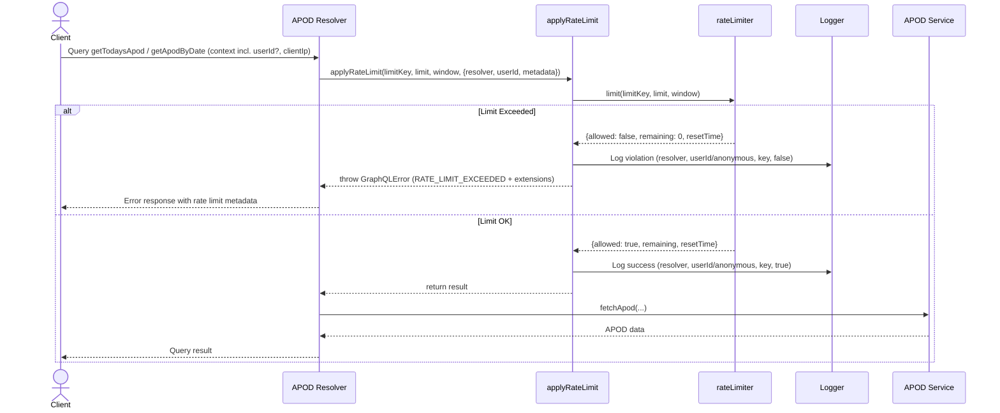

# APOD Feature
Astronomy Picture of the Day from NASA API

I will add a cool interactive button in my portfolio that will have a simple and straightforward behavior:

> Generate the APOD

Once generated (via agentic daily routine), the data will be saved in my database and next requests will re-use/return that previously generated APOD.

If user logs in, however, they will be able to play around more, generating new APODs with different dates.

--- 

## ✅ Issue #61: frontend: APOD floating action button (Fab) with NASA branding #61

```typescript
**Implementation Rules**
- Create ApodFab (`frontend/src/components/apod/ApodFab.tsx`)
- Mimic GogginsFab: floating button with NASA icon, gradient border, aura/pulse effect, tooltip, accessible aria-label
- Place on homepage (or portfolio page)
- Unit test: assert button renders, opens dialog on click

**Acceptance Criteria**
- APOD button appears, shows dialog on click
- Accessible, visually branded to NASA

**Learning Goals**
- Learn React portal, composition, a11y, and test-driven component architecture

**Code stub:**
See: [frontend/src/components/goggins/GogginsFab.tsx](https://github.com/lfariabr/luisfaria.dev/blob/main/frontend/src/components/goggins/GogginsFab.tsx)
See: [frontend/src/app/__tests__/GogginsFab.page.test.tsx](https://github.com/lfariabr/luisfaria.dev/blob/main/frontend/src/app/__tests__/GogginsFab.page.test.tsx)

```

---

### Implementation Steps

#### 1. First things first: I created `Apod.tsx`
A simple bottom-right circular button rendered on the client-side. Next, I've plugged into the main layout `Layout.tsx` to render it.

#### 2. Tests
Following that, I've created `frontend/__tests__/components/Apod.test.tsx` to test the button behavior.

#### 3. ApodDialog.tsx 
Created `frontend/src/components/apod/ApodDialog.tsx` with:
- NASA-branded dialog with gradient border (blue/red/blue NASA colors)
- Rocket icon with gradient title text
- Date display with calendar icon
- Placeholder for APOD image (ready for NASA API integration)
- External link to NASA APOD website
- "Powered by NASA Open APIs" footer

#### 4. Renamed Apod.tsx → ApodFab.tsx 
Following the naming convention from GogginsFab:
- Component now exports `ApodFab`
- Proper floating action button pattern

#### 5. Added Tooltip 
Installed `@radix-ui/react-tooltip` and created `frontend/src/components/ui/tooltip.tsx`:
- Tooltip appears on hover showing "Astronomy Picture of the Day"
- NASA-themed dark styling

#### 6. Added NASA Gradient Border 
Applied NASA brand colors gradient border using CSS mask technique:
- `linear-gradient(135deg, #0B3D91, #FC3D21, #1E90FF)` (NASA blue, red, lighter blue)
- Blue pulse aura effect (`bg-blue-500` instead of primary)

#### 7. Updated Tests 
Enhanced `frontend/src/__tests__/components/Apod.test.tsx`:
- Renders button with accessible name
- Renders NASA APOD image
- Opens dialog on click (verifies dialog role + NASA branding)
- Renders tooltip on hover

---

#### Files Created/Modified

| File | Action |
|------|--------|
| `src/components/apod/ApodFab.tsx` | Created (renamed from Apod.tsx) |
| `src/components/apod/ApodDialog.tsx` | Created |
| `src/components/ui/tooltip.tsx` | Created |
| `src/app/layout.tsx` | Updated import |
| `src/__tests__/components/Apod.test.tsx` | Updated tests |

---

## refactor: FAB adaptation to light mode

Updated both `ApodFab.tsx` and `ApodDialog.tsx` for light/dark mode compatibility using Tailwind's `dark:` variants.

### ApodFab.tsx
- Button: `bg-white dark:bg-zinc-950` with proper hover states
- Border: `border-zinc-200 dark:border-white/10`
- Inner circle: `bg-zinc-100 dark:bg-black` with `ring-zinc-300 dark:ring-white/15`
- Tooltip: Light background with dark text in light mode

### ApodDialog.tsx
- Dialog background: `bg-white/95 dark:bg-zinc-950/85`
- All text colors: `text-zinc-900 dark:text-white`, `text-zinc-600 dark:text-white/70`, etc.
- Borders: `border-zinc-200 dark:border-white/10`
- Button: Light gray background with proper hover states
- Bottom fade: `to-zinc-100/50 dark:to-black/30`

---

## ✅ Issue #65: backend: NASA_API_KEY config, validation & documentation for APOD #65

```typescript
**Implementation Rules**
- Create `.env.example` and update `.env` with NASA_API_KEY (document in backend/docs/1.Setup.MD)
- Type NASA_API_KEY in backend/src/config/config.ts:

  ts
  interface Config {
    // ...
    nasaApiKey: string;
  }
  // add to validation
  'NASA_API_KEY',
  // default
  nasaApiKey: process.env.NASA_API_KEY || '',

- Throw error if missing; update README and Setup docs for environment setup and Docker Compose instructions

**Acceptance Criteria**
- Server refuses to boot without NASA_API_KEY set
- Docs update with configuration example

**Learning Goals**
- Understand env var typing, validation, and config management with TypeScript and dotenv
- Practice documenting integrations for team clarity

**Code stub:**
See: [backend/src/config/config.ts](https://github.com/lfariabr/luisfaria.dev/blob/main/backend/src/config/config.ts)
See: [backend/docs/1.Setup.MD](https://github.com/lfariabr/luisfaria.dev/blob/main/backend/docs/1.Setup.MD)
See: [backend/README.MD](https://github.com/lfariabr/luisfaria.dev/blob/main/backend/README.MD)
```

### Implementation steps

1. First I created account at Nasa APOD API page
2. Then I updated `.env` and `.env.example` with the API key
3. Then I updated `backend/src/config/config.ts` to include the API key

---

## ✅ Issue #66: backend: NASA APOD API service, request validation & structured logging #66

```typescript
**Implementation Rules**
- Add backend/src/services/nasa/apod.ts for NASA APOD client
- Use fetch to call NASA API, validate response schema with Zod or built-in validation
- Log request status (success, error, latency, userId/context if available) using winston
- Handle 429s, errors gracefully; support date param for APOD history/fetch
- Unit tests: mock fetch, check error handling & logging

**Acceptance Criteria**
- Reliable NASA API fetch with schema validation
- Structured logs for request status (success, error, latency, userID)
- All request paths tested (success, network error, rate limit, invalid response)

**Learning Goals**
- Build robust external API client in TypeScript
- Validate API responses and add test coverage
- Instrument logging for observability

**Code stub:**
See: [backend/src/services/nasa/apod.ts](https://github.com/lfariabr/luisfaria.dev/blob/main/backend/src/services/nasa/apod.ts)
See: [backend/src/utils/logger.ts](https://github.com/lfariabr/luisfaria.dev/blob/main/backend/src/utils/logger.ts)
See: [backend/docs/11.DataValidationZod.MD](https://github.com/lfariabr/luisfaria.dev/blob/main/backend/docs/11.DataValidationZod.MD)
```

### Implementation steps
> *service → query resolver → schema additions*

#### 1. Create Zod Validation Schema
**File:** `backend/src/validation/schemas/apod.schema.ts`

```typescript
import { z } from 'zod';

export const apodResponseSchema = z.object({
  copyright: z.string().optional(),
  date: z.string().regex(/^\d{4}-\d{2}-\d{2}$/, 'Date must be in YYYY-MM-DD format'),
  explanation: z.string().min(1, 'Explanation is required'),
  media_type: z.enum(['image', 'video']),
  service_version: z.string(),
  title: z.string().min(1, 'Title is required'),
  url: z.string().url('URL must be valid'),
  hdurl: z.string().url().optional(),
});

export type ApodResponse = z.infer<typeof apodResponseSchema>;
```

**Learning:** Zod validates NASA responses at runtime, catching malformed data before it reaches clients.

---

#### 2. Create Hardened Service
**File:** `backend/src/services/apod.ts`

**Key Features:**
- **`ApodServiceError`** - Custom error class with typed codes:
  - `RATE_LIMITED` (429 from NASA)
  - `NASA_API_ERROR` (4xx/5xx errors)
  - `VALIDATION_ERROR` (response doesn't match schema)
  - `NETWORK_ERROR` (connection failures)

- **Latency logging** - Every request logs `latencyMs`
- **User context** - Optional `userId` for observability
- **Config internal** - NASA API key pulled from `config.nasaApiKey`

```typescript
export async function fetchApod(
  options: { date?: string; context?: ApodRequestContext } = {}
): Promise<ApodResponse>
```

**Why this signature?** Callers don't need to pass the API key - service handles it. Context is optional for logging/rate limiting.

---

#### 3. Create GraphQL Resolver
**File:** `backend/src/resolvers/apod/queries.ts`

**Two queries:**
- **`getTodaysApod`** - Public, no auth required
- **`getApodByDate(date: String!)`** - Requires authentication

**Error mapping:**
| Service Error Code | GraphQL Extension Code |
|-------------------|------------------------|
| `RATE_LIMITED` | `TOO_MANY_REQUESTS` |
| `NASA_API_ERROR` | `EXTERNAL_SERVICE_ERROR` |
| `VALIDATION_ERROR` | `BAD_GATEWAY` |
| `NETWORK_ERROR` | `SERVICE_UNAVAILABLE` |

```typescript
throw new GraphQLError(error.message, {
  extensions: {
    code: mapErrorCode(error.code),
    statusCode: error.statusCode,
    details: error.details,
  },
});
```

**Why structured errors?** Clients can react based on `extensions.code` (show retry button for rate limits, etc.)

---

#### 4. Add GraphQL Schema Types
**File:** `backend/src/schemas/types/apodTypes.ts`

```graphql
type Apod {
  copyright: String
  date: String!
  explanation: String!
  mediaType: String!      # Mapped from snake_case
  serviceVersion: String! # Mapped from snake_case
  title: String!
  url: String!
  hdurl: String
}

extend type Query {
  getTodaysApod: Apod!
  getApodByDate(date: String!): Apod!
}
```

**Field resolvers** in `resolvers/index.ts` map `media_type` → `mediaType` and `service_version` → `serviceVersion`.

---

#### 5. Wire Into Schema
**Files modified:**
- `backend/src/schemas/typeDefs.ts` - Import and include `apodTypes`
- `backend/src/resolvers/index.ts` - Spread `ApodQueries` + add `Apod` field resolver

---

#### 6. Create Tests (28 passing)
**Service tests:** `backend/src/__tests__/unit/apod.service.test.ts`
- Success cases (image, video, date param, user context)
- 429 rate limiting detection
- NASA API errors (403, 404, 500)
- Network errors (ETIMEDOUT)
- Validation errors (missing fields, wrong format, invalid URL)

**Resolver tests:** `backend/src/__tests__/unit/apod.resolver.test.ts`
- Returns data successfully
- Passes user context when authenticated
- Maps error codes correctly
- `getApodByDate` requires authentication

---

#### 7. Test using Apollo Studio

```graphql
query GetTodaysApod {
  getTodaysApod {
    copyright
    date
    explanation
    mediaType
    serviceVersion
    title
    url
    hdurl
  }
}
```

---


## ✅ Issue #78: refactor: Decompose apod.ts into service, api, fallback, types, errors, and constants modules #78

The current `apod.ts` file mixes types, validation, fetch logic, error codes, logging, and both main API & fallback paths. To improve readability, scalability, and maintainability, refactor by splitting into focused modules under `src/services/apod/`.

**Implementation Steps**
- Move domain types to `apod.types.ts` (e.g. `ApodResponse`, `ApodRequestContext`)
- Move all error types and codes to `apod.errors.ts` (e.g. `ApodServiceError`)
- Move infrastructure config (timeouts, retries, URLs) to `apod.constants.ts`
- Implement pure NASA API logic (fetch, retries, AbortController) in `apod.api.ts`
- Implement fallback scraping (HTML parsing) in `apod.fallback.ts`
- Core orchestration (try API, validate, fallback if needed, logger hooks, error handling): `apod.service.ts`
- Update imports in all code that depended on the monolithic file
- Keep existing logic close to unchanged—this is mostly a move, not a rewrite

**Acceptance Criteria**
- Each concern split to its own file; `apod.service.ts` is orchestration only
- No logic regressions; same tests (unit/integration) pass
- Better discoverability: easy to trace concerns, reason about code, and onboard

**Learning Goals**
- Understand separation of concerns at a real-world services scale
- Practice orchestrating feature logic in a clean/production-grade way
- Work with domain types, infra, error handling as first-class modules

**Code stub/snippet**
Example tree:
```
src/services/apod/
  apod.service.ts
  apod.api.ts
  apod.fallback.ts
  apod.errors.ts
  apod.types.ts
  apod.constants.ts
```
Example export in `apod.service.ts`:
```ts
import { fetchApodData } from './apod.api'
import { scrapeApodFallback } from './apod.fallback'
import { ApodResponse } from './apod.types'
import { ApodServiceError } from './apod.errors'
export class ApodService { /* ...orchestrated logic... */ }
```

### Implementation steps

I've done the hard work - structure is clean and logic is preserved. Status:

What's done:
- ✅ Constants, types, errors, API, fallback, service all created
- ✅ Fallback HTML scraping (nice addition!)

What needs finishing:
- Add missing logging to apod.api.ts
- Create index.ts barrel for clean exports
- Update resolver imports
- Update test imports
- Remove old apod.ts

### Modular APOD structure is now fully wired and working.

#### Final Structure
```
src/services/apod/
├── index.ts          # Barrel export (clean entry point)
├── apod.service.ts   # Orchestrator (API + fallback)
├── apod.api.ts       # NASA API client (retries, timeout, logging)
├── apod.fallback.ts  # HTML scraping fallback
├── apod.errors.ts    # ApodServiceError + ApodErrorCode
├── apod.types.ts     # ApodResponse, ApodRequestContext
└── apod.constants.ts # URLs, timeouts, retry config
```

#### What Was Done
| Task | Status |
|------|--------|
| Enhanced apod.api.ts with full logging (latency, retries, status codes) | ✅ |
| Created index.ts barrel for clean imports | ✅ |
| Updated resolver imports to use ../../services/apod/ | ✅ |
| Rewrote tests to properly mock modular structure | ✅ |
| Removed old monolithic apod.ts | ✅ |

---

#### Key Architectural Benefit
The service now has graceful fallback:

```typescript
try {
  return await fetchApodFromApi(url, logContext);
} catch (error) {
  logger.warn("NASA API failed, falling back to HTML", {...});
  return await fetchApodHtmlFallback();
}
```

If NASA API returns 504/timeouts/errors → HTML scraping kicks in automatically.

#### Imports
Consumers just import from the barrel:

```typescript
import { fetchApod, ApodServiceError, ApodResponse } from '../../services/apod/';
```

---

## ✅ Issue #79: refactor: Extract shared GraphQL error handling infrastructure

**Problem:** DRY violation in `queries.ts` — identical try/catch/instanceof/wrap pattern duplicated across resolvers. Adding a new error code means updating multiple files.

**Branch:** `refactor/shared-error-handling`

### Implementation

Created centralized error handling infrastructure that any resolver can use:

#### New Files Created

| File | Purpose |
|------|---------|
| `src/utils/errors/graphqlErrors.ts` | Shared error utilities |
| `src/utils/errors/index.ts` | Barrel exports |
| `src/services/apod/apod.errorHandler.ts` | APOD-specific error transformer |

#### Key Components

**ErrorCodes constant** - Single source of truth:
```typescript
export const ErrorCodes = {
  BAD_USER_INPUT: 'BAD_USER_INPUT',
  UNAUTHENTICATED: 'UNAUTHENTICATED',
  FORBIDDEN: 'FORBIDDEN',
  NOT_FOUND: 'NOT_FOUND',
  TOO_MANY_REQUESTS: 'TOO_MANY_REQUESTS',
  EXTERNAL_SERVICE_ERROR: 'EXTERNAL_SERVICE_ERROR',
  // ...
} as const;
```

**Error factories** - One-liners for common errors:
```typescript
export const Errors = {
  unauthenticated: (message = 'Authentication required') => createGraphQLError(...),
  forbidden: (message = 'Not authorized') => createGraphQLError(...),
  notFound: (resource = 'Resource') => createGraphQLError(...),
  // ...
};
```

**createErrorHandler()** - Generic wrapper generator:
```typescript
export function createErrorHandler<TCode, TError>(
  mapErrorCode: (code: TCode) => ErrorCode,
  isServiceError: (error: unknown) => error is TError,
  defaultMessage: string
) {
  return function withErrorHandling<T>(fn: () => Promise<T>, operationName: string): Promise<T>
}
```

#### APOD Error Handler

Service-specific error mapping now lives with the service:

```typescript
// src/services/apod/apod.errorHandler.ts
export const withApodErrorHandling = createErrorHandler(
  mapApodErrorCode,
  isApodServiceError,
  'An unexpected error occurred while fetching APOD'
);
```

#### Resolver Before/After

**Before (103 lines):**
```typescript
// Duplicated try/catch in EVERY resolver
try {
  const apod = await fetchApod({...});
  return apod;
} catch (error) {
  if (error instanceof ApodServiceError) {
    throw new GraphQLError(error.message, {
      extensions: { code: mapErrorCode(error.code), ... }
    });
  }
  // ... more boilerplate
}
```

**After (34 lines):**
```typescript
import { fetchApod, withApodErrorHandling } from '../../services/apod/';
import { Errors } from '../../utils/errors';

export const ApodQueries = {
  getTodaysApod: async (_, __, context) =>
    withApodErrorHandling(
      () => fetchApod({ context: { userId: context.user?.id } }),
      'getTodaysApod'
    ),

  getApodByDate: async (_, args, context) => {
    if (!context.user) {
      throw Errors.unauthenticated('Authentication required to browse historical APODs');
    }
    const userId = context.user.id;
    return withApodErrorHandling(
      () => fetchApod({ date: args.date, context: { userId } }),
      'getApodByDate'
    );
  },
};
```

### Commits

| Commit | Files |
|--------|-------|
| `feat(errors): add shared GraphQL error handling infrastructure` | `src/utils/errors/graphqlErrors.ts`, `src/utils/errors/index.ts` |
| `feat(apod): extract error handler to service layer` | `src/services/apod/apod.errorHandler.ts`, `src/services/apod/index.ts` |
| `refactor(apod): use shared error handling in resolver` | `src/resolvers/apod/queries.ts` |
| `test(apod): update resolver tests for new mock structure` | `src/__tests__/unit/apod.resolver.test.ts` |

### Benefits

- **Single place to add error codes** — `ErrorCodes` constant
- **Resolver is pure business logic** — no error transformation noise
- **Error mapping lives with service** — where it belongs
- **Reusable** — Other services can use `createErrorHandler()` with their own error types

---

## ✅ Issue #80: fix: NASA API schema compatibility + add apodUrl field

**Problem:** NASA API returns `media_type: "other"` for interactive content (SDO videos, embeds), but our Zod schema only accepted `"image" | "video"`. Also, `url` is missing for `media_type: "other"`, causing validation failures and unnecessary fallback to HTML scraping.

**Branch:** `fix/apod-schema-media-type-other`

### Root Cause

NASA API response for interactive content:
```json
{
  "date": "2026-01-13",
  "explanation": "What just leapt from the Sun?...",
  "media_type": "other",
  "service_version": "v1",
  "title": "A Solar Eruption from SDO"
  // NO url field!
}
```

Our schema rejected this because:
1. `media_type: z.enum(['image', 'video'])` — missing `'other'`
2. `url: z.string().url()` — required, but NASA doesn't provide it for `"other"`

### Implementation

#### 1. Fix Zod Schema

**File:** `src/validation/schemas/apod.schema.ts`

```typescript
export const apodResponseSchema = z.object({
  // ...
  media_type: z.enum(['image', 'video', 'other']),  // Added 'other'
  url: z.string().url('URL must be valid').optional(),  // Now optional
  apod_url: z.string().url().optional(),  // New computed field
});
```

#### 2. Fix GraphQL Schema

**File:** `src/schemas/types/apodTypes.ts`

```graphql
type Apod {
  copyright: String
  date: String!
  explanation: String!
  mediaType: String!
  serviceVersion: String!
  title: String!
  url: String              # Changed from String! to String
  hdurl: String
  "Direct link to the APOD page on NASA's website"
  apodUrl: String!         # NEW - always available
}
```

#### 3. Compute apodUrl in Service

**File:** `src/services/apod/apod.service.ts`

```typescript
/**
 * Generates the direct APOD page URL for a given date.
 * Format: https://apod.nasa.gov/apod/apYYMMDD.html
 */
function buildApodPageUrl(date: string): string {
  const [year, month, day] = date.split("-");
  const shortYear = year.slice(2);
  return `https://apod.nasa.gov/apod/ap${shortYear}${month}${day}.html`;
}

export async function fetchApod(...): Promise<ApodResponse> {
  // ... fetch logic ...

  // Enrich with direct APOD page URL
  return {
    ...apodData,
    apod_url: buildApodPageUrl(apodData.date),
  };
}
```

#### 4. Add Field Resolver

**File:** `src/resolvers/index.ts`

```typescript
Apod: {
  mediaType: (parent: ApodResponse) => parent.media_type,
  serviceVersion: (parent: ApodResponse) => parent.service_version,
  apodUrl: (parent: ApodResponse) => parent.apod_url,  // NEW
},
```

### Commits

| Commit | Files |
|--------|-------|
| `fix(apod): add 'other' media type and make url optional in schema` | `src/validation/schemas/apod.schema.ts`, `src/schemas/types/apodTypes.ts` |
| `feat(apod): add apodUrl field for direct APOD page links` | `src/services/apod/apod.service.ts`, `src/resolvers/index.ts` |
| `test(apod): update service tests for apod_url field` | `src/services/apod/apod.service.ts`, `src/resolvers/index.ts` |

### Result

**Before:** `media_type: "other"` → validation error → fallback to HTML scraping  
**After:** `media_type: "other"` → validation passes → direct API response + `apodUrl` for viewing

Query example:
```graphql
query GetTodaysApod {
  getTodaysApod {
    title
    mediaType      # "other"
    url            # null (NASA doesn't provide it)
    apodUrl        # "https://apod.nasa.gov/apod/ap260113.html" (always available!)
  }
}
```

---

## Updated Module Structure

```
src/
├── utils/
│   └── errors/
│       ├── index.ts              # Barrel exports
│       └── graphqlErrors.ts      # Shared error infrastructure
│
└── services/
    └── apod/
        ├── index.ts              # Barrel export
        ├── apod.service.ts       # Orchestrator + apodUrl enrichment
        ├── apod.api.ts           # NASA API client
        ├── apod.fallback.ts      # HTML scraping fallback
        ├── apod.errors.ts        # ApodServiceError + ApodErrorCode
        ├── apod.errorHandler.ts  # GraphQL error transformer (NEW)
        ├── apod.types.ts         # ApodResponse, ApodRequestContext
        └── apod.constants.ts     # URLs, timeouts, retry config
```

---

## Issue #67: backend: GraphQL resolver for APOD with rate limiting, caching, and audit logs #67

**Implementation Rules**
- Add GraphQL query (getApod) in typeDefs/resolvers. Expose REST if needed
- Enforce authentication (optionally public for demo)
- Integrate Redis-based rate limiting via atomic Lua (see goggins/chatbot)
- Add short-term Redis caching on APOD results (date/title key)
- Emit audit logs on each request (user, rate limiter state, NASA status)
- Tests: integration test for resolver, validate limiter, log output

**Acceptance Criteria**
- APOD query enforced by rate limiter; returns cached result or live from NASA with audit logging
- Error and limit paths observable in logs/tests

**Learning Goals**
- Integrate rate limiting with resolver logic
- Add cross-cutting observability (logging/audit)
- Implement caching for reuse and performance

**Code stub:**
See: [backend/src/middleware/rateLimiter.ts](https://github.com/lfariabr/luisfaria.dev/blob/main/backend/src/middleware/rateLimiter.ts)
See: [backend/src/services/rateLimiter.ts](https://github.com/lfariabr/luisfaria.dev/blob/main/backend/src/services/rateLimiter.ts)
See: [backend/docs/15.AtomicRateLimiting.md](https://github.com/lfariabr/luisfaria.dev/blob/main/backend/docs/15.AtomicRateLimiting.md)

### Implementation

#### 1. feat(apod): add rate limiting and logging to requests (Relates #67)

| Cohort / File(s) | Summary |
|------------------|---------|
| **Rate-limited APOD Resolver:** `backend/src/resolvers/apod/queries.ts` | Added per-endpoint rate limiting calls before fetchApod for getTodaysApod (context-aware limitKey: userId or client IP) and getApodByDate (per-user key); converted getTodaysApod to block body to use context and await limits; preserved withApodErrorHandling. |
| **Rate Limiting Utility:** `backend/src/utils/applyRateLimit.ts` | New export applyRateLimit(limitKey, limit, window, context) that calls rateLimiter.limit, logs structured info, returns limiter result on success, and throws GraphQLError with RATE_LIMIT_EXCEEDED and extensions (limit, remaining, resetTime) on violation. |
| **GraphQL Context Update:** `backend/src/index.ts` | MyContext extended with clientIp: string; Apollo context now populates clientIp from x-forwarded-for or remote address. |
| **Tests Updated for Context:** `backend/src/__tests__/unit/apod.resolver.test.ts` | Tests updated to include clientIp: '127.0.0.1' in resolver context expectations for getTodaysApod cases. |



#### 2. fix(apod): rate-limit anonymous getTodaysApod per-client IP (Relates #67)
- Update the MyContext interface to include clientIp
- Update the context creation to extract clientIp from the request
- Update the queries.ts to use the IP-based key for anonymous users

- `backend/src/index.ts` – Updated MyContext interface to include clientIp and added IP extraction logic in the Apollo context:
  - Parses x-forwarded-for header (first IP for proxy chains)
  - Falls back to req.socket.remoteAddress or 'unknown'
- `backend/src/resolvers/apod/queries.ts` – Updated getTodaysApod:
  - Context type now includes `clientIp: string`
  - Anonymous key changed from `'apod:today:public'` → `'apod:today:ip:${context.clientIp}'`
  - `clientIp` passed via `metadata` for audit logging

#### 3. feat(apod): caching strategy for results (Closes #67)

#TODO

---

## Backlog
- ~~**Backend Integration**: Create GraphQL query to fetch/cache APOD from NASA API~~ ✅
- ~~**Authenticated Features**: Allow logged-in users to browse historical APODs `getApodByDate`~~ ✅
- ~~**Timeout Handling**: Add request timeout + retry logic for slow NASA responses~~ ✅
- ~~**Refactor Apod Service**: Split into different concerns `backend/src/services/apod/`~~ ✅
- ~~**DRY Error Handling**: Extract shared error infrastructure `src/utils/errors/`~~ ✅
- ~~**Schema Compatibility**: Support NASA's `media_type: "other"`~~ ✅
- ~~**Rate Limiting**: Add rate limiting to prevent abuse `backend/src/utils/applyRateLimit.ts`~~ ✅
- **Database Storage**: Store daily APOD in MongoDB to reduce API calls
- **Agentic Routine**: Set up daily cron job to pre-fetch APOD
